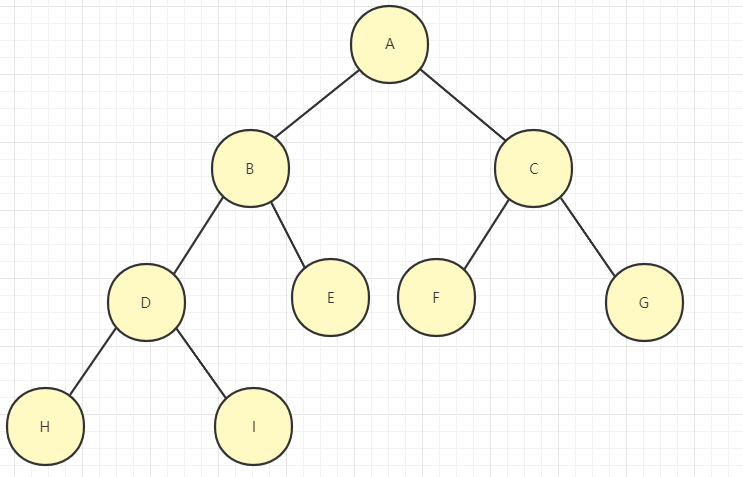
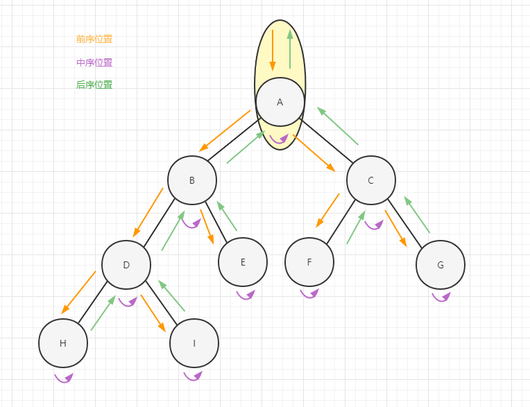

## 二叉树（纲领）

二叉树的解题思路有两个方向

> 通过遍历一棵树得到答案，即**遍历**的思想

> 通过递归，将整个问题分解为子问题推导出问题的答案，即**分解**的思想

首先我们来回顾以下二叉树的几种遍历方式

* 前序遍历
* 中序遍历
* 后序遍历
* 层次遍历

大家在课内学习的时候，应该是这么背的

前序是`根左右`，中序是`左根右`，后序是`左右根`，层次遍历就是一层一层写



前序遍历集合：`ABDHIECFG`

中序遍历集合：`HDIBEAFCG`

后序遍历集合：`HIDEBFGCA`

层次遍历集合：`ABCDEFGHI`

相信这个对于大家来说都没有难度，理解前中后序对于做二叉树问题十分重要，这里给出遍历二叉树的模板代码。

```java
public void traverse(TreeNode root){
    if(root==null){
        return;
    }
    // 前序位置
    traverse(root.left);
    // 中序位置
    traverse(root.right);
    // 后序位置
}
```

下面请你对照这段模板，看下面这张图



你会发现，每个节点都会有唯一属于自己的前中后序位置，前中后序其实对应就是处理每一个节点的三个特殊时间点。

二叉树的问题，其实就是在这三个时间点注入自己的代码逻辑，只需要单独考虑每一个节点在每个时间点该做些什么，其他的交给二叉树遍历框架即可。

### 前序输出集合

我们来写一下前序遍历，方法签名如下`public List<TreeNOde> getPreorderList(TreeNOde root){}`

#### 一、遍历

借助traverse函数和一个外部变量即可完成

在进入一个节点的时候将其加入到结果集中去，最后将结果集返回

```java
List<TreeNode> res = new ArrayList<>();

public List<TreeNOde> getPreorderList(TreeNOde root) {
    traverse(root);
    return res;
}

public void traverse(TreeNode root) {
    if (root == null) {
        return;
    }
    res.add(root);
    traverse(root.left);
    traverse(root.right);
}
```

#### 二、分解问题

求一整个树的前序遍历即求其子树的前序遍历集合

```java
public List<TreeNode> getPreorderList(TreeNode root){
    List<TreeNode> res = new ArrayList<>();
    if(root==null){
        return res;
    }
    // 将当前节点放入集合
    res.add(root);
    // 将左节点的前序遍历放入集合
    res.addAll(getPreorderList(root.left));
    // 将右节点的前序遍历放入集合
    res.addAll(getPreorderList(root.right));
    // 讲结果集返回
    return res;
}
```

### [二叉树的最大深度](https://leetcode.cn/problems/maximum-depth-of-binary-tree/)

给定一个二叉树，找出其最大深度。

二叉树的深度为根节点到最远叶子节点的最长路径上的节点数。

`说明: 叶子节点是指没有子节点的节点。`

> 示例：

给定二叉树 [3,9,20,null,null,15,7]

    	3
       / \
      9  20
        /  \
       15   7
返回它的最大深度 3 。

我们来使用两种上述思维来看这道题

#### 一、遍历

如何得到最大深度，即得到每一个节点的深度，在叶子节点处将当前深度和当前最大深度取最大，然后将最大的深度返回即可

```java
public class Solution {
    int depth = 0;
    int max = 0;

    public int maxDepth(TreeNode root) {
        traverse(root);
        return max;
    }

    public void traverse(TreeNode root) {
        if (root == null) {
            return;
        }
        // 前序位置
        depth++;
        // 在叶子节点处更新最大深度
        if (root.left == null && root.right == null) {
            max = Math.max(max, depth);
        }
        traverse(root.left);
        // 中序位置
        traverse(root.right);
        // 后序位置
        depth--;
    }
}
```

前序位置是进入一个节点的时候，中序位置是从左子树切到右子树的时候，后序位置是离开一个节点返回其父母节点的时候

depth记录着当前深度，max记录着最大深度

在进入一个新的节点的时候，depth自增1，在离开这个节点的时候，depth自减1

#### 二、分解问题

求树的最大深度即求树的高度

求树的高度即可分解问题，分解到由子树高度推导出完整的树的高度

```java
public int maxDepth(TreeNode root) {
    if (root == null) {
        return 0;
    }
    // 左子树的高度
    int left = maxDepth(root.left);
    // 右子树的高度
    int right = maxDepth(root.right);
    // 返回自身高度
    int max = Math.max(left, right) + 1;
    return max;
}
```


