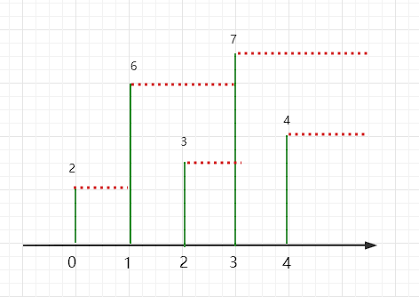
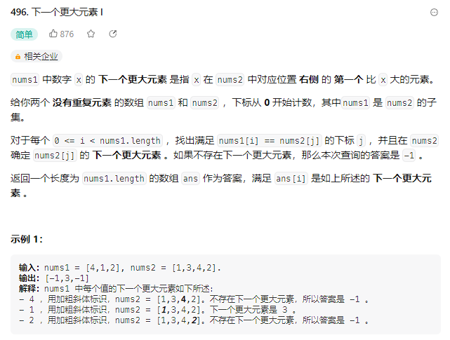
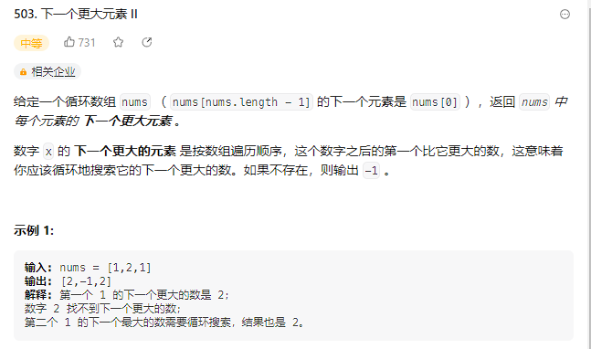
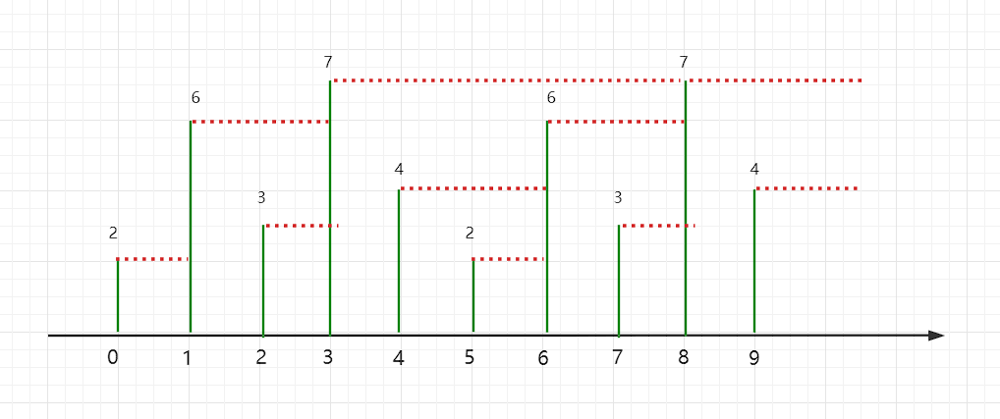
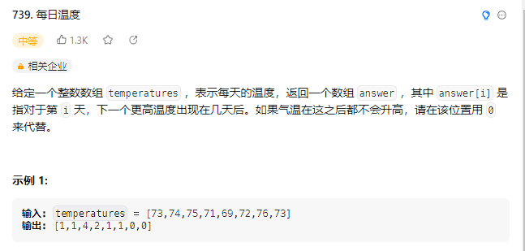

## 单调栈

单调栈就是一种栈，只不过用了一种逻辑在内部维护了所有的栈内元素递增或者递减的序列

这种技巧用的不多，一般就是以下讲到的典型的题目

先来体会一下单调栈

### 技巧阐述

我们以题入技

题目如下

```bash
# 输入一个数组nums，然后返回一个等长的结果数组，结果数组中对应索引存储着nums数组中该索引后第一个比它大的元素，如果没有更大的元素，就存 -1。
例：
输入：[2,6,3,7,4]
输出：[6,7,7,-1,-1]
```

函数签名如下：`int[] nextBigerElement(int[] nums);`

题目很好理解，用暴力解的话就是在每一个元素向后面找第一个比它大的元素，时间复杂度是`O(n^2)`

现在我们使用单调栈的技巧来解决这道题

`nums = [2,6,3,7,4]`

先来看这张图



```java
int[] nextBigerElement(int[] nums) {
    int[] res = new int[nums.length];
    Stack<Integer> stack = new Stack<>();
    // 倒着遍历
    for (int i = nums.length - 1; i >= 0; i--) {
        // 如果栈顶元素比nums[i]小，则出栈，直到栈顶元素比nums[i]大或者栈为空
        while (!stack.isEmpty() && stack.peek() <= nums[i]) {
            stack.pop();
        }
        res[i] = stack.isEmpty() ? -1 : stack.peek();
        stack.push(nums[i]);
    }
    return res;
}
```

### [496.下一个更大元素Ⅰ](https://leetcode.cn/problems/next-greater-element-i/)



题目意思有点绕，这里解释一下。

首先，nums1是nums2的子集

其次，题目要求返回的是nums1的每一个元素在nums2中的位置后的比它大的元素的值

那么题目意思明白了之后，这道题就很简单了

我只需要对nums2的每一个元素找到其后面第一个比它大的元素的数组

然后使用一个hash表存起来，再遍历nums1，用nums1[1]在map中取得结果将其放入结果集中，最后返回

下面看代码

```java
class Solution {
    int[] nextBigerElement(int[] nums){
        int[] res = new int[nums.length];
        Stack<Integer> stack = new Stack<>();
        for (int i = nums.length-1; i >= 0; i--) {
            // 如果栈顶元素比nums[i]小，则出栈，直到栈顶元素比nums[i]大或者栈为空
            while (!stack.isEmpty()&&stack.peek()<=nums[i]){
                stack.pop();
            }
            res[i] = stack.isEmpty()?-1:stack.peek();
            stack.push(nums[i]);
        }
        return res;
    }
    public int[] nextGreaterElement(int[] nums1, int[] nums2) {
        int[] res = nextBigerElement(nums2);
        // key是nums的值，value是其后面第一个比它大的数
        HashMap<Integer,Integer> map = new HashMap<>();
        for (int i = 0; i < nums2.length; i++) {
            map.put(nums2[i],res[i]);
        }
        int[] r = new int[nums1.length];
        for (int i = 0; i < r.length; i++) {
            r[i] = map.get(nums1[i]);
        }
        return r;
    }
}
```

### [503.下一个更大元素 II](https://leetcode.cn/problems/next-greater-element-ii/)



这一题是循环数组，很简单的一个技巧，那就是将数组复制一遍放到原数组后面，这样不就实现了循环数组找到下一个元素了吗



但是这里我们不新建一个两倍长的数组然后拷贝数组

这里我们使用`%`符号来巧妙地完成逻辑上扩一倍地效果

```java
public int[] nextGreaterElements(int[] nums) {
    int len = nums.length;
    int[] res = new int[len];
    Stack<Integer> stack = new Stack<>();
    // 一样的从最后一个元素开始
    for (int i = len * 2 - 1; i >= 0; i--) {
        while (!stack.isEmpty() && stack.peek() <= nums[i]) {
            stack.pop();
        }
        // 这里的索引都需要对len取余
        res[i % len] = stack.isEmpty() ? -1 : stack.peek();
        stack.push(nums[i % len]);
    }
    return res;
}
```

### [739.每日温度](https://leetcode.cn/problems/daily-temperatures/)



这道题目其实和我们一开始的技巧阐述的思想是一样的

但是这里返回的数组中存储的是索引而已

这道题直接上代码

```java
public class Solution {
    public int[] dailyTemperatures(int[] temperatures) {
        Stack<Integer> stack = new Stack<>();
        int[] res = new int[temperatures.length];
        for (int i = temperatures.length - 1; i >= 0; i--) {
            // 如果栈顶元素比当前元素小，则一直出栈，直到出现第一个比它大的数或者栈空
            while (!stack.isEmpty() && temperatures[stack.peek()] <= temperatures[i]) {
                stack.pop();
            }
            // 注意:题目需要的是几天后，所以是stack.peek()-i而不是stack.peek();
            res[i] = stack.isEmpty() ? 0 : stack.peek() - i;
            stack.push(i);
        }
        return res;
    }
}
```


