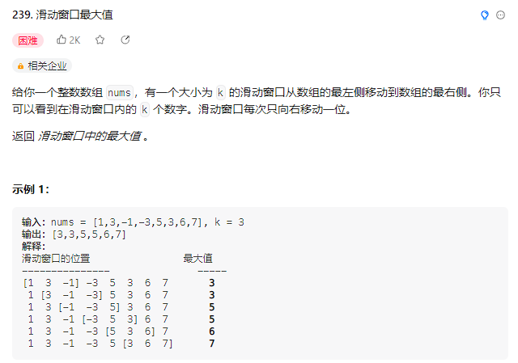

## 单调队列

这个技巧和单调栈一样，运用的场景比较少

它本质也是一个队列，只不过是运用了一些巧妙的逻辑

在内部维护了一个递增或者递减的序列

然后还保持了先进先出的特性

下面直接看题

### [滑动窗口最大值](https://leetcode.cn/problems/sliding-window-maximum/)



这道题的描述不就是使用滑动窗口技巧吗，我们知道在滑动窗口技巧中

最重要的就是清楚在何时扩大窗口，在何时缩小窗口

但是这道题中，我没法根据出窗口的那个元素来判断是否需要更新最大值，如何更新

如果出窗口的就是最大值，那我就需要重新遍历一遍窗口找到最值，这样的时间复杂度是较高的

所以就需要使用到单调队列的技巧了

这里我们自己维护一个单调队列的类

```java
public class MonotonousQueue {
    // 在队尾添加元素 n
    void push(int n);
    // 返回当前单调队列中的最大值
    int max();
    // 队头元素如果是n的话就删除它
    void pop(int n);
}
```

在队尾添加元素的时候，需要将所有队尾元素比它小的元素都出队，直到遇到第一个比它大的元素或者队列为空的时候

最大值就是队列的队首元素

下面看这道题的解法

```java
class Solution {
    public int[] maxSlidingWindow(int[] nums, int k) {
        MonotonousQueue window = new MonotonousQueue();
        List<Integer> res = new LinkedList<>();
        for (int i = 0; i < nums.length; i++) {
            // 前k-1个元素直接入队
            if (i < k - 1){
                window.push(nums[i]);
            }else {
                // 第k个元素入队
                window.push(nums[i]);
                // 将窗口中的最大值放入结果集
                res.add(window.max());
                // 将窗口第一个元素出队
                window.pop(nums[i-k+1]);
            }
        }
        // 将res转换为数组返回
        int[] r = new int[res.size()];
        for (int i = 0; i < res.size(); i++) {
            r[i] = res.get(i);
        }
        return r;
    }
}
class MonotonousQueue {
    LinkedList<Integer> queue = new LinkedList<>();
    // 在队尾添加元素 n
    void push(int n){
        // 维护递减的序列
        while (!queue.isEmpty()&&n>queue.getLast()){
            queue.removeLast();
        }
        queue.addLast(n);
    }
    // 返回当前单调队列中的最大值
    int max(){
        return queue.getFirst();
    }
    // 队头元素如果是n的话就删除它
    void pop(int n){
        if (queue.getFirst()==n){
            queue.removeFirst();
        }
    }
}
```


