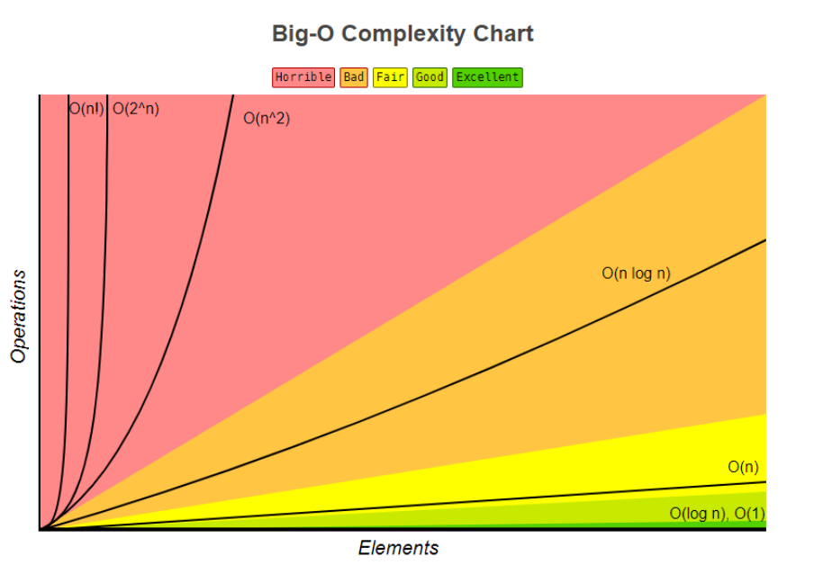

## 如何去评判一个算法的好坏呢？

我们可以从两个维度分别是时间和空间去评判，所以我们也可以根据这两点去优化我们的代码，从而使自己的算法的复杂度降低，效率提高。

那这样说的话，是不是我拿着不同的算法在不同的电脑上跑然后比较时间，谁的时间短，谁的算法更牛逼。那如果两台电脑的性能本就有着很大的差距呢？这样就不公平了，导致了比较的偏差。

## 大O表示法

那么我们可以使用一种表示法也就是大O表示法来具体表示**时间复杂度**和**空间复杂度**。它将代码的所有步骤转换为**关于数据规模n的公式项**，然后排除不会对问题的整体复杂度产生较大影响的**低阶、系数项和常数项**。



### 时间复杂度

其实该值表示的是，当数据的量级增加的时候，时间增长的一个趋势。

公式：T(n) = O(f(n))

O(1)的例子：

```java
int x = 0;
int y = 1;
int temp = x + y;
```

O(n)的例子：

```java
for (int i = 1; i < n; i++){
    System.out.println(i);
}
/**
* 该循环实际会执行多少行代码呢？
* int i = 1;   *  1
* i < n        *  n
* i++          *  n
* sout(i)      *  n
* 所以是O(1+3n)
* 我们在开始就说过了需要排除不会对问题的整体复杂度产生较大影响的低阶、系数项和常数项。
* 所以复杂度是O(n)
*/
```

再来看一个O(n^2)的案例：

```java
for (int i = 0; i < n; i++) {
    for (int j = 0; j < n; j++) {
        System.out.println(i+j);
    }
}
/*
* 一样的我们来看一下这个循环实际会执行多少次
* int i = 0;       *   1
* int j = 0;       *   1
* i < n            *   n
* i++              *   n
* j < n            *   n*n
* j++              *   n*n
* sout(i+j);       *   1
* 也就是O(n^2+2n+3) = O(n^2)
*/
```

O(logn)的例子：

```java
int i=1;
while(i < n){
    i = i * 2; 
}
/*
* int i = 1;    *  1
* i < n         * (log2)n
* i = i * 2     * (log2)n
* 也就是O(2(log2)n)==(log2)n
*/
```

O(nlogn)的例子：

```java
for (int i = 1; i < n; i++){
    int j = 1;
    while(j < n){
        j = j * 2; 
    }
}
//这个很简单，和之前的分析是一样的
```

### 空间复杂度

该复杂度表示的是内存空间随着数据的增加增长的趋势。

常用的空间复杂度O(1),O(n),O(n^2)

O(1)的例子：

```java
int x = 0;
int y = 1;
int temp = x + y;
```

O(n)的例子：

```java
int[] arr = new int[n];
for (int i = 0; i < n; i++){
    arr[i] = i;
}
```

O(n^2)的例子：

```java
int[][] arr = new int[n][n];
for (int i = 0; i < n; i++){
    for (int j = 0; j < n; j++){
        arr[i][j] = i + j;
    }
}
```


