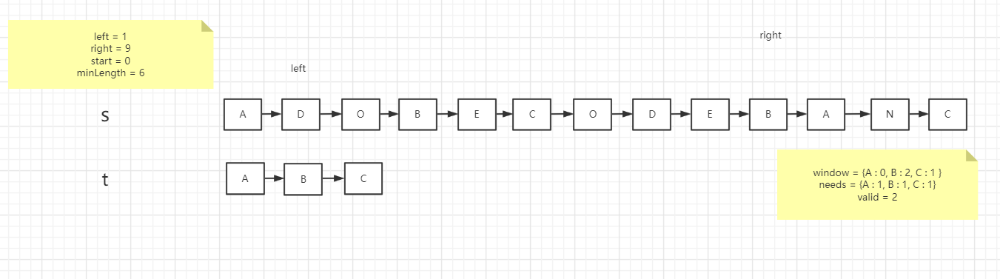

## 滑动窗口

滑动窗口的思路非常简单

就是维护一个窗口

不断滑动

然后更新答案

#### 滑动窗口的骨架

```java
public void slidingWindow(String s1, String s2) {
        int left = 0;
        int right = 0;
        char now;
        Map<Character, Integer> needs = new HashMap<>();
        for (char c : s1.toCharArray()) {
            needs.merge(c, 1, Integer::sum);
        }
        Map<Character, Integer> window = new HashMap<>();
        // 当前符合needs条件的条数
        int valid = 0;
        while (right < s2.length()) {
            now = s2.charAt(right++);
            // 窗口内的数据更新

            while (// 左窗口收缩条件){
            // 收缩左窗口
            }
        }
}
```

看完了骨架，直接上四个题目

#### 最小覆盖子串

[力扣76：最小覆盖子串](https://leetcode-cn.com/problems/minimum-window-substring/)


1、我们先初始化 `left = right = 0`，把索引区间 `[left, right)` 中的内容称为窗口。

2、不断地增加 `right` 指针扩大窗口 `[left, right)`，直到窗口中的字符串符合要求（即窗口中的内容包含了 `t` 中的所有字符）。

3、此时，我们停止增加 `right`，开始不断增加 `left` 指针缩小窗口 `[left, right)`，直到窗口中的字符串不再符合要求。同时，每次增加 `left`，我们都要更新结果。

4、重复第 2 和第 3 步，直到 `right` 到达字符串 `S` 的尽头。


这时候left开始向右移动，直到window中的字符不满足target的字符，即valid不等于needs的size()





这时候left开始向右移动，直到window中的字符不满足target的字符，即valid不等于needs的size()


这时候left开始向右移动，直到window中的字符不满足target的字符，即valid不等于needs的size()


代码：

```java
class Solution {
    public String minWindow(String s, String t) {
        if (t.length() > s.length()) {
            return "";
        }
        int len = s.length();
        int left = 0;
        int right = 0;
        char now;
        char[] chars = s.toCharArray();
        Map<Character, Integer> window = new HashMap<>();
        // valid指的是need中的所有条件的满足个数
        int valid = 0;
        Map<Character, Integer> needs = new HashMap<>();
        for (char c : t.toCharArray()) {
            // 这个是java8的map新特性，当map中不存在该值，自动创建值并赋值为1，当该值存在的时候，将其加1
            needs.merge(c, 1, Integer::sum);
        }
        int start = 0;
        int minLength = Integer.MAX_VALUE;
        while (right < len) {
            now = chars[right++];
            // 只有当前这个字符是t里面的，我再去将其放入窗口中
            // 如果这时候窗口中的该字符数量达到了needs中的，则valid自增
            if (needs.get(now) != null) {
                window.merge(now, 1, Integer::sum);
                if (window.get(now).equals(needs.get(now))) {
                    valid++;
                }
            }
            // 如果needs中的条件都满足了，则left要自增
            while (valid == needs.size()) {
                // 这里使用right-left充当字符串长度，因为now = chars[right++];这里right已经自增了
                if (right - left < minLength) {
                    start = left;
                    minLength = right - left;
                }
                now = chars[left++];
                if (window.get(now) != null) {
                    // 这个是java8的map新特性，当map中存在该值，则将其加上-1
                    window.merge(now, -1, Integer::sum);
                    if (window.get(now) < needs.get(now)) {
                        valid--;
                    }
                }
            }
        }
        return minLength == Integer.MAX_VALUE ? "" : s.substring(start, start + minLength);
    }
}
```

#### 字符串排序

[力扣567：字符串排序](https://leetcode-cn.com/problems/permutation-in-string/)


1、先初始化`left`和`right`为0，把`[left,right)`范围的数据叫做窗口

2、将需要符合的字符串条件初始化到needs中

3、不断扩大`right`，使窗口逐渐变大

4、直到窗口长度等于s1的长度，如果这时候已经出现了符合条件的字符串直接返回true，反之，将`left`向右走，缩小窗口

5、重复3、4，直到`right`走到最后

```java
class Solution {
    public boolean checkInclusion(String s1, String s2) {
        int left = 0;
        int right = 0;
        char now;
        Map<Character, Integer> needs = new HashMap<>();
        for (char c : s1.toCharArray()) {
            needs.merge(c, 1, Integer::sum);
        }
        Map<Character, Integer> window = new HashMap<>();
        int valid = 0;
        while (right < s2.length()) {
            now = s2.charAt(right++);
            if (needs.get(now) != null) {
                window.merge(now, 1, Integer::sum);
                if (window.get(now).equals(needs.get(now))) {
                    valid++;
                }
            }
            if (right - left == s1.length()) {
                now = s2.charAt(left++);
                if (valid == needs.size()) {
                    return true;
                }
                if (window.get(now) != null) {
                    if (window.get(now).equals(needs.get(now))) {
                        valid--;
                    }
                    window.merge(now, -1, Integer::sum);
                }
            }
        }
        return false;
    }
}
```

#### 找到字符串中所有字母异位词

[力扣438：找到字符串中所有字母异位词](https://leetcode-cn.com/problems/find-all-anagrams-in-a-string/)


其实本题就是上面那一题，只不过这一题需要将所有的异位词出现的地方都放到一个List中

代码：

```java
class Solution {
    public List<Integer> findAnagrams(String s, String p) {
        List<Integer> result = new ArrayList<>();
        int left = 0;
        int right = 0;
        int valid = 0;
        char now;
        Map<Character, Integer> needs = new HashMap<>();
        for (char c : p.toCharArray()) {
            needs.merge(c, 1, Integer::sum);
        }
        Map<Character, Integer> window = new HashMap<>();
        char[] chars = s.toCharArray();
        while (right < s.length()) {
            now = chars[right++];
            if (needs.get(now) != null) {
                window.merge(now, 1, Integer::sum);
                if (window.get(now).equals(needs.get(now))) {
                    valid++;
                }
            }
            if (right - left == p.length()) {
                if (valid == needs.size()) {
                    result.add(left);
                }
                now = chars[left++];
                if (window.get(now) != null) {
                    if (window.get(now).equals(needs.get(now))) {
                        valid--;
                    }
                    window.merge(now, -1, Integer::sum);
                }
            }
        }
        return result;
    }
}
```

#### 无重复最长子串

[力扣3：无重复字符的最长子串](https://leetcode-cn.com/problems/longest-substring-without-repeating-characters/)


1、初始化`left`和`right`为0，window作为窗口

2、将当前`right`处的字符在window中的数目加一

3、如果当前`right`处的字符在window中的数目已经大于1了。说明有了重复元素，需要将`left`不断左移，直到当前`right`处的字符在window中的数目不大于1

4、重复2、3操作

代码：

```java
class Solution {
     public int lengthOfLongestSubstring(String s) {
        int len = s.length();
        if (len < 2) {
            return len;
        }
        int left = 0;
        int right = 0;
        int maxLength = 1;
        char now;
        Map<Character, Integer> window = new HashMap<>();
        while (right < len) {
            now = s.charAt(right++);
            window.merge(now, 1, Integer::sum);
            while (window.get(now) > 1) {
                window.merge(s.charAt(left++), -1, Integer::sum);
            }
            maxLength = Math.max(right - left, maxLength);
        }
        return maxLength;
    }
}
```


