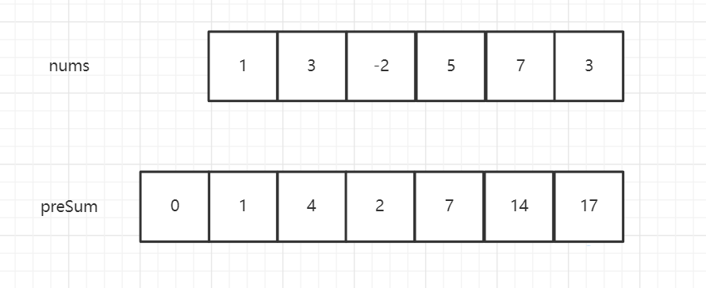

## 前缀和数组

### 技巧说明

此技巧主要用于频繁的范围求和

### 栗一

[力扣303：区域和检索 - 数组不可变](https://leetcode-cn.com/problems/range-sum-query-immutable/)

这是一道很典型的使用前缀和数组的题目。

对于频繁计算数组的一个范围的和，学没过前缀和数组的会这样做，

```java
class NumArray{
    private int[] nums;
    NumArray(int[] nums) {
        this.nums = nums;
    }
    public int sumRange(int[] sums, int left, int right) {
        int sum = 0;
        for(int i = left ;i <= right;i++){
            sum += nums[i];
        }
        return sum;
    }
}
```

这样确实可以达到效果，但是频繁这样操作，效率不是很高。

所以学过前缀和的会这么写从而提高效率

```java
class NumArray{
    private int[] nums;
    private int[] preSum
        NumArray(int[] nums) {
        this.nums = nums;
        int[] preSum = new int[nums.length + 1];
        for (int i = 1; i <= nums.length ; i++) {
            preSum[i] = preSum[i-1] + nums[i-1];
        }
    }
    public int sumRange(int[] sums, int left, int right) {
        return preSum[right+1] - preSum[left];
    }
}

```

我们来分析一下这个`preSum`

它的长度是原数组的长度加一

`preSum[0]`置为`nums`数组前0个的和

`preSum[1]`置为`nums`数组前1个的和

`preSum[2]`置为`nums`数组前2个的和



所以我如果需要`[0,1]`区间的和，则返回`preSum[2]-preSum[0]`（前2个数的和减去前0个数的和）

所以我如果需要`[3,5]`区间的和，则返回`preSum[6]-preSum[3]`（前6个数的和减去前3个数的和）

所以这道力扣303题的代码为：

```java
class NumArray {
    private int[] preSum;

    public NumArray(int[] nums) {
        preSum = new int[nums.length+1];
        for (int i = 1; i <= nums.length; i++) {
            preSum[i]=preSum[i-1]+nums[i-1];
        }
    }
    
    public int sumRange(int left, int right) {
        return preSum[right+1]-preSum[left];
    }
}
```

---

小试身手：初三一班的数学期末成绩(满分120分)出来了，现将成绩乱序列表发于你，请你统计在`[min,max]`范围内的学生人数

方法签名：`public int scoreRange(List<Integer> scores, int fullMarks, int min, int max)`

**在学前缀和数组之前**

先将scores按升序排序

然后使用二分搜索两个端点，将长度返回

这样的思路确实没毛病，但是如果频繁需要查询，

就算是强如二分查找，也会消耗很多资源

**学了前缀和数组之后**

既然学了前缀和数组，我们就使用该技巧去优化

```java
/**
     * 返回成绩范围内的学生数
     * @param scores 学生成绩列表
     * @param fullMarks 这门成绩的满分
     * @param min 最小值
     * @param max 最大值
     * @return 满足成绩区间的个数
     */
public int scoreRange(List<Integer> scores, int fullMarks, int min, int max){
    int[] counts = new int[fullMarks + 1];
    int[] preSums = new int[fullMarks + 2];
    // counts[i]的意思是分数为i的学生有几个人
    for (Integer score : scores) {
        counts[score]++;
    }
    preSums[0]=0;
    for (int i = 1; i <= counts.length; i++) {
        preSums[i] = preSums[i-1] + counts[i-1];
    }
    // 也就是counts在区间[min,max]范围和
    return preSums[max + 1] - preSums[min];
}
```

### 栗二

现在我们来解决[力扣304：二维区域和检索 - 矩阵不可变](https://leetcode-cn.com/problems/range-sum-query-2d-immutable/)

本质和一维的时候是一样的只不过变成了二维，需要预处理一个二维前缀和数组而已

```java
class NumMatrix {
    private int[][] preSums;

    public NumMatrix(int[][] matrix) {
        preSums = new int[matrix.length][matrix[0].length+1];
        for (int i = 0; i < matrix.length; i++) {
            for (int j = 1; j <= matrix[i].length; j++) {
                preSums[i][j] = preSums[i][j-1] + matrix[i][j-1];
            }
        }
    }
    
    public int sumRegion(int row1, int col1, int row2, int col2) {
        int sum = 0;
        for (int i = row1; i <= row2; i++) {
            sum += preSums[i][col2+1]-preSums[i][col1];
        }
        return sum;
    }
}
```

这是另一种解法

```java
class NumMatrix {
    // 定义：preSum[i][j] 记录 matrix 中子矩阵 [0, 0, i-1, j-1] 的元素和
    private int[][] preSum;
    
    public NumMatrix(int[][] matrix) {
        int m = matrix.length, n = matrix[0].length;
        if (m == 0 || n == 0) return;
        // 构造前缀和矩阵
        preSum = new int[m + 1][n + 1];
        for (int i = 1; i <= m; i++) {
            for (int j = 1; j <= n; j++) {
                // 计算每个矩阵 [0, 0, i, j] 的元素和
                preSum[i][j] = preSum[i-1][j] + preSum[i][j-1] + matrix[i - 1][j - 1] - preSum[i-1][j-1];
            }
        }
    }
    
    // 计算子矩阵 [x1, y1, x2, y2] 的元素和
    public int sumRegion(int x1, int y1, int x2, int y2) {
        // 目标矩阵之和由四个相邻矩阵运算获得
        return preSum[x2+1][y2+1] - preSum[x1][y2+1] - preSum[x2+1][y1] + preSum[x1][y1];
    }
}
```
