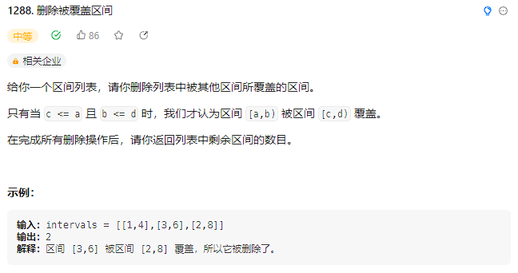
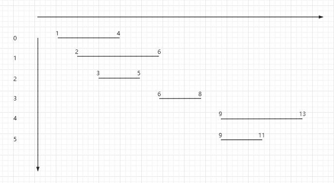
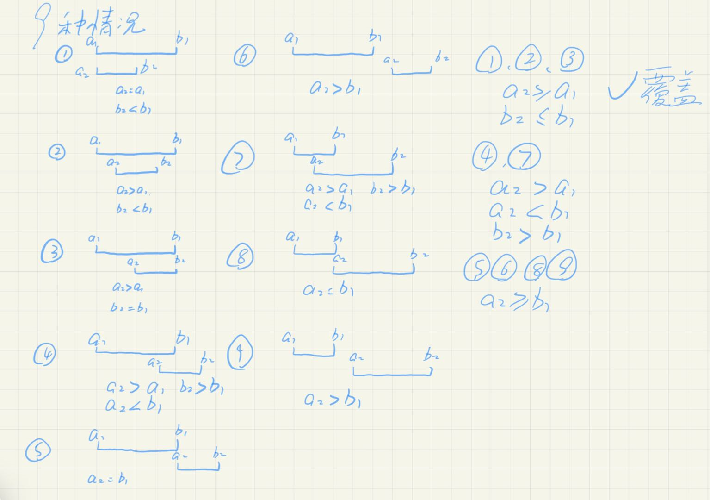
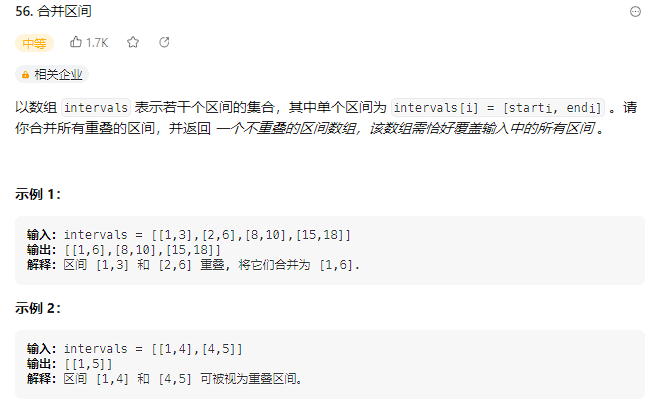
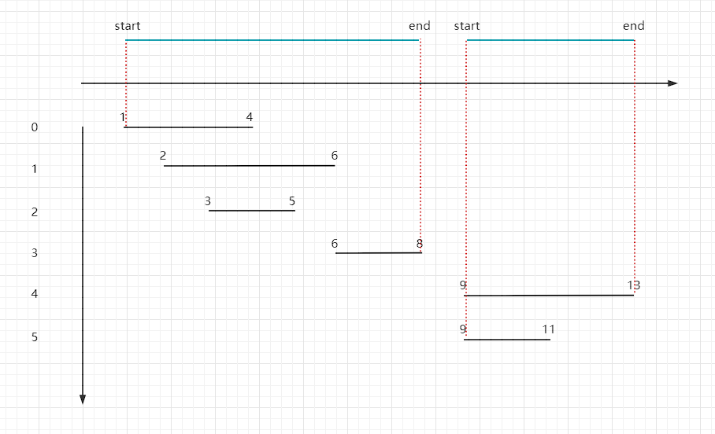
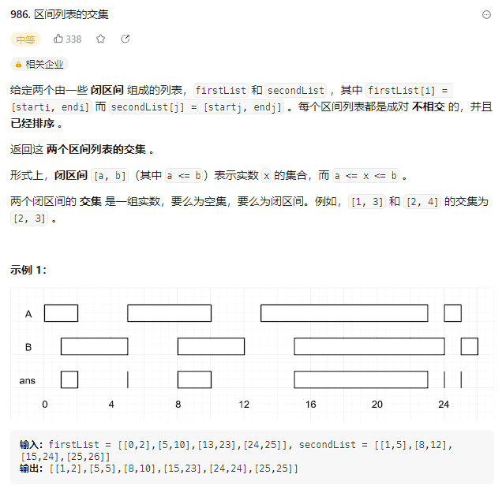

## 区间问题

区间问题是什么，其实就是给了你一组区间，比如`[[2,6],[9,13],[6,8],[1,4],[3,5],[9,11]]`

然后让你有多少区间是被覆盖的，合并所有可以合并的区间等等操作

这种题目就两个步骤

第一步排序，按照左边界升序排序，右边界降序排序

第二步画图，画出两个边界之间的关系的所有可能的情况

### [1288.删除被覆盖的区间](https://leetcode.cn/problems/remove-covered-intervals/description/)



然后我们按照以上两个步骤来解决这道题

#### 排序

以`[[2,6],[9,13],[6,8],[1,4],[3,5],[9,11]]`作为测试数据

将其按照左边界升序排序，右边界降序排序后

变为`[[1,4],[2,6],[3,5],[6,8],[9,13],[9,11]]`

用图像来表示就是这样



#### 画图

然后我们来画图将所有出现的区间关系画出来



​	其中①②③这三种情况都是属于覆盖的情况，所以我只要将这些情况记录到res中，最后`intervals.length-res`就是需要删除的被覆盖的区间个数

​	④⑦都是属于区间相交的情况

​	⑤⑥⑧⑨属于区间交错的情况

心中有图，代码我有！

```java
class Solution {
    public int removeCoveredIntervals(int[][] intervals) {
        // 按照左边界升序排序，有边界降序排序
        Arrays.sort(intervals,(a,b)->a[0]==b[0]?b[1]-a[1]:a[0]-b[0]);
        // 记录被覆盖的区间个数
        int res = 0;
        // 记录左边界
        int left = intervals[0][0];
        // 记录右边界
        int right = intervals[0][1];
        // 从第二组边界开始遍历
        for(int i = 1; i < intervals.length;i++){
            // 拿到这组边界
            int[] interval = intervals[i];
            int a1 = interval[0];
            int b1 = interval[1];
            // 如果这组的边界的左边界大于等于left并且有边界小于right，则说明这组边界被[left,right]覆盖，res自增
            if (a1 >= left && b1 <= right) {
                res++;
            }
            // 如果这组边界的左边界大于等于right说明两者相错开，更新left和right
            if (a1 >= right) {
                left = a1;
                right = b1;
            }
            // 如果right在这组边界的中间，说明两组边界🍌相交吗，更新right
            // 这一步更新right其实就是合并这两个区间
            if (right >= a1 && right <= b1) {
                right = b1;
            }
        }
        return intervals.length-res;
    }
}
```

### [56.合并区间](https://leetcode.cn/problems/merge-intervals/)



这一题也是按照上述两个步骤做就行了，这里直接上代码

```java
class Solution {
    public int[][] merge(int[][] intervals) {
        // 排序
        Arrays.sort(intervals,(a,b)->a[0]==b[0]?b[1]-a[1]:a[0]-b[0]);
        // 因为不确定最后会保留几个区间，所以这里使用List来暂时保存结果
        List<int[]> res = new LinkedList<>();
        int left = intervals[0][0];
        int right = intervals[0][1];
        for(int i = 1;i < intervals.length;i++){
            int[] interval = intervals[i];
            int a1 = interval[0];
            int b1 = interval[1];
            // 如果区间完全相错，直接将[left,right]区间加入结果集中，更新left和right
            if(a1>right){
                res.add(new int[]{left,right});
                left = a1;
                right = b1;
                continue;
            }
            // 如果这个区间被[left,right]区间覆盖，不用管
            if(a1>=left&&b1<=right){
                continue;
            }
            // 这个区间和[left,right]区间相交，更新right为b1
            if(right>=a1&&right<b1){
                right = b1;
            }
        }
        // 将最后一个区间加入结果集
        res.add(new int[]{left,right});
        // 转换list为二维矩阵返回
        int[][] r = new int[res.size()][2];
        for (int i = 0; i < res.size(); i++) {
            r[i] = res.get(i);
        }
        return r;
    }
}
```

或者使用以下的方法

```java
class Solution {
    public int[][] merge(int[][] intervals) {
        Arrays.sort(intervals,(a,b)->a[0]==b[0]?b[1]-a[1]:a[0]-b[0]);
        List<int[]> res = new LinkedList<>();
        int left = intervals[0][0];
        int right = intervals[0][1];
        // 手动控制i的增长
        for(int i = 0;i < intervals.length;){
            int[] interval = intervals[i];
            int a1 = interval[0];
            int b1 = interval[1];
            // 如果相交或者覆盖
            if (a1>=left&&a1<=right){
                right = Math.max(right,b1);
                i++;
                // 当i小于intervals.length
                // 左边界在[left,right]之间
                // 则一直往后找最大的right
                while (i < intervals.length){
                    int[] temp = intervals[i];
                    if (temp[0] >= left && temp[0] <= right) {
                        right = Math.max(right,temp[1]);
                        i++;
                    }else {
                        break;
                    }
                }
                res.add(new int[]{left,right});
                // 如果找到了最后一个则直接退出循环
                if (i==intervals.length){
                    break;
                }
                left = intervals[i][0];
                right = intervals[i][1];
            }else {
                // 区间相错了，直接将区间[left,right]加入集合然后i++，更新jleft和right
                res.add(new int[]{left,right});
                left = a1;
                right = b1;
                i++;
            }
        }
        int[][] r = new int[res.size()][2];
        for (int i = 0; i < res.size(); i++) {
            r[i] = res.get(i);
        }
        return r;
    }
}
```




### [986.区间列表的交集](https://leetcode.cn/problems/interval-list-intersections/)



这道题和上述思路一致的，只需要将交集的部分放入res中

```java
class Solution {
    public int[][] intervalIntersection(int[][] firstList, int[][] secondList) {
        List<int[]> res = new LinkedList<>();
        int firstIndex = 0;
        int secondIndex = 0;
        while(firstIndex<firstList.length&&secondIndex<secondList.length){
            int[] firstInterval = firstList[firstIndex];
            int[] secondInterval = secondList[secondIndex];
            // 相交
            if(firstInterval[1]>=secondInterval[0]&&firstInterval[0]<=secondInterval[1]){
                // 取两个左边最大的作为交集的左边界，取两个右边界最小的作为交集的右边界
                res.add(new int[]{
                    Math.max(secondInterval[0],firstInterval[0]),
                    Math.min(firstInterval[1],secondInterval[1])
                });
            }
            // 如果第二个区间的右边界比第一个区间的右边界大
            // 则firstIndex自增，因为第一个区间的右边界到第二个区间的左边界有可能被firstList的下一个区间相交的
            if(secondInterval[1]>firstInterval[1]){
                firstIndex++;
            }else {
                secondIndex++;
            }
        }
        int[][] r = new int[res.size()][2];
        for (int i = 0; i < res.size(); i++) {
            r[i] = res.get(i);
        }
        return r;
    }
}
```


