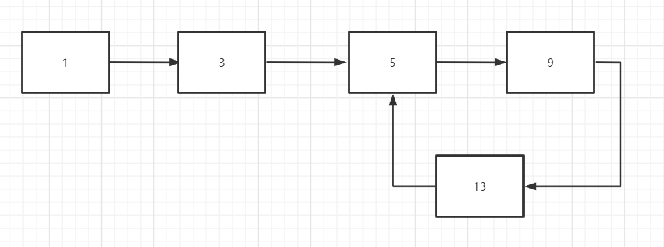
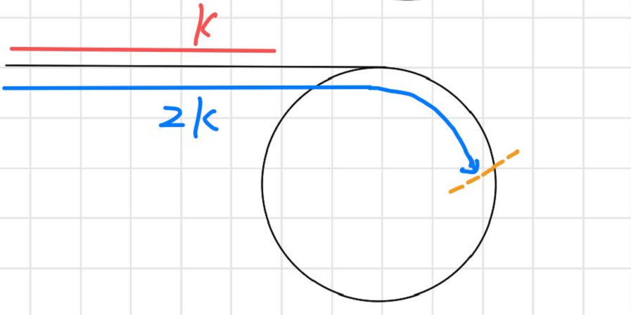
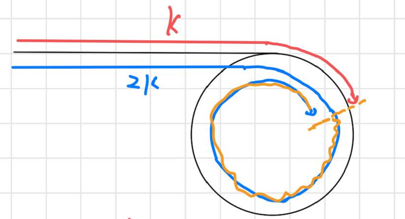
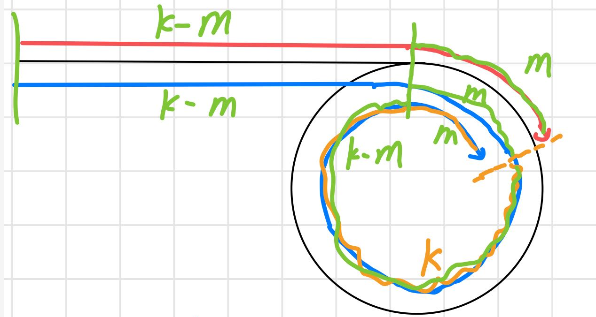
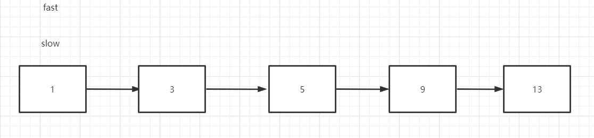
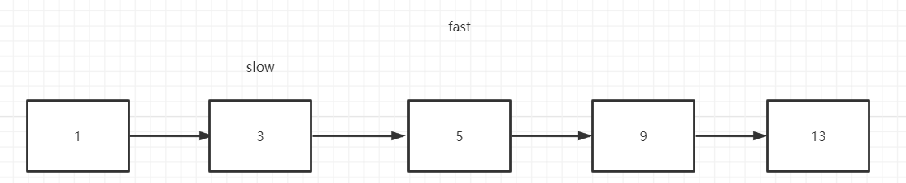
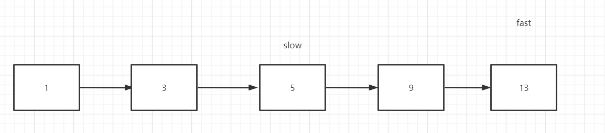
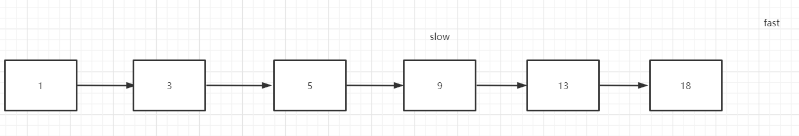
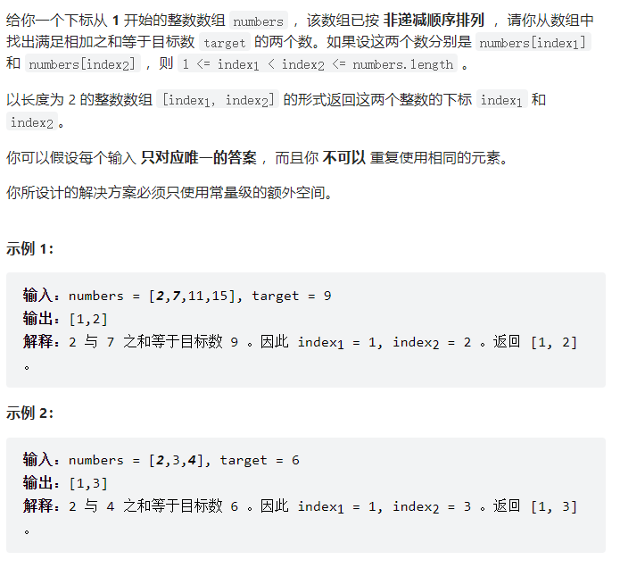

## 双指针技巧

对于双指针，一般分为**快慢指针**和**前后指针**

前者一般使用在链表中，后者一般使用在数组中。

```java
class ListNode {
    int val;
    ListNode next;
    ListNode(int val) {
        this.val = val;
        this.next = null;
    }
    ListNode(int val, ListNode next) {
        this.val = val;
        this.next = next;
    }
}
```

### 快慢指针

快慢指针一般初始化两个指针分别指向链表的头结点 `head`

前进时快指针 `fast` 在前

慢指针 `slow` 在后

这就是快慢指针的核心

#### 判断链表是否成环

[力扣141题：环形链表](https://leetcode-cn.com/problems/linked-list-cycle/)



单链表的特点是每一个节点只知道**后置节点**，不知道**前置节点**。如果我使用单指针想去解决这个判断成环

```java
public class Solution {
    public boolean hasCycle(ListNode head) {
        ListNode temp = head;
        while(temp != null){
            temp = temp.next;
        }
        return false;
    }
}
```

当链表成环的时候，因为没有一个节点的后置节点为`null`，所以该方法一定是死循环，无法退出。

经典解法就是使用两个指针，`fast`指针跑得快，`slow`指针跑得慢。

如果链表没有环，跑得快的那个指针最终会遇到 `null`，说明链表不含环；

如果链表有环，快指针最终会超慢指针一圈，和慢指针相等，说明链表含有环。

以下是解法

```java
public class Solution {
    public boolean hasCycle(ListNode head) {
        ListNode slow = head;
        ListNode fast = head;
        while (fast != null && fast.next != null) {
            slow = slow.next;
            fast = fast.next.next;
            if (slow == fast) {
                return true;
            }
        }
        return false;
    }
}
```

#### 已知链表有环，返回环开始的地方

[力扣142题：环形链表 II](https://leetcode-cn.com/problems/linked-list-cycle-ii/)


`5`就是那个环开始的地方

假设快指针走了`2k`步，则慢指针就一定走了`k`步，那么`k`其实就是环节点个数的整数倍





黄色的线就是快指针比慢指针多走的步数，即`k`,图上只画了一圈，但是实际可能**不止一圈**

设慢指针在环中走了`m`个节点。

则说明在环节点之前，一共有`k-m`个节点，就是说我可以从头结点往后走`k-m`次就可以找到该环开始的地方了。

但是如果想着如何把`k-m`求出来的话是有点困难的，所以我们来看看关于快指针的路径中可不可以出现`k-m`

我们现在来看看快指针走的`2k`长度的路径，它在环里面走过的路径长度是`k+m`，从相遇点到相遇点的距离是`k`

那么就是说快指针从相遇点在环中走`k-m`步就可以走到环开始的节点，

所以我们可以将slow置于`head`，与fast同步前进，当两个指针相同时，返回该值



代码：

```java
public class Solution {
    public ListNode detectCycle(ListNode head) {
        ListNode slow = head;
        ListNode fast = head;
        while (fast != null && fast.next != null) {
            slow = slow.next;
            fast = fast.next.next;
            if (slow == fast) {
                break;
            }
        }
        if (fast == null || fast.next == null) {
            return null;
        }
        slow = head;
        while (slow != fast) {
            slow = slow.next;
            fast = fast.next;
        }
        return fast;
    }
}
```

#### 寻找链表的中点

[力扣876：链表的中心节点](https://leetcode-cn.com/problems/middle-of-the-linked-list/)

给出一个无环的链表，要求返回该链表的中点

使用快慢指针，当fast指针走到尾部的时候，slow就在链表中间位置了

以下是节点个数为奇数的情况







以下是节点个数为偶数的结果



可以发现，当个数为奇数的时候，慢指针正好在中心位置，

当个数为偶数的时候，慢指针在中心偏右的位置

这个算法在链表的归并算法中常常被用到

代码：

```java
public ListNode middleNode(ListNode head) {
    ListNode slow = head;
    ListNode fast = head;
    while(fast != null && fast.next != null){
        slow = slow.next;
        fast = fast.next.next;
    }
    return slow;
}
```

这是hash实现

```java
public ListNode middleNode(ListNode head) {
    Map<Integer, ListNode> map = new HashMap<>();
    ListNode curr = head;
    int i = 0;
    while(curr != null){
        map.put(i++,curr);
        curr = curr.next;
    }
    return map.get(i/2);
}
```

#### 删除倒数第n个节点

[力扣19题：删除倒数第n个节点](https://leetcode-cn.com/problems/remove-nth-node-from-end-of-list/)

思路就是快指针先走n步，然后慢指针和快指针同步向前，当快指针的next是null的时候，慢指针的下一个就是倒数第n个节点

```java
class Solution {
    public ListNode removeNthFromEnd(ListNode head, int n) {
        ListNode slow = head;
        ListNode fast = head;
        while (n-- > 0) {
            fast = fast.next;
        }
        if (fast == null) {
            return head.next;
        }
        while (fast.next != null) {
            slow = slow.next;
            fast = fast.next;
        }
        slow.next = slow.next.next;
        return head;
    }
}
```

### 左右指针

左右指针一般初始化`left right`两个变量来表示左边界和右边界

#### 二分查找

这里就不赘述二分查找的细节了，之前有写，这里就写一种最常见的

查找target找到则返回索引，没有找到则返回-1

```java
int binarySearch(int[] nums, int target) {
    int left = 0; 
    int right = nums.length - 1;
    int mid;
    while(left <= right) {
        mid = (right + left) / 2;
        if(nums[mid] == target){
            return mid; 
        } else if (nums[mid] < target){
            left = mid + 1; 
        } else if (nums[mid] > target){
            right = mid - 1;
        }
    }
    return -1;
}
```

#### 两数之和



题目中说，该数组是递增的，

通过left和right来调整大小从而判断是否存在两个数使得和为target

```java
class Solution {
    public int[] twoSum(int[] numbers, int target) {
        int left = 0;
        int right = numbers.length-1;
        int mid;
        int sum;
        while(left < right){
            mid = (left + right) >> 1;
            sum=numbers[left] + numbers[right];
            if(sum == target){
                return new int[]{left+1, right+1};
            }else if(sum > target){
                // 使大的值变小
                right--;
            }else {
                // 使小的值变大
                left++;
            }
        }
        return new int[]{-1, -1};
    }
}
```

#### 反转数组

这个就很简单了，直接上代码

```java
void reverseString(int[] arr) {
    int left = 0;
    int right = arr.length - 1;
    while (left < right) {
        // 交换 arr[left] 和 arr[right]
        int temp = arr[left];
        arr[left++] = arr[right];
        arr[right--] = temp;
    }
}
```

#### 滑动窗口

这个就是左右指针的重头戏了，掌握了这个方法后，可以解决一大类子字符串匹配的问题！

这个放在下一篇文章中详解

