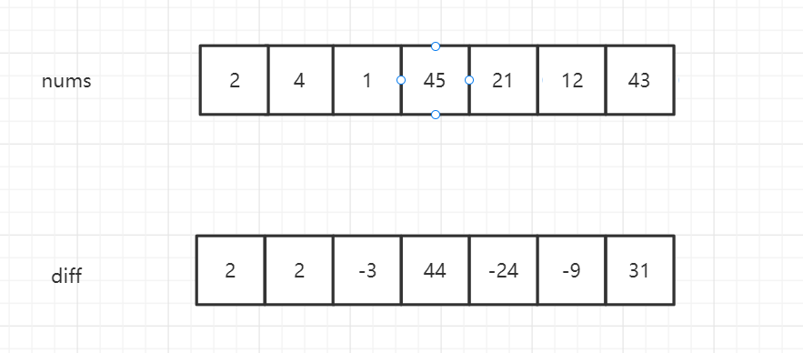
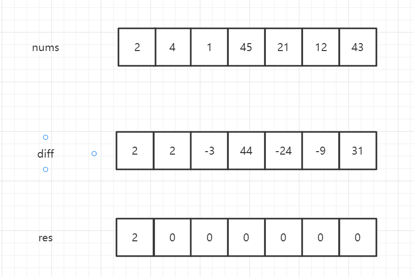
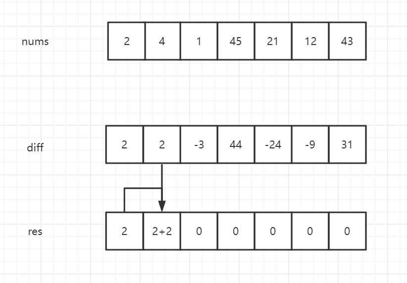
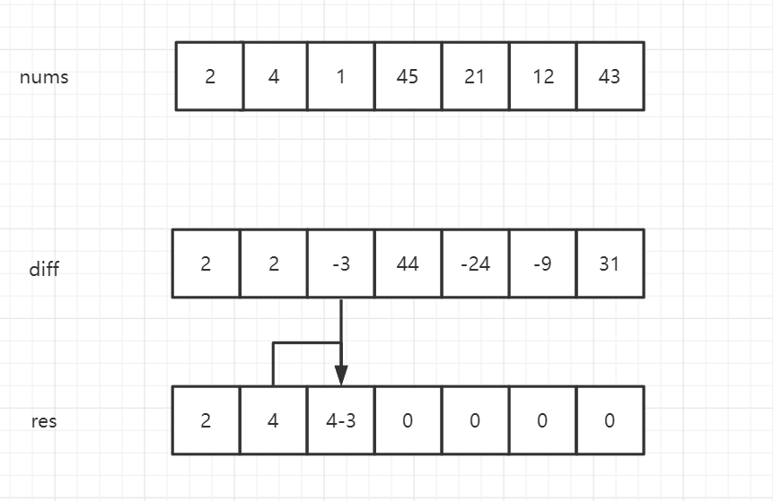
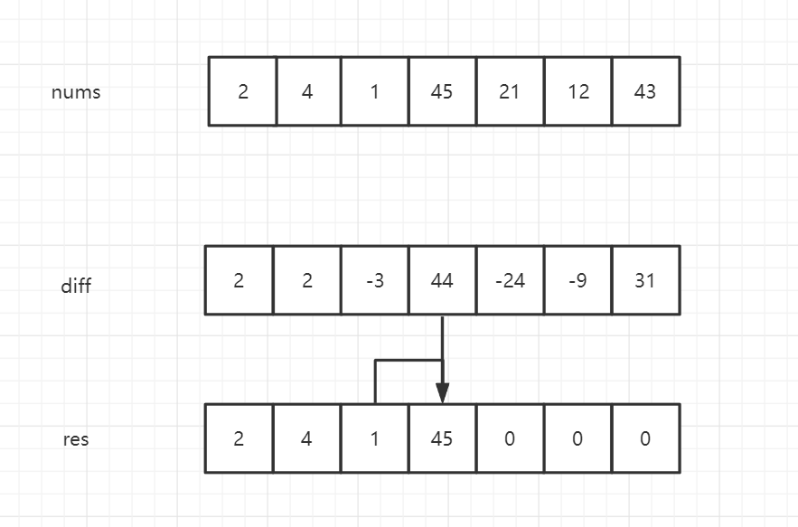
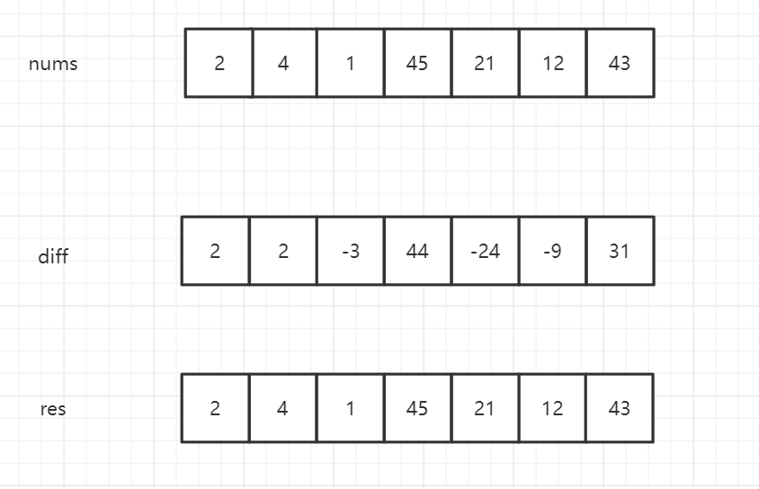

## 差分数组

该技巧和前缀和数组一样都是用在**数组**上的，

前缀和数组是用来简化 任意区间的元素之和的，

差分数组是用来简化 频繁在任意区间减去某个值或者在任意区间加上某个值，最后输出最后的数组结果的

比如，给你一个数组`nums[2,4,1,45,21,54,12,43]`，我需要先将`[2,4]`都加3，再将`[3,6]`都减1，再.....，最后输出最后的数组结果

如果没学过差分数组，那么应该是使用for循环将范围内的数都进行操作，最后输出数组，

对`nums`的操作十分频繁，这样的效率十分低下

这里我们就使用差分数组来提高我们的效率

```java
int[] diff = new int[nums.length];
diff[0] = nums[0];
for (int i = 1; i < nums.length; i++) {
    diff[i] = nums[i] - nums[i-1];
}
```



当`i!=0`的时候`diff[i]`代表`nums[i]-nums[i-1]`的值，即当前值与前一个值的差

那有了这个差分数组，我们怎么将数组还原呢？











```java
int[] res = new int[diff.length];
res[0] = diff[0];
for (int i = 1; i < diff.length; i++) {
    res[i] = res[i-1] + diff[i];
}
```

`diff`的还原是先new一个新的数组来存放最后的结果，对于0之后的元素，`res[i]`等于前一个元素加上当前索引的`diff`

如果我要将`[i,j]`区间加2，那么就将`diff[i]+=2;diff[j+1]-=2`即可

我将`diff[i]+=2`，即达到`res[i]`到最后都会被加上2的效果

我将`diff[j+1]-=2`，即达到`res[j+1]`之后，会将前面的加2抵消，所以`j`之后的元素就不会被影响了

我们来和之前的那道前缀和数组一样，抽象出来一个类来处理数组

```java
class Diff{
    private int[] diff;
    public Diff(int[] nums){
        
    }
    public void increase(int left, int right, int step){
        
    }
    public int[] getResult(){
        
    }
}
```

大家可以先自己写一下

这是实现：

```java
class Diff {
    private int[] diff;

    public Diff(int[] nums) {
        diff = new int[nums.length];
        diff[0] = nums[0];
        for (int i = 1; i < nums.length; i++) {
            diff[i] = nums[i] - nums[i - 1];
        }
    }

    public void increase(int left, int right, int step) {
        diff[left] += step;
        if (right < diff.length - 1) {
            diff[right + 1] -= step;
        }
    }

    public int[] getResult() {
        int[] result = new int[diff.length];
        result[0] = diff[0];
        for (int i = 1; i < diff.length; i++) {
            result[i] = result[i - 1] + diff[i];
        }
        return result;
    }
}
```

### 小试牛刀

接下来就要实践出真知，来看一下这道力扣题，这道题在力扣上是plus会员才可以查看，这里直接将题目简述给大家

#### [力扣370：区间加法](https://leetcode-cn.com/problems/range-addition/)

```bash
# 370.区间加法
假设你有一个长度为 n 的数组nums，初始情况下所有的数字均为 0，你将会被给出 k 个更新的操作。
其中，每个操作会被表示为一个三元组：[left,right,step]，你需要该区间[left,right] (包括left和right)增加step。
请你返回 k 次操作后的数组。
# 示例
len=5,updates=[[1,3,3],[2,4,-5],[0,3,4]]
原数组变为 [0,0,0,0,0]
原数组变为 [0,3,3,3,0]
原数组变为 [0,3,-2,-2,-5]
原数组变为 [4,7,2,2,-5]
result: [4,7,2,2,-5]

# 方法签名
public int[] getModifiedArray(int[] nums, int[][] updates) {
    
}
```

只要懂了上面的`Diff`类的写法，这题轻轻松松拿下！

代码：

```java
public int[] getModifiedArray(int[] nums, int[][] updates) {
    int[] diff = new int[nums.length];
    diff[0] = nums[0];
    for (int i = 1; i < diff.length; i++) {
        diff[i] = nums[i] - nums[i - 1];
    }
    for (int[] update : updates) {
        diff[update[0]] += update[2];
        if (update[1] + 1 < diff.length) {
            diff[update[1] + 1] -= update[2];
        }
    }
    int[] result = new int[diff.length];
    result[0] = diff[0];
    for (int i = 1; i < result.length; i++) {
        result[i] = result[i - 1] + diff[i];
    }
    return result;
}
```

既然我们之前写了`Diff`那么我们就可以使用它

```java
public int[] getModifiedArray1(int[] nums, int[][] updates) {
    Diff diff = new Diff(nums);
    for (int[] update : updates) {
        diff.increase(update[0], update[1], update[2]);
    }
    return diff.getResult();
}
```

#### [力扣1109：航班预订统计](https://leetcode-cn.com/problems/corporate-flight-bookings/)

本质是一样的，只不过这边需要注意一下索引和编号的对应关系，

```java
class Solution {
    public int[] corpFlightBookings(int[][] bookings, int n) {
        int[] diff = new int[n];
        for (int[] booking : bookings) {
            diff[booking[0] - 1] += booking[2];
            if (booking[1] < n) {
                diff[booking[1]] -= booking[2];
            }
        }
        int[] answer = new int[diff.length];
        answer[0] = diff[0];
        for (int i = 1; i < answer.length; i++) {
            answer[i] = answer[i - 1] + diff[i];
        }
        return answer;
    }
}
```

相信学完这些，你对差分数组的理解也比较深刻了

