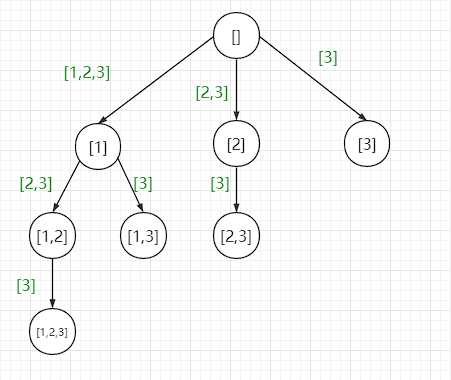
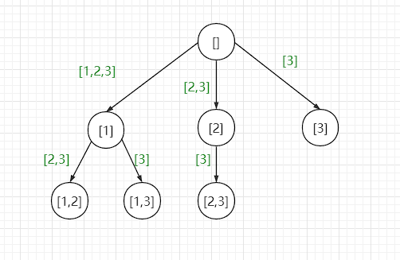
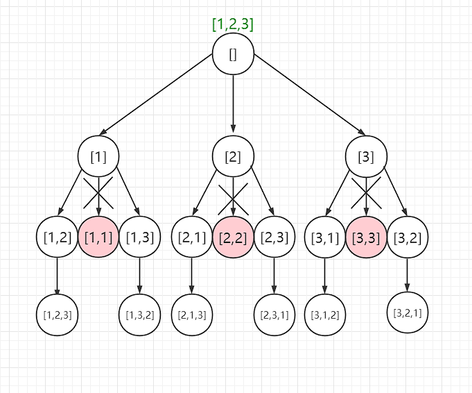

## 算法-子集、排列、组合问题

### 子集

输入一个不包含重复元素的数组，求它的子集，函数签名如下

```java
 public List<List<Integer>> subsets(int[] nums);
```

 比如输入了`[1,2,3]`

返回以下数据

 ```json
 [
     [],
     [1],
     [2],
     [3],
     [1,2],
     [1,3],
     [2,3],
     [1,2,3]
 ]
 ```

#### 递归

第一个解法就是我们可以通过小规模问题推导出大规模问题的，即分治的方式来解决

> 空数组的子集

`subsets([])=[[]]`

> 1的子集

`subsets([1])=[[],[1]]`

> 2的子集

`subsets([1,2])=[[],[1],[2],[1,2]]`

>  3的子集

 `subsets([1,2,3])=[[],[1],[2],[3],[1,2],[1,3],[2,3],[1,2,3]`

 通过数学归纳法，我们可以发现，大规模的求子集问题可以通过小规模的求子集问题中推导得知

 2的子集可以由1的子集再加上1的子集中每一个元素加上2求得

 3的子集可以由2的子集再加上2的子集中每一个元素加上3求得

 这不就是典型的递归和分治的思想吗

```java
public List<List<Integer>> subsets(int[] nums){
    return subsets(nums,0);
}

/**
     * 返回到[index,nums.length)的所有数字的子集
     * @param nums
     * @param index
     * @return
     */
public List<List<Integer>> subsets(int[] nums,int index){
    if(index == nums.length){
        List<List<Integer>> res = new LinkedList<>();
        res.add(new LinkedList<>());
        return res;
    }
    List<List<Integer>> subPro = subsets(nums, index + 1);
    int size = subPro.size();
    // 将当前元素加入到之前求得的每一个子集中，并加入这个子集，求得[index,nums.length)的子集
    for (int i = 0; i < size; i++) {
        // 这里要复制一份，不然最后的结果会有问题
        LinkedList<Integer> append = new LinkedList<>(subPro.get(i));
        append.add(nums[index]);
        subPro.add(append);
    }
    return subPro;
}
```

#### 回溯

还可以使用回溯的思想来解决这道题，直接套用回溯的模板

```java
public List<List<Integer>> subsets(int[] nums) {
    LinkedList<List<Integer>> res = new LinkedList<>();
    LinkedList<Integer> track = new LinkedList<>();
    backTrack(nums, 0, track, res);
    return res;
}
// 路径：track
// 选择列表：[start,nums.length)
// 结束条件：没有，就是要穷举每一种可能，将每一次选择都记录下来
private void backTrack(int[] nums, int index, LinkedList<Integer> track, LinkedList<List<Integer>> res) {
    res.add(new LinkedList<>(track));
    for (int i = index; i < nums.length; i++) {
        track.addLast(nums[i]);
        backTrack(nums, index + 1, track, res);
        track.removeLast();
    }
}
```

`nums=[1,2,3]`的决策树如下

绿色的数组代表的是选择列表



### 组合

输入两个数字 `n, k`，算法输出 `[1..n]` 中 k 个数字的所有组合，方法签名如下

```java
List<List<Integer>> combine(int n, int k);
```

这是一个很典型的回溯的问题

n限制了树的宽度，k限制了树的高度

```java
public List<List<Integer>> combine(int n, int k) {
    List<List<Integer>> res = new LinkedList<>();
    List<Integer> track = new LinkedList<>();
    combine(n, k, 1, track, res);
    return res;
}

// 路径：track
// 选择列表：[start,n]
// 结束条件：k==track.size()
private void combine(int n, int k, int start, List<Integer> track, List<List<Integer>> res) {
    if (k == track.size()) {
        res.add(new LinkedList<>(track));
        return;
    }
    for (int i = start; i <= n; i++) {
        track.add(i);
        combine(n, k, i + 1, track, res);
        track.remove(track.size() - 1);
    }
}
```

`n = [1,2,3]`的时候的决策树是这样的

绿色的数组代表的是选择列表



可以发现这张决策树长得和求子集的时候的决策树很像

是这样的，求子集的时候是将每一个节点的选择都记录下来了

而求组合问题的时候，其实就是只要叶子节点的选择

### 排列

输入一个数组`nums`，返回这个数组的所有排列方式，函数签名如下

```java
public List<List<Integer>> permute(int[] nums);
```

`nums=[1,2,3]`的决策树如下



```java
class Solution {
    public List<List<Integer>> permute(int[] nums) {
        List<List<Integer>> res = new LinkedList<>();
        LinkedList<Integer> track = new LinkedList<>();
        permute(nums, track, res);
        return res;
    }

    // 路径：track中的数字
    // 选择列表：通过track和nums推得
    // 结束条件：track的长度等于nums的长度
    private void permute(int[] nums, LinkedList<Integer> track, List<List<Integer>> res) {
        if (track.size() == nums.length) {
            res.add(new LinkedList<>(track));
            return;
        }
        for (int i = 0; i < nums.length; i++) {
            if (track.contains(nums[i])) {
                continue;
            }
            track.add(nums[i]);
            permute(nums, track, res);
            track.removeLast();
        }
    }
}
```

排列问题中通过 `contains` 方法来排除在 `track` 中已经选择过的数字，从而得到选择列表，因为维护一个选择列表比较麻烦，所以用了这种推导的方式

组合问题通过维护一个 `start` 参数，来排除 `start` 索引之前的数字，从而得到选择列表，因为组合中`[1,2]`和`[2,1]`是算重复的
