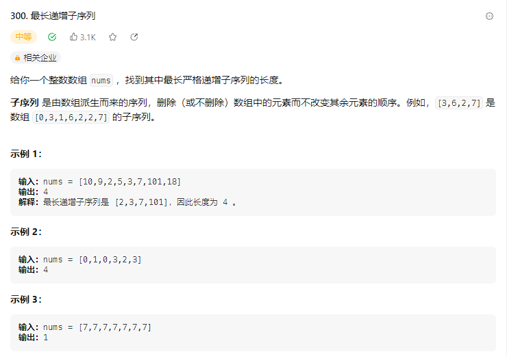
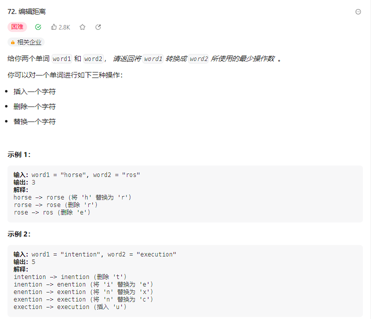
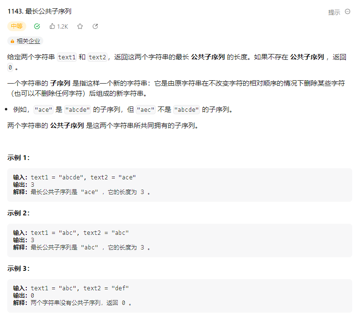
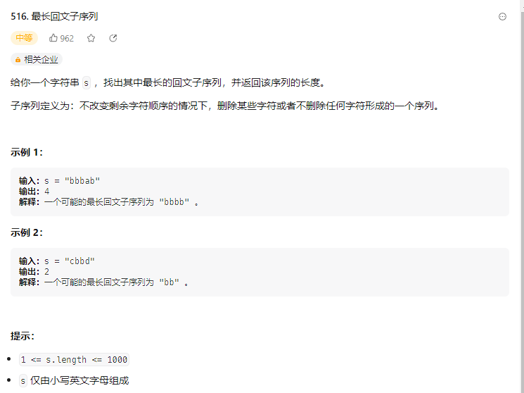

## 子序列问题

子序列问题是很常见的一类动态规划的问题，与之类似的还有子串问题，这两者有什么区别呢？

子序列是不需要连续的，但是字串是需要连续的。

`"abcd"`

子序列是`["a","b","c","d","ab","ac","ad","bc","bd","cd"]`

字串是`["a","b","c","d","ab","bc","cd"]`

观察一下两者之间的区别。

这类子序列问题一般使用动态规划来做，一般有以下两种思路

### 一维dp数组

#### 最长递增子序列



状态：索引的位置

选择：向后移

dp[ i ]：nums的 [0 ...  i] 区间的递增子序列的长度

base case ：dp[0 ...  i] = 1

```java
public int lengthOfLIS(int[] nums) {
    int[] dp = new int[nums.length];
    // 初始状态是自己成递增子序列，长度为1
    Arrays.fill(dp, 1);
    for (int i = 1; i < dp.length; i++) {
        int temp = nums[i];
        // 往前面找
        for (int j = i - 1; j >= 0; j--) {
            // 找到一个比nums[i]位置大的值，就更新下dp[i]
            if (nums[j] > temp) {
                dp[i] = Math.max(
                        dp[i],
                    // dp[0..j]加上nums[i]这个值
                        dp[j] + 1
                );
            }
        }
    }
    // 返回dp数组中的最大值
    return max(dp);
}

private int max(int... num) {
    int max = num[0];
    for (int i = 1; i < num.length; i++) {
        max = Math.max(min, num[i]);
    }
    return max;
}
```

### 二维dp

```bash
# 涉及两个字符串/数组时，dpdp[i][j] 的含义如下：
在子数组arr1[0..i]和子数组arr2[0..j]中，要求的子序列长度
例：最长公共子序列、编辑距离

# 只涉及一个字符串/数组时，dp[i][j] 数组的含义如下：
在子数组arr[i..j]中，要求的子序列的长度
例：最长回文子序列
```

#### 最短编辑距离



> dp\[ i \] \[ j \]：将word1 [ 0 , i )变为word2 [ 0 , j )的最少操作数

```java
public int minDistance(String word1, String word2) {
    int[][] dp = new int[word1.length() + 1][word2.length() + 1];
    for (int i = 0; i < dp.length; i++) {
        dp[i][0] = i;
    }
    for (int j = 0; j < dp[0].length; j++) {
        dp[0][j] = j;
    }
    for (int i = 1; i < dp.length; i++) {
        for (int j = 1; j < dp[0].length; j++) {
            if (word1.charAt(i) == word2.charAt(j)) {
                dp[i][j] = dp[i - 1][j - 1];
            } else {
                dp[i][j] = min(
                        dp[i][j - 1] + 1, // 插入 
                        dp[i - 1][j] + 1, // 删除
                        dp[i - 1][j - 1] + 1 //替换
                );
            }
        }
    }
    return dp[word1.length()][word2.length()];
}

private int min(int... num) {
    int min = num[0];
    for (int i = 1; i < num.length; i++) {
        min = Math.min(min, num[i]);
    }
    return min;
}
```

#### 最长公共子序列



> dp \[ i ,  j \]：text1 [ 0 , i ) 与 text2[ 0 , j )的最长公共子序列长度

```java
public int longestCommonSubsequence(String text1, String text2) {
    int[][] dp = new int[text1.length() + 1][text2.length() + 1];
    for (int i = 1; i < dp.length; i++) {
        for (int j = 1; j < dp[0].length; j++) {
            if (text1.charAt(i - 1) == text2.charAt(j - 1)) {
                dp[i][j] = dp[i - 1][j - 1] + 1;
            } else {
                dp[i][j] = Math.max(
                        dp[i - 1][j],
                        dp[i][j - 1]
                );
            }
        }
    }
    return dp[text1.length()][text2.length()];
}
```

#### 最长回文子序列




> dp \[ i , j \]：s \[ i , j \]的最长回文子序列的长度

```java
public int longestPalindromeSubseq(String s) {
    int len = s.length();
    int[][] dp = new int[len][len];
    for (int i = 0; i < dp.length; i++) {
        dp[i][i] = 1;
    }
    for (int i = len - 2; i >= 0; i--) {
        for (int j = i + 1; j < len; j++) {
            if (s.charAt(i) == s.charAt(j)) {
                dp[i][j] = dp[i + 1][j - 1] + 2;
            } else {
                dp[i][j] = Math.max(
                        dp[i + 1][j],
                        dp[i][j - 1]
                );
            }
        }
    }
    return dp[0][len - 1];
}
```

另一种解法

```java
public int longestPalindromeSubseq(String s) {
    int len = s.length();
    int[][] dp = new int[len][len];
    for (int i = 0; i < dp.length; i++) {
        dp[i][i] = 1;
    }
    // 偏移对角线
    for (int offset = 1; offset < len; offset++) {
        for (int i = offset; i < len; i++) {
            int acI = i - offset;
            if (s.charAt(acI) == s.charAt(i)) {
                dp[acI][i] = dp[acI + 1][i - 1] + 2;
            } else {
                dp[acI][i] = Math.max(
                    dp[acI + 1][i],
                    dp[acI][i - 1]
                );
            }
        }
    }
    return dp[0][len - 1];
}
```


