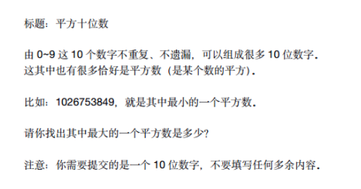
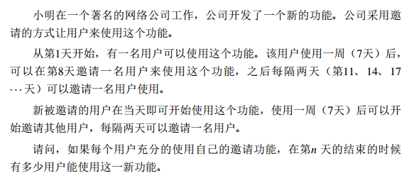
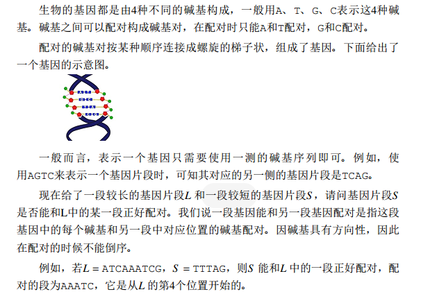

## 题目 1：平方十位数



### 分析

一共 1 0 位的数字，由 0 - 9这 1 0 个数字不重复，不遗漏，组成 1 0 位数字

需要我们返回最大的是平方数是哪一个

一共有 `10 * 9 * 8 * 7 * 6 * 5 * 4 * 3 * 2 * 1 = 3628800` 种可能

先来看看如何求得所有的可能组合情况

```java
private static void maxTenNumber() {
    // 每一位所有的情况
    int[] choose = {0, 1, 2, 3, 4, 5, 6, 7, 8, 9};
    // 路径
    LinkedList<Integer> track = new LinkedList<>();
    // 结果集
    LinkedList<Long> res = new LinkedList<>();
    // 递归
    maxTenNumber(choose, track, res);
    // 升序排序
    res.sort(Long::compareTo);
    // 打印所有
    for (int i = res.size() - 1; i >= 0; i--) {
        System.out.println(res.get(i));
    }
}
private static void maxTenNumber(int[] choose, LinkedList<Integer> track, LinkedList<Long> res) {
    // 如果长度到了choose的length
    if (track.size() == choose.length) {
        // 将track组成long放入res
        res.add(parseToLong(track));
        return;
    }
    // 遍历每一种可能
    for (int i = 0; i < choose.length; i++) {
        // 如果路径中已经有了，那就跳过这次选择
        if (track.contains(choose[i])) {
            continue;
        }
        // 做出选择
        track.addLast(choose[i]);
        // 递归
        maxTenNumber(choose, track, res);
        // 撤销选择
        track.removeLast();
    }
}

private static long parseToLong(LinkedList<Integer> track) {
    // 将track按次序追加到temp
    StringBuilder temp = new StringBuilder();
    for (int i = 0; i < track.size(); i++) {
        temp.append(track.get(i));
    }
    return Long.parseLong(temp.toString());
}
```

接着将res升序排序，倒序遍历，找到第一个符合平方数条件的数字并返回

### 示例代码

```java
private static void maxTenNumber() {
    // 每一位所有的情况
    int[] choose = {0, 1, 2, 3, 4, 5, 6, 7, 8, 9};
    // 路径
    LinkedList<Integer> track = new LinkedList<>();
    // 结果集
    LinkedList<Long> res = new LinkedList<>();
    // 递归
    maxTenNumber(choose, track, res);
    // 升序排序
    res.sort(Long::compareTo);
    for (int i = res.size() - 1; i >= 0; i--) {
        String nStr = String.valueOf(Math.sqrt(res.get(i)));
        if (Long.parseLong(nStr.substring(nStr.lastIndexOf(".") + 1)) == 0) {
            return n;
        }
    }
    return -1;
}
private static void maxTenNumber(int[] choose, LinkedList<Integer> track, LinkedList<Long> res) {
    // 如果长度到了choose的length
    if (track.size() == choose.length) {
        // 将track组成long放入res
        res.add(parseToLong(track));
        return;
    }
    // 遍历每一种可能
    for (int i = 0; i < choose.length; i++) {
        // 如果路径中已经有了，那就跳过这次选择
        if (track.contains(choose[i])) {
            continue;
        }
        // 做出选择
        track.addLast(choose[i]);
        // 递归
        maxTenNumber(choose, track, res);
        // 撤销选择
        track.removeLast();
    }
}

private static long parseToLong(LinkedList<Integer> track) {
    // 将track按次序追加到temp
    StringBuilder temp = new StringBuilder();
    for (int i = 0; i < track.size(); i++) {
        temp.append(track.get(i));
    }
    return Long.parseLong(temp.toString());
}
```

## 试题 2 ：卡片

小蓝有很多数字卡片，每张卡片上都是数字 0 到 9。

小蓝准备用这些卡片来拼一些数，他想从 1 开始拼出正整数，每拼一个，就保存起来，卡片就不能用来拼其它数了。

小蓝想知道自己能从 1 拼到多少。

例如，当小蓝有 30 张卡片，其中 0 到 9 各 3 张，则小蓝可以拼出 1 到 10，但是拼 11 时卡片 1 已经只有一张了，不够拼出 11。

现在小蓝手里有 0 到 9 的卡片各 2021 张，共 20210 张，请问小蓝可以从1拼到多少？

### 示例代码

```java
private static int assembled(int sumGroup) {
    int[] array = new int[10];
    Arrays.fill(array, sumGroup);
    int counter = 1;
    while (true) {
        int temp = counter;
        while (temp != 0) {
            // 将每一位的数字剩余数目自减 1
            array[temp % 10]--;
            // 如果这个数字用完了
            if (array[temp % 10] < 0) {
                // 说明当前数字已经不够用了，所以是counter减1后的值
                return counter - 1;
            }
            temp /= 10;
        }
        counter++;
    }
}
```

## 试题 3：网站扩张



### 分析

将所有的员工都封装成一个对象，如下所示

```java
static class Person {
    // 已经加入的天数
    private int addDay;
    // 第几天加入的
    private int startDay;
    public Person(int addDay, int startDay) {
        super();
        this.addDay = addDay;
        this.startDay = startDay;
    }
}
```

将所有的员工都装入一个集合中，在每一天遍历每一个员工，判断其是否可以邀请用户即可

### 示例代码

```java
private static long expandPerson(int n) {
    LinkedList<Person> whole = new LinkedList<>();
    whole.add(new Person(0, 1));
    for (int day = 1; day <= n; day++) {
        LinkedList<Person> newPersons = new LinkedList<>();
        for (Person p : whole) {
            // 新人
            if (p.addDay < 7) {
                p.addDay++;
            } else if (p.addDay == 7) {
                // 正好满7天，邀请一名新人
                newPersons.add(new Person(0, day));
                p.addDay++;
            } else {
                // 老人每 3 天可以拉一个人，即隔 2 天拉一个人
                int hasStay = day - p.startDay - 7;
                if (hasStay % 3 == 0) {
                    newPersons.add(new Person(0, day));
                }
                p.addDay++;
            }
        }
        whole.addAll(newPersons);
    }
    return whole.size();
}

static class Person {
    private int addDay;
    private int startDay;
    public Person(int addDay, int startDay) {
        super();
        this.addDay = addDay;
        this.startDay = startDay;
    }
}
```

## 试题4：基因配对



### 分析

这道题其实本质上就是字符串匹配

`A`和`T`等价

`G`和`C`等价

只要将 L 或者 S 转化为它的等价字符串之后，问题就转化为了字符串匹配了

### 示例代码

> KMP 算法

```java
private static final char A = 'A';
private static final char T = 'T';
private static final char G = 'G';
private static final char C = 'C';
private int firstPairingIndex(String L, String S) {
    String target;
    String pattern;
    // 长的是target串
    // 短的是pattern串
    if (S.length() > L.length()) {
        pattern = L;
        target = S;
    } else {
        pattern = S;
        target = L;
    }
    char[] tArray = target.toCharArray();
    char[] pArray = pattern.toCharArray();
    // 转化pattern串
    parse(pArray);
    // 得到pattern的next数组
    int[] next = getNext(pArray);
    // 从target的第0位开始匹配
    for (int tIndex = 0; tIndex < tArray.length; ) {
        // 从pattern的第0位开始匹配
        int pIndex = 0;
        // 只要pIndex没到头，并且匹配成功，就一直往后走
        while (pIndex < pArray.length && pArray[pIndex++] == tArray[tIndex++]) {
        }
        // 如果pIndex走完了pattern，说明匹配成功
        if (pIndex == pArray.length) {
            // 匹配成功开始的位置就是tIndex减去模式串的长度
            return tIndex - pArray.length;
        }
        // 更新tIndex
        tIndex = tIndex - 1 - next[pIndex - 1];
    }
    // 匹配失败
    return -1;
}
// 返回pattern的next数组
private int[] getNext(char[] sArray) {
    int[] next = new int[sArray.length];
    // 初始化
    next[0] = -1;
    next[1] = 0;
    // 从第三个开始
    for (int index = 2; index < sArray.length; index++) {
        // 拿到[0,index-1]范围前后缀相等的长度
        int prev = next[index - 1];
        // 特殊情况，当pattern是AAAA的时候
        // index = 3
        // prev是1 index - 1 - prev是1时
        // next[index]的值直接就是next[index-1]
        if (prev >= index - 1 - prev) {
            next[index] = next[index - 1];
            continue;
        }
        // 如果前一位和之前的前缀相等长度的下一个字符相等，则当前next[index]为前一个next的值加上1
        if (sArray[prev] == sArray[index - 1]) {
            next[index] = next[index - 1] + 1;
        } else {
            // 否则就看前一位和第一个字符是否相等，如果相等，则是1，不相等，则是0
            next[index] = sArray[0] == sArray[index - 1] ? 1 : 0;
        }
    }
    return next;
}
private void parse(char[] sArray) {
    for (int i = 0; i < sArray.length; i++) {
        char cur = sArray[i];
        if (cur == A) {
            sArray[i] = T;
        } else if (cur == T) {
            sArray[i] = A;
        } else if (cur == G) {
            sArray[i] = C;
        } else if (cur == C) {
            sArray[i] = G;
        }
    }
}
```


