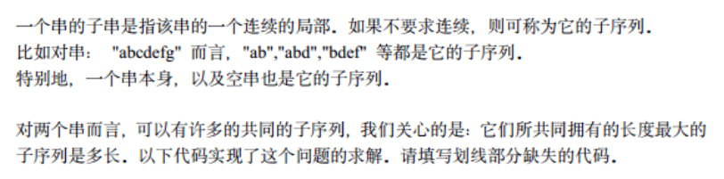
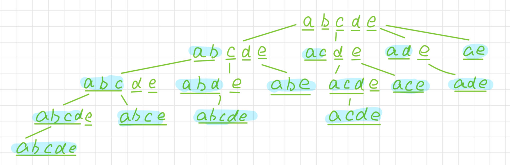
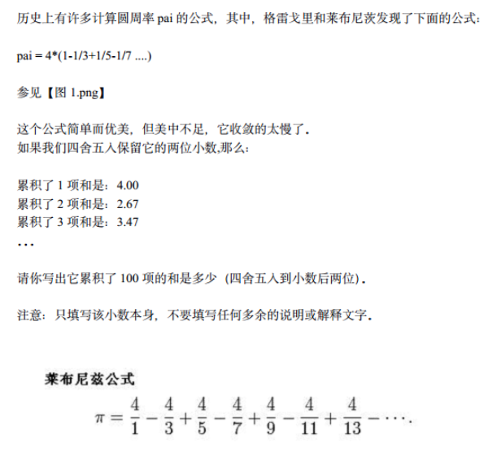
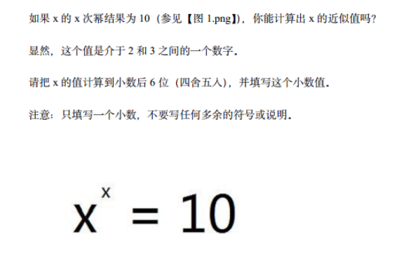
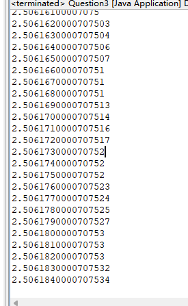
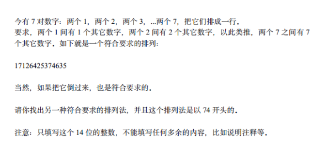
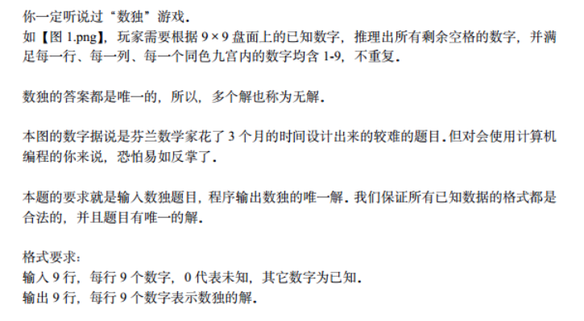

# C大学A组67149

```bash
# 题目PDF链接: https://pan.quark.cn/s/b99e9b59745b
# 虽然是 C 语言的组，但也可以看看题目练练手
```

## 试题 1



### 分析

子序列和子串的概念要分清

子串在原串中一定是连续的，而子序列就没有这个要求

举个栗子就明白了

> 对于字符串`apsl`

子序列：`[a, p, s, l, ap, as, al, ps, pl, sl, aps, apl, asl, apsl]`

子串：`[a, p, s, l, ap, ps, sl, aps, psl, apsl]`

这样就可以能够明白两者之间的差别了

题目既然需要两者的公共子序列，并且返回最长的公共子序列的长度

那我就可以分别得到两个字符串的子序列，然后取两者的交集

再把交集按照子序列长度排序，从而得到最长的子序列的长度

接下来问题就转化为了：给定一个字符串，如何得到它的子序列

还是刚刚那个栗子：`str = "apslk"`，如何科学的求得它的子序列



荧光的就是子序列，可以看到有重复的

```java
// 返回str的子序列集合
private static HashSet<String> getChildSequence(String str) {
    String[] chooses = new String[str.length()];
    for (int i = 0; i < str.length(); i++) {
        chooses[i] = String.valueOf(str.charAt(i));
    }
    HashSet<String> res = new HashSet<>();
    res.add(str);
    res.add("");
    getChildSequence(chooses, res, 0);
    return res;
}

private static void getChildSequence(String[] chooses, HashSet<String> res, int fixed) {
    // 如果长度为1了，就不需要再组合了
    if (chooses.length == 1) {
        return;
    }
    for (int i = fixed + 1; i < chooses.length; i++) {
        String[] assemble = assemble(fixed, i, chooses);
        // 将组合后的数组的第一个元素放入res中
        res.add(assemble[0]);
        // 递归调用
        getChildSequence(assemble, res, 0);
    }
}

private static String[] assemble(int fixed, int start, String[] chooses) {
    // 组合后的数组长度
    String[] assemble = new String[chooses.length - start];
    assemble[0] = chooses[fixed] + chooses[start++];
    for (int j = 1; j < assemble.length; j++) {
        assemble[j] = chooses[start++];
    }
    return assemble;
}
```

### 示例代码

#### 列举

```java
class Question1 {
    private static int maxLengthChildSequence(String str1, String str2) {
        Set<String> str1ChildSequence = getChildSequence(str1);
        Set<String> str2ChildSequence = getChildSequence(str2);
        LinkedList<String> intersection = new LinkedList<>();
        str1ChildSequence.forEach(s -> {
            if (str2ChildSequence.contains(s)) {
                intersection.add(s);
            }
        });
        // 按照长度升序排序
        intersection.sort((a, b) -> a.length() - b.length());
        // 得到最长的那个重复子序列的长度
        return intersection.getLast().length();
    }

    private static HashSet<String> getChildSequence(String str) {
        String[] chooses = new String[str.length()];
        for (int i = 0; i < str.length(); i++) {
            chooses[i] = String.valueOf(str.charAt(i));
        }
        HashSet<String> res = new HashSet<>();
        res.add(str);
        res.add("");
        getChildSequence(chooses, res, 0);
        return res;
    }
    
    private static void getChildSequence(String[] chooses, HashSet<String> res, int start) {
        if (chooses.length == 1) {
            return;
        }
        String choose = chooses[start];
        for (int i = start + 1; i < chooses.length; i++) {
            String[] assemble = assemble(start, i, chooses);
            res.add(assemble[0]);
            getChildSequence(assemble, res, 0);
        }
    }

    private static String[] assemble(int fixed, int start, String[] chooses) {
        String[] assemble = new String[chooses.length - start];
        assemble[0] = chooses[fixed] + chooses[start++];
        for (int j = 1; j < assemble.length; j++) {
            assemble[j] = chooses[start++];
        }
        return assemble;
    }
}
```

#### 递归

```java
public class Question1 {
	private static int maxLengthChildSequence(String str1, String str2) {
		return maxLengthChildSequence(str1, 0, str2, 0);
	}

	private static int maxLengthChildSequence(String str1, int index1, String str2, int index2) {
        // 递归退出条件
		if (index1 == str1.length() || index2 == str2.length()) {
			return 0;
		}
        // 如果当前位相等，那就都往后走一位
		if (str1.charAt(index1) == str2.charAt(index2)) {
			return maxLengthChildSequence(str1, index1 + 1, str2, index2 + 1) + 1;
		}
        // 当前位不相等
        // index1往后走一位或者index2往后走一位然后取两者最大值
		return Math.max(maxLengthChildSequence(str1, index1, str2, index2 + 1),
				maxLengthChildSequence(str1, index1 + 1, str2, index2));
	}
}
```

## 试题 2



### 示例代码

> 这题很简单，直接给示例代码了

```java
private static double calculatePai(int n) {
    int turn = 1;
    double pai = 0;
    int k = 1;
    for (int i = 0; i < n; i++, k += 2) {
        pai += turn * (1.0 / k);
        turn = turn * -1;
    }
    return pai * 4;
}
```

## 试题 3



### 分析

这题目乍一看很吓人，感觉根本算不出来，但是我们可以依靠程序去算

2 的 2 次方是4

3 的 3 次方是27

所以这个 x 一定是在 2 到 3 之间

### 示例代码

```java
public static void main(String[] args) {
    for (double i = 2; i < 3; i += 0.000_001) {
        // 如果与10之间的差距在0.000_000_001之间，那就说明i的i次方很接近10了
        if (Math.pow(i, i) - 10 <= 0.000_000_001) {
            System.out.println(i);
        }
    }
}
```




所以答案就是`2.506184`

## 试题 4



### 分析

这道题只需要读懂题目即可

然后根据题意得到一个符合要求的排列

比如：`74151643752362`

## 试题 5



### 分析

典型的回溯问题

### 示例代码

```java
private static void solveSudoku(int[][] sudo) {
    solveSudoku(sudo, 0, 0);
    // 题目保证数独有唯一的解
    for (int i = 0; i < sudo.length; i++) {
        System.out.println(Arrays.toString(sudo[i]));
    }
}

private static boolean solveSudoku(int[][] sudo, int row, int column) {
    // 到了最后一行了，判断是否符合数独的要求
    if (row == sudo.length) {
        return isRight(sudo);
    }
    // 换行
    if (column == sudo.length) {
        return solveSudoku(sudo, row + 1, 0);
    }
    // 本身不需要填数字
    if (sudo[row][column] != 0) {
        return solveSudoku(sudo, row, column + 1);
    }
    // 遍历每一种情况
    for (int i = 1; i <= 9; i++) {
        // 如果不合法直接跳过本次选择
        if (!isValid(sudo, row, column, i)) {
            continue;
        }
        // 做出选择
        sudo[row][column] = i;
        if (solveSudoku(sudo, row, column + 1)) {
            // 成功了就不要撤销了，并且直接返回
            return true;
        }
        // 撤销选择
        sudo[row][column] = 0;
    }
    return false;
}

private static boolean isRight(int[][] sudo) {
    int len = sudo.length;
    // 用来记录每一列的总和
    int[] columnSums = new int[len];
    // 应该的总和
    int rightSum = Arrays.stream(sudo[0]).sum();
    for (int i = 0; i < len; i++) {
        int rowSum = 0;
        for (int j = 0; j < len; j++) {
            // 将这一行的数据求和
            rowSum += sudo[i][j];
            // sudo[i][j]放入第j列的总和中
            columnSums[j] += sudo[i][j];
        }
        // 如果有一行的总和错了，直接返回
        if (rowSum != rightSum) {
            return false;
        }
    }
    // 如果有一列的总和错了，直接返回
    for (int columnSum : columnSums) {
        if (columnSum != rightSum) {
            return false;
        }
    }
    return true;
}

/**
 * 判断在sudo中[i,j]所在的九宫格是否有和place相等的值
 * 判断第 i 行是否有place
 * 判断第 j 列是否有place
 * @param sudo
 * @param i
 * @param j
 * @param place
 * @return
 */
private static boolean isValid(int[][] sudo, int i, int j, int place) {
    for (int k = 0; k < sudo.length; k++) {
        if (sudo[i][k] == place) {
            return false;
        }
        if (sudo[k][j] == place) {
            return false;
        }
        // 这里需要注意一下
        // 是判断[i,j]所在的九宫格是否存在place
        if (sudo[(i / 3) * 3 + k / 3][(j / 3) * 3 + k % 3] == place) {
            return false;
        }
    }
    return true;
}
```

