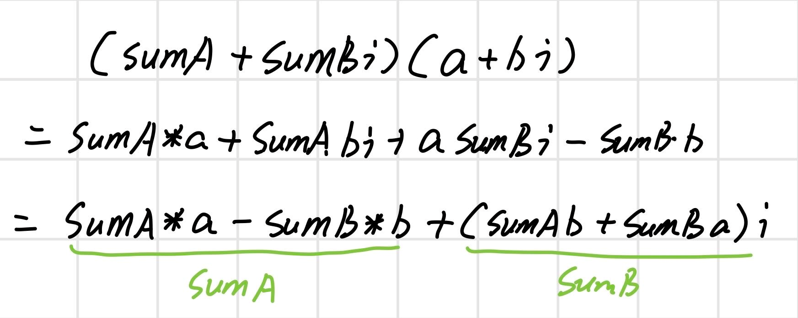

## 第九届蓝桥杯大赛软件赛省赛_Java_B组

### 试题A：第几天


#### 分析

直接调用Java的时间api即可

#### 参考答案

```java
public class QuestionA {
	public static void main(String[] args) {
		LocalDate date = LocalDate.of(2000, 5, 4);
		System.out.println(date.getDayOfYear());
	}
}
```

### 试题B：方格计数


#### 分析

先将问题拆解，求四个角的小方格

即只要求右上角的1/4⚪有多少小方格

转化为计算右上角的点的坐标是否在⚪内，只要右上角的点在⚪内，该小方格就是在⚪内

#### 参考答案

```java
public class QuestionB {
	public static void main(String[] args) {
		int r = 3;
		int counter = 0;
		for (int i = 1; i <= r; i++) {
			for (int j = 1; j <= r; j++) {
				if (Math.sqrt(i * i + j * j) <= r) {
					counter++;
				}
			}
		}
		System.out.println(counter * 4);
	}
}
```

### 试题C：复数幂


#### 分析

SumA和SumB是最后的结果

a和b是不变量：a一直是2，b一直是3



#### 参考答案

```java
public class QuestionC {
	static final int a = 2;
	static final int b = 3;

	public static void main(String[] args) {
		long sumA = a;
		long sumB = b;
		for (int i = 1; i < 123456; i++) {
			long tempA = sumA * a - sumB * b;
			long tempB = b * sumA + a * sumB;
			sumA = tempA;
			sumB = tempB;
		}
		System.out.println(sumA + "" + sumB + "i");
	}
}
```

### 试题D：测试次数


#### 分析

这题很古怪，我一开始是没做出来的

看了解析知道使用动态规划解的

使用动态规划的思路做了，但是找不到状态转移方程

看了解析，还是一脸懵逼

以下参考答案是在csdn找的

#### 参考答案

```java
public class Main {
    public static void main(String[] args) {
        int phoneNumber = 3;
        int level = 1000;
        int[][] dp = new int[level + 1][phoneNumber + 1];
        //当只有一层的时候不论几部手机都是只需要测试一次就可以得到结果
        for (int j = 1; j <= phoneNumber; ++j) {
            dp[1][j] = 1;
        }
        //当只有一部手机的时候，有多少层楼，最坏的情况下就需要测试多少次
        for (int i = 1; i <= level; ++i) {
            dp[i][1] = i;
        }
        for (int i = 2; i <= level; i++) {
            for (int j = 2; j <= phoneNumber; ++j) {
                //每次测试都有两种情况，要么碎了要么没碎
                //1.如果碎了就相当于待测试的楼层数为k-1，剩余的手机数-1
                //2.如果没有碎，就相当于剩余的楼层i-k，手机数量不变
                //dp就等于这两种情况测试次数最多的一个
                int min = Integer.MAX_VALUE;
                for (int k = 1; k <= i; k++) {
                    if (min > Math.max(dp[k - 1][j - 1], dp[i - k][j])) {
                        min = Math.max(dp[k - 1][j - 1], dp[i - k][j]) + 1;
                    }
                }
                dp[i][j] = min;
            }
        }
        System.out.println(dp[level][phoneNumber]);
    }
}
```

### 试题E：快速排序


#### 分析

题目的快排主要功能是查找第 k 大的数

#### 参考答案

```java
import java.util.Random;
public class Main{
    public static int quickSelect(int a[], int l, int r, int k) {
        Random rand = new Random();
        int p = rand.nextInt(r - l + 1) + l;
        int x = a[p];
        int tmp = a[p]; a[p] = a[r]; a[r] = tmp;
        int i = l, j = r;
        while(i < j) {
            while(i < j && a[i] < x) i++;
            if(i < j) {
                a[j] = a[i];
                j--;
            }
            while(i < j && a[j] > x) j--;
            if(i < j) {
                a[i] = a[j];
                i++;
            }
        }
        a[i] = x;
        p = i;
        if(i - l + 1 == k) return a[i];
        if(i - l + 1 < k) return quickSelect(a ,i + 1 ,r ,k - i + l - 1); //往右边找
        else return quickSelect(a, l, i - 1, k);
    }
    public static void main(String args[]) {
        int [] a = {1, 4, 2, 8, 5, 7};
        System.out.println(quickSelect(a, 0, 5, 4));
    }
}
```

### 试题F：递增三元组


#### 分析

先对三个数组排序

然后分别用三个指针aIndex、bIndex、cIndex指向数组的头部

每次遍历的时候将bIndex指向第一个比A[aIndex]大的位置

将cIndex指向第一个比C[bIndex]大的位置

这样的话bIndex之后都是比A[aIndex]大的数字

cIndex之后都是比B[bIndex]大的数字

这两个数字相乘累加起来，就是最后的答案

#### 参考答案

```java

public class QuestionF {
	public static void main(String[] args) {
		Scanner sc = new Scanner(System.in);
		int N = sc.nextInt();
		int[] A = new int[N];
		for (int i = 0; i < N; i++) {
			A[i] = sc.nextInt();
		}
		int[] B = new int[N];
		for (int i = 0; i < N; i++) {
			B[i] = sc.nextInt();
		}
		int[] C = new int[N];
		for (int i = 0; i < N; i++) {
			C[i] = sc.nextInt();
		}
        // 对三个数组进行排序
		Arrays.sort(A);
		Arrays.sort(B);
		Arrays.sort(C);
        // 三个指针
		int aIndex = 0;
		int bIndex = 0;
		int cIndex = 0;
		int sum = 0;
        // 遍历第一个数组
		while (aIndex < N) {
            // 将bIndex指向第一个比A[aIndex]大的位置
			while (bIndex < N && B[bIndex] < A[aIndex]) {
				bIndex++;
			}
            // 将cIndex指向第一个比B[bIndex]大的位置
			while (cIndex < N && C[cIndex] < B[bIndex]) {
				cIndex++;
			}
            // 累加
			sum += (N - bIndex) * (N - cIndex);
            // aIndex往后走
			aIndex++;
		}
		System.out.println(sum);
	}
}
```

### 试题G：螺旋折线


#### 分析

从原点螺旋走

边走边维护走的路径

直到走到目标点即可

#### 参考答案

```java

public class QuestionG {
    static final int[] UP = {0, 1};
    static final int[] DOWN = {0, -1};
    static final int[] LEFT = {-1, 0};
    static final int[] RIGHT = {1, 0};

    public static void main(String[] args) {
        Scanner scanner = new Scanner(System.in);
        int targetX = scanner.nextInt();
        int targetY = scanner.nextInt();
        LinkedList<int[]> sequence = new LinkedList<>();
        // 从原点出发，方向是定的
        sequence.add(LEFT);
        sequence.add(UP);
        sequence.add(RIGHT);
        sequence.add(DOWN);
        int x = 0;
        int y = 0;
        // 这一次需要走几步
        int len = 1;
        int sum = 0;
        out:
        while (true) {
            for (int i = 0; i < sequence.size(); i++) {
                int[] d = sequence.get(i);
                int tX = x + d[0] * len;
                int tY = y + d[1] * len;
                System.out.println(tX + " " + tY);
                while (x != tX || y != tY) {
                    x += d[0];
                    y += d[1];
                    // 步数加1
                    sum += 1;
                    if (x == targetX && y == targetY) {
                        break out;
                    }
                }
                // 第二次转弯的时候，长度需要加1
                if (i == 1) {
                    len++;
                }
            }
            // 这一圈转完了，长度需要加1
            len++;
        }
        System.out.println(sum);
    }
}
```

### 试题H：日志统计


#### 参考答案

```java

public class QuestionH {
	public static void main(String[] args) {
		Scanner scanner = new Scanner(System.in);
		// N行日志
		int N = scanner.nextInt();
		// 时间长度为D的区间
		// [T,T + D -1]
		int D = scanner.nextInt();
		// K个赞
		int K = scanner.nextInt();
		int[][] logs = new int[N][2];
		for (int i = 0; i < logs.length; i++) {
			logs[i][0] = scanner.nextInt();
			logs[i][1] = scanner.nextInt();
		}
		// 按照时间升序
		// 时间相同的情况下，按照帖子id升序
		// logs[i][0]->T
		// logs[i][1]->id
		Arrays.sort(logs, (a, b) -> a[0] == b[0] ? a[1] - b[1] : a[0] - b[0]);
		// 最长的时间结尾
		int timeEnd = logs[logs.length - 1][0];
		// 保存曾经是热帖的帖子id
		HashSet<Integer> set = new HashSet<>();
		// key->帖子id
		// value->帖子热度
		HashMap<Integer, Integer> map = new HashMap<>();
		// 从0时刻开始
		for (int i = 0; i < timeEnd; i++) {
			for (int j = 0; j < logs.length; j++) {
				int[] log = logs[j];
				int now = log[0];
				int tId = log[1];
                // 这条日志不适用
                if (now - i < 0){
                    continue;
                }
				// 超过时间范围了
				if (now - i >= D) {
					break;
				}
                // 记录这条帖子
				map.merge(tId, 1, Integer::sum);
			}
			map.forEach((tId, rd) -> {
				if (rd >= K) {
					set.add(tId);
				}
			});
			// 清除所有的记录
			map.clear();
		}
		System.out.println(set);
	}
}
```

##### 稍微改进了一下

主要体现在记录了下一次日志的开始遍历的位置

不需要每次都从日志的第一条开始遍历

```java
public class QuestionH {
	public static void main(String[] args) {
		Scanner scanner = new Scanner(System.in);
		// N行日志
		int N = scanner.nextInt();
		// 时间长度为D的区间
		// [T,T + D -1]
		int D = scanner.nextInt();
		// K个赞
		int K = scanner.nextInt();
		int[][] logs = new int[N][2];
		for (int i = 0; i < logs.length; i++) {
			logs[i][0] = scanner.nextInt();
			logs[i][1] = scanner.nextInt();
		}
		// 按照时间升序
		// 时间相同的情况下，按照帖子id升序
		// logs[i][0]->T
		// logs[i][1]->id
		Arrays.sort(logs, (a, b) -> a[0] == b[0] ? a[1] - b[1] : a[0] - b[0]);
		// 最长的时间结尾
		int timeEnd = logs[logs.length - 1][0];
		// 保存曾经是热帖的帖子id
		HashSet<Integer> set = new HashSet<>();
		// key->帖子id
		// value->帖子热度
		HashMap<Integer, Integer> map = new HashMap<>();
		int lIndex = 0;
		// 从0时刻开始
		for (int i = 0; i < timeEnd; i++) {
			int j = lIndex;
			while (j < logs.length) {
				int[] log = logs[j];
				int now = log[0];
				int tId = log[1];
				// 超过时间范围了
				if (now - i >= D) {
					break;
				}
				map.merge(tId, 1, Integer::sum);
				j++;
				lIndex++;
			}
			while (j < logs.length && lIndex >= 0 && logs[j][0] - logs[lIndex][0] < D) {
				lIndex--;
			}
			lIndex++;
			map.forEach((tId, rd) -> {
				if (rd >= K) {
					set.add(tId);
				}
			});
			// 清除所有的记录
			map.clear();
		}
		System.out.println(set);
	}
}
```

### 试题I：全球变暖


#### 参考答案

一开始我是这么写的，但是写完后，发现有问题

```java
public class QuestionI {
    static final String W = ".";
    static final String L = "#";

    public static void main(String[] args) {
        Scanner scanner = new Scanner(System.in);
        int n = Integer.parseInt(scanner.nextLine());
        int[][] water = new int[n][n];
        int[][] after = new int[n][n];
        for (int i = 0; i < water.length; i++) {
            String[] line = scanner.nextLine().split(" ");
            for (int j = 0; j < water.length; j++) {
                if (line[j].equals(W)) {
                    water[i][j] = 0;
                    after[i][j] = 0;
                } else {
                    water[i][j] = 1;
                    after[i][j] = 1;
                }
            }
        }
        int initSum = howMuchLand(water);
        System.out.println(initSum);
        for (int i = 1; i < water.length - 1; i++) {
            for (int j = 1; j < water.length - 1; j++) {
                if (water[i][j] == 0) {
                    continue;
                }
                // 向上、向下、向左、向右
                if (water[i - 1][j] == 0 || water[i + 1][j] == 0 || water[i][j - 1] == 0 || water[i][j + 1] == 0) {
                    after[i][j] = 0;
                }
            }
        }
        int afterSum = howMuchLand(after);
        System.out.println(afterSum);
        System.out.println(initSum - afterSum);
    }

    private static int howMuchLand(int[][] water) {
        boolean[][] visited = new boolean[water.length][water.length];
        int sum = 0;
        for (int i = 1; i < water.length - 1; i++) {
            for (int j = 1; j < water.length - 1; j++) {
                int c = water[i][j];
                if (c == 0) {
                    continue;
                }
                if (c == 1 && visited[i][j]) {
                    continue;
                }
                divergent(water, visited, i, j);
                sum += 1;
            }
        }
        return sum;
    }

    private static void divergent(int[][] water, boolean[][] visited, int i, int j) {
        if (i < 0 || i >= water.length || j < 0 || j >= water.length) {
            return;
        }
        if (water[i][j] == 0 || visited[i][j]) {
            return;
        }
        visited[i][j] = true;
        // 上
        divergent(water, visited, i - 1, j);
        // 下
        divergent(water, visited, i + 1, j);
        // 左
        divergent(water, visited, i, j - 1);
        // 右
        divergent(water, visited, i, j + 1);
    }
}
```

问题就是，可能会出现，淹没一开始的小岛后，会出现多个小岛，它们其实应该是同一个小岛，但是这样算就是算成了多个小岛

给小岛弄个编号即可

```java
public class QuestionI_2 {
    static final String W = ".";
    static final String L = "#";

    public static void main(String[] args) {
        Scanner scanner = new Scanner(System.in);
        int n = Integer.parseInt(scanner.nextLine());
        int[][] water = new int[n][n];
        int[][] after = new int[n][n];
        for (int i = 0; i < water.length; i++) {
            String[] line = scanner.nextLine().split(" ");
            for (int j = 0; j < water.length; j++) {
                if (line[j].equals(W)) {
                    water[i][j] = 0;
                    after[i][j] = 0;
                } else {
                    water[i][j] = 1;
                    after[i][j] = 1;
                }
            }
        }
        // 给小岛编号，从1开始编号
        // number返回的就是小岛的个数
        int number = initNumber(water);
        System.out.println(number);
        for (int i = 1; i < water.length - 1; i++) {
            for (int j = 1; j < water.length - 1; j++) {
                if (water[i][j] == 0) {
                    continue;
                }
                // 向上、向下、向左、向右
                if (water[i - 1][j] == 0 || water[i + 1][j] == 0 || water[i][j - 1] == 0 || water[i][j + 1] == 0) {
                    after[i][j] = 0;
                }
            }
        }
        // 保存最后还剩下几个小岛的编号，即剩下几个小岛
        HashSet<Integer> afterSet = new HashSet<>();
        for (int i = 0; i < after.length; i++) {
            for (int j = 0; j < after.length; j++) {
                if (after[i][j] == 0) {
                    continue;
                }
                afterSet.add(after[i][j]);
            }
        }
        System.out.println(afterSet.size());
        // 一开始的小岛数目 - 剩下的小岛数量
        System.out.println(number - afterSet.size());
    }

    private static int initNumber(int[][] water) {
        int number = 1;
        boolean[][] visited = new boolean[water.length][water.length];
        for (int i = 1; i < water.length - 1; i++) {
            for (int j = 1; j < water.length - 1; j++) {
                // 水直接跳过
                // 走过了
                if (water[i][j] == 0 || visited[i][j]) {
                    continue;
                }
                build(water, visited, i, j, number);
                number++;
            }
        }
        return number - 1;
    }

    private static void build(int[][] water, boolean[][] visited, int i, int j, int number) {
        if (i < 0 || i >= water.length || j < 0 || j >= water.length) {
            return;
        }
        // 如果是水或者已经被编过号了，跳过
        if (water[i][j] == 0 || visited[i][j]) {
            return;
        }
        visited[i][j] = true;
        build(water, visited, i - 1, j, number);
        build(water, visited, i + 1, j, number);
        build(water, visited, i, j - 1, number);
        build(water, visited, i, j + 1, number);
    }
}
```

### 试题J：堆的计数


