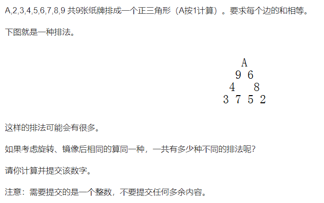
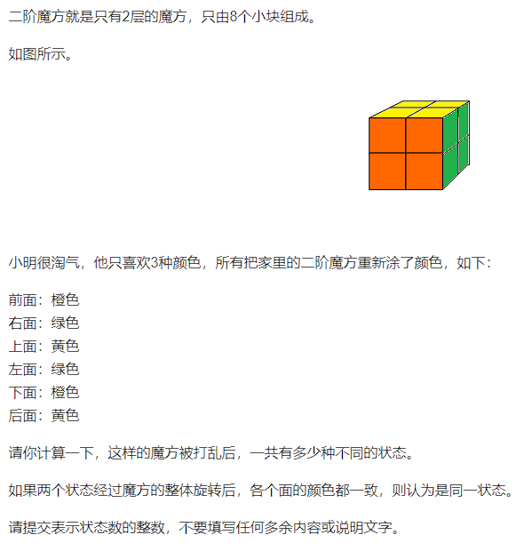
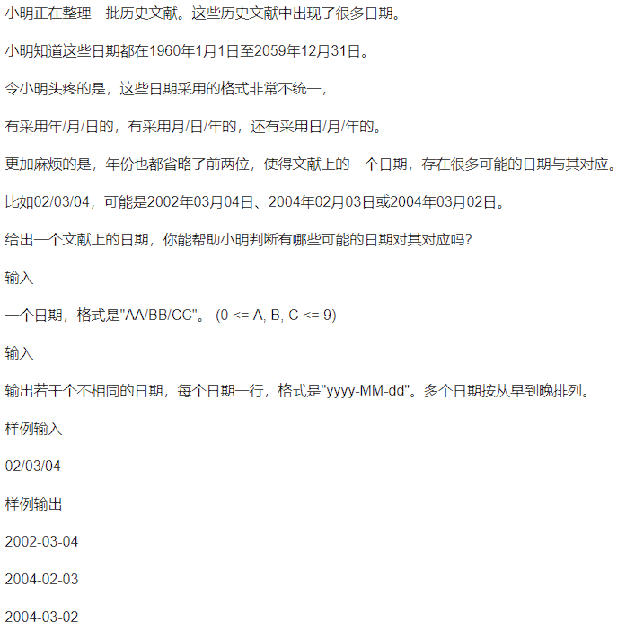
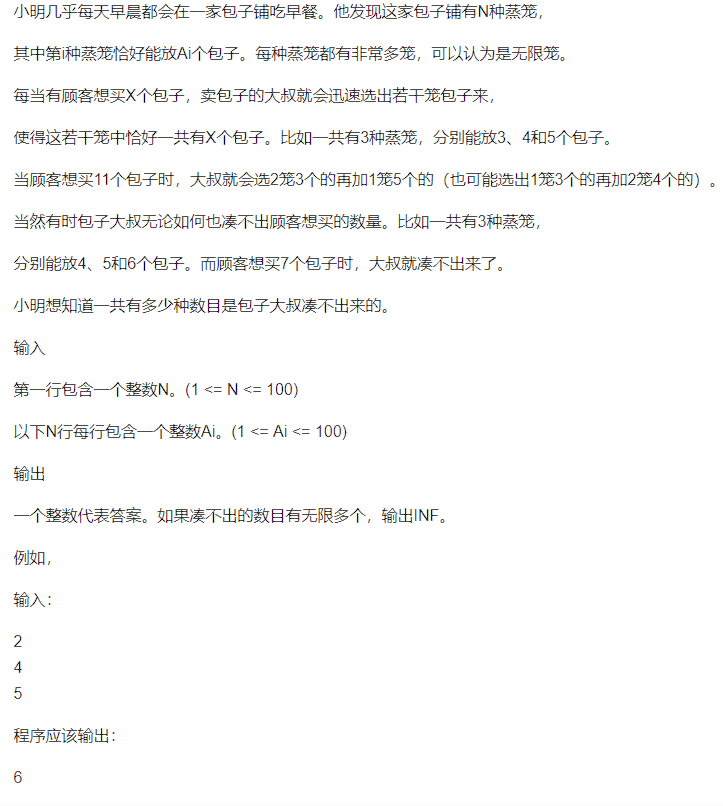
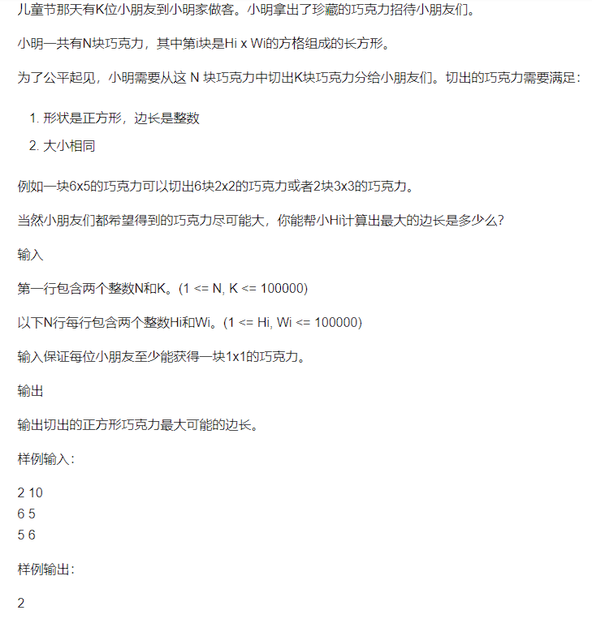
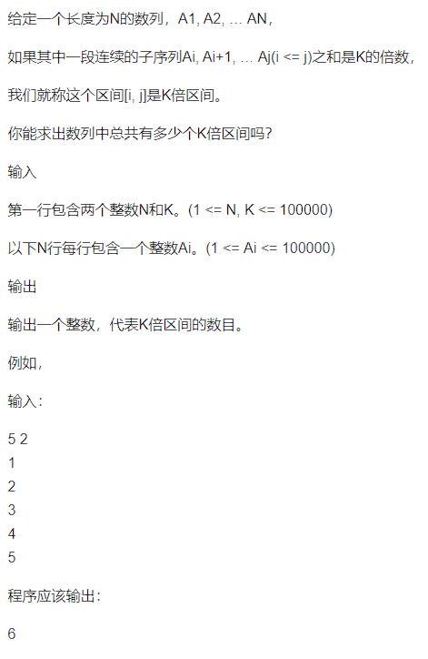

## 第八届蓝桥杯大赛软件赛省赛_Java_B组

### 试题A：购物单

```bash
 小明刚刚找到工作，老板人很好，只是老板夫人很爱购物。老板忙的时候经常让小明帮忙到商场代为购物。小明很厌烦，但又不好推辞。

    这不，XX大促销又来了！老板夫人开出了长长的购物单，都是有打折优惠的。
    小明也有个怪癖，不到万不得已，从不刷卡，直接现金搞定。
    现在小明很心烦，请你帮他计算一下，需要从取款机上取多少现金，才能搞定这次购物。

    取款机只能提供100元面额的纸币。小明想尽可能少取些现金，够用就行了。
    你的任务是计算出，小明最少需要取多少现金。

以下是让人头疼的购物单，为了保护隐私，物品名称被隐藏了。
-----------------
****     180.90       88折
****      10.25       65折
****      56.14        9折
****     104.65        9折
****     100.30       88折
****     297.15        半价
****      26.75       65折
****     130.62        半价
****     240.28       58折
****     270.62        8折
****     115.87       88折
****     247.34       95折
****      73.21        9折
****     101.00        半价
****      79.54        半价
****     278.44        7折
****     199.26        半价
****      12.97        9折
****     166.30       78折
****     125.50       58折
****      84.98        9折
****     113.35       68折
****     166.57        半价
****      42.56        9折
****      81.90       95折
****     131.78        8折
****     255.89       78折
****     109.17        9折
****     146.69       68折
****     139.33       65折
****     141.16       78折
****     154.74        8折
****      59.42        8折
****      85.44       68折
****     293.70       88折
****     261.79       65折
****      11.30       88折
****     268.27       58折
****     128.29       88折
****     251.03        8折
****     208.39       75折
****     128.88       75折
****      62.06        9折
****     225.87       75折
****      12.89       75折
****      34.28       75折
****      62.16       58折
****     129.12        半价
****     218.37        半价
****     289.69        8折
--------------------

需要说明的是，88折指的是按标价的88%计算，而8折是按80%计算，余者类推。
特别地，半价是按50%计算。

请提交小明要从取款机上提取的金额，单位是元。
```

#### 分析

用程序计算，然后向上取整即可

#### 参考答案

```java
public class QuestionA {
	public static void main(String[] args) throws IOException {
		BufferedReader br = new BufferedReader(new FileReader(new File("a.txt")));
		LinkedList<String[]> list = new LinkedList<>();
		String temp;
		while ((temp = br.readLine()) != null) {
			String[] splitStrings = temp.split("\\s");
			String thirdString = splitStrings[splitStrings.length - 1].trim();
			if (thirdString.contains("折")) {
				thirdString = thirdString.substring(0, thirdString.length() - 1);
			} else {
				thirdString = "50";
			}
			list.add(new String[] { splitStrings[5].trim(), thirdString });
		}
		BigDecimal sum = new BigDecimal("0");
		for (String[] a : list) {
			BigDecimal price = new BigDecimal(a[0]);
			BigDecimal zk = new BigDecimal("0." + a[1]);
			sum = sum.add(price.multiply(zk));
		}
        // 5136.8595
		System.out.println(sum);
	}
}
```

### 试题B：纸牌三角形



#### 分析

三角形的结构可能不能直接存，使用一个一维数组映射即可

```bash
int[] arr = [1, 6, 8, 2, 5, 7, 3, 4, 9];
```

然后使得

`arr[0] + arr[1] + arr[2] + arr[3] == arr[3] + arr[4] + arr[5] + arr[6] == arr[6] + arr[7] + arr[8] + arr[0]`

回溯即可

#### 参考答案

```java
public class QuestionB {
	static int[] temp = new int[9];

	public static void main(String[] args) {
		int[] track = new int[9];
		LinkedList<int[]> res = new LinkedList<>();
		backTrack(0, track, res);
		res.stream().forEach(a -> System.out.println(Arrays.toString(a)));
        // 旋转三次
        // 翻转两次
		System.out.println(res.size() / 3 / 2);
	}

	private static void backTrack(int currIndex, int[] track, LinkedList<int[]> res) {
		if (currIndex == 9) {
			updateRes(track, res);
			return;
		}
		for (int i = 1; i <= 9; i++) {
			if (contains(track, i, currIndex)) {
				continue;
			}
			track[currIndex] = i;
			backTrack(currIndex + 1, track, res);
			track[currIndex] = 0;
		}
	}

	private static boolean contains(int[] track, int add, int end) {
		for (int j = 0; j <= end; j++) {
			if (track[j] == add) {
				return true;
			}
		}
		return false;
	}

	private static void updateRes(int[] track, LinkedList<int[]> res) {
		int m = track[3] + track[4] + track[5] + track[6];
		if (track[0] + track[1] + track[2] + track[3] != m || m != track[6] + track[7] + track[8] + track[0]) {
			return;
		}
		System.arraycopy(track, 0, temp, 0, track.length);
		System.out.println(Arrays.toString(temp));
		res.add(temp);
	}
}
```

为啥最后结果要除以6

下面有三角的就是本质上一样的


### 试题C：承压计算

X星球的高科技实验室中整齐地堆放着某批珍贵金属原料。

每块金属原料的外形、尺寸完全一致，但重量不同。

金属材料被严格地堆放成金字塔形

```bash
                             7
                            5 8
                           7 8 8
                          9 2 7 2
                         8 1 4 9 1
                        8 1 8 8 4 1
                       7 9 6 1 4 5 4
                      5 6 5 5 6 9 5 6
                     5 5 4 7 9 3 5 5 1
                    7 5 7 9 7 4 7 3 3 1
                   4 6 4 5 5 8 8 3 2 4 3
                  1 1 3 3 1 6 6 5 5 4 4 2
                 9 9 9 2 1 9 1 9 2 9 5 7 9
                4 3 3 7 7 9 3 6 1 3 8 8 3 7
               3 6 8 1 5 3 9 5 8 3 8 1 8 3 3
              8 3 2 3 3 5 5 8 5 4 2 8 6 7 6 9
             8 1 8 1 8 4 6 2 2 1 7 9 4 2 3 3 4
            2 8 4 2 2 9 9 2 8 3 4 9 6 3 9 4 6 9
           7 9 7 4 9 7 6 6 2 8 9 4 1 8 1 7 2 1 6
          9 2 8 6 4 2 7 9 5 4 1 2 5 1 7 3 9 8 3 3
         5 2 1 6 7 9 3 2 8 9 5 5 6 6 6 2 1 8 7 9 9
        6 7 1 8 8 7 5 3 6 5 4 7 3 4 6 7 8 1 3 2 7 4
       2 2 6 3 5 3 4 9 2 4 5 7 6 6 3 2 7 2 4 8 5 5 4
      7 4 4 5 8 3 3 8 1 8 6 3 2 1 6 2 6 4 6 3 8 2 9 6
     1 2 4 1 3 3 5 3 4 9 6 3 8 6 5 9 1 5 3 2 6 8 8 5 3
    2 2 7 9 3 3 2 8 6 9 8 4 4 9 5 8 2 6 3 4 8 4 9 3 8 8
   7 7 7 9 7 5 2 7 9 2 5 1 9 2 6 5 3 9 3 5 7 3 5 4 2 8 9
  7 7 6 6 8 7 5 5 8 2 4 7 7 4 7 2 6 9 2 1 8 2 9 8 5 7 3 6
 5 9 4 5 5 7 5 5 6 3 5 3 9 5 8 9 5 4 1 2 6 1 4 3 5 3 2 4 1
X X X X X X X X X X X X X X X X X X X X X X X X X X X X X X
```

其中的数字代表金属块的重量（计量单位较大）。

最下一层的X代表30台极高精度的电子秤。

假设每块原料的重量都十分精确地平均落在下方的两个金属块上，

最后，所有的金属块的重量都严格精确地平分落在最底层的电子秤上。

电子秤的计量单位很小，所以显示的数字很大。

工作人员发现，其中读数最小的电子秤的示数为：2086458231

请你推算出：读数最大的电子秤的示数为多少

#### 分析

这题目说实话，最后问的真挺“独特”

#### 参考答案

```java

public class QuestionC {
	public static void main(String[] args) throws IOException {
		BufferedReader bReader = new BufferedReader(new FileReader(new File("c.txt")));
		LinkedList<String> levels = new LinkedList<>();
		String temp;
		while ((temp = bReader.readLine()) != null) {
			levels.add(temp);
		}
		// 59个称的位置，每两个称之间留一个位置
		BigDecimal[] cheng = new BigDecimal[(levels.size() + 1) * 2 - 1];
		for (int i = 0; i < cheng.length; i += 2) {
			cheng[i] = new BigDecimal("0");
		}
		BigDecimal[][] jzt = build(levels, cheng.length);
		BigDecimal two = new BigDecimal("2");
		int index = 29;
		for (int i = 0; i < jzt.length - 1; i++) {
			for (int j = index; j < jzt[i].length; j += 2) {
				if (jzt[i][j] == null) {
					continue;
				}
				BigDecimal k = jzt[i][j].divide(two);
				jzt[i + 1][j - 1] = jzt[i + 1][j - 1].add(k);
				jzt[i + 1][j + 1] = jzt[i + 1][j + 1].add(k);
			}
			index--;
		}
		System.out.println(Arrays.toString(jzt[28]));
		for (int i = 1; i < jzt[0].length; i += 2) {
			BigDecimal k = jzt[28][i].divide(two);
			cheng[i - 1] = cheng[i - 1].add(k);
			cheng[i + 1] = cheng[i + 1].add(k);
		}
		System.out.println(Arrays.toString(cheng));
	}

	private static BigDecimal[][] build(LinkedList<String> levels, int len) {
		BigDecimal[][] jzt = new BigDecimal[levels.size()][len];
		int start = 1;
		for (int i = levels.size() - 1; i >= 0; i--) {
			BigDecimal[] level = jzt[i];
			int s = start;
			String[] ls = levels.get(i).split("\\s+");
			for (int j = 1; j < ls.length; j++) {
				level[s] = new BigDecimal(ls[j]);
				s += 2;
			}
			start++;
		}
		return jzt;
	}
}
```

### 试题D：魔方状态



#### 分析

一点思路都没有，参考这位大佬的做法吧[试题D：魔方状态](https://blog.csdn.net/qq_35222235/article/details/79725363)

### 试题E：取数位

求1个整数的第k位数字有很多种方法。

以下的方法就是一种。

```java
public class Main5 {
    static int len(int x){
        if(x<10) return 1;
        return len(x/10)+1;
    }

    // 取x的第k位数字
    static int f(int x, int k){
        if(len(x)-k==0)
            return x%10;
        return _________;  // 填空
    }

    public static void main(String[] args) {
        int x = 23513;
         System.out.println(f(x,4));
    }
}
```

#### 参考答案

`len`函数的作用就是返回`len`的数位，即`len(100) = 3`、`len(1234) = 4`

`f`函数的作用就是返回x的第k位数字

```java
f(x/10, k)
```

### 试题F：最大公共子串

最大公共子串长度问题就是：

求两个串的所有子串中能够匹配上的最大长度是多少。

比如：“abcdkkk” 和 “baabcdadabc”，

可以找到的最长的公共子串是"abcd",所以最大公共子串长度为4。

下面的程序是采用矩阵法进行求解的，这对串的规模不大的情况还是比较有效的解法。

请分析该解法的思路，并补全划线部分缺失的代码。

```java
public class Main6 {

    static int f(String s1, String s2) {
        char[] c1 = s1.toCharArray();
        char[] c2 = s2.toCharArray();

        int[][] a = new int[c1.length + 1][c2.length + 1];

        int max = 0;
        for (int i = 1; i < a.length; i++) {
            for (int j = 1; j < a[i].length; j++) {
                if (c1[i - 1] == c2[j - 1]) {
                    a[i][j] = ________;  // 填空
                    if (a[i][j] > max)
                        max = a[i][j];
                }
            }
        }

        return max;
    }

    public static void main(String[] args) {
        int n = f("abcdkkk", "baabcdadabc");
        System.out.println(n);
    }
}
```

#### 参考答案

本题其实是动态规划，a就是那个dp数组

填空的地方就是状态转移方程

```java
a[i - 1][j - 1] + 1
```

### 试题G：日期问题



#### 分析

注意一点，不允许使用1.7以后的特性

也就是不能使用`LocalDate`

那就自己判断日期是否合法，合法的话就将其加入到结果集中

#### 参考答案

```java
public class QuestionG {
	public static void main(String[] args) {
		Scanner scanner = new Scanner(System.in);
		String[] dateChooses = scanner.nextLine().split("/");
		String[] ys = { "19", "20" };
		String[] yearChooses = { dateChooses[0], dateChooses[2] };
		String[] dayChooses = { dateChooses[0], dateChooses[1], dateChooses[2] };
		String[] monthChooses = { dateChooses[0], dateChooses[1] };
		HashSet<String> dates = new HashSet<>();
		for (int i = 0; i < ys.length; i++) {
			for (int j = 0; j < yearChooses.length; j++) {
				String yearStr = ys[i] + yearChooses[j];
				int year = Integer.parseInt(yearStr);
				int ysuffix = Integer.parseInt(yearChooses[j]);
				for (int k = 0; k < monthChooses.length; k++) {
					int month = Integer.parseInt(monthChooses[k]);
					for (int z = 0; z < dayChooses.length; z++) {
						int day = Integer.parseInt(dateChooses[z]);
						if (month == day || month == ysuffix || day == ysuffix) {
							continue;
						}
						if (year < 1960 || year > 2059) {
							continue;
						}
						if (month == 1 || month == 3 || month == 5 || month == 7 || month == 8 || month == 10
								|| month == 12) {
							if (day > 31) {
								continue;
							}
						} else if (month == 2) {
							if (isRun(year) && day > 28) {
								continue;
							}
						} else {
							if (day > 30) {
								continue;
							}
						}
						dates.add(yearStr + "-" + monthChooses[k] + "-" + dateChooses[z]);
					}
				}
			}
		}
		System.out.println(dates);
		System.out.println(dates.size());
	}

	private static boolean isRun(int year) {
		// 1、被四整除，不能被100整除
		// 2、能被400整除
		return year % 400 == 0 || year % 4 == 0 && year % 100 != 0;
	}
}
```

### 试题H：包子凑数



#### [参考分析](https://blog.csdn.net/Yh_yh_new_Yh/article/details/109351718)

### 试题I：分巧克力



#### 参考答案

```java
public class QuestionI {
	public static void main(String[] args) {
		Scanner scanner = new Scanner(System.in);
		int n = scanner.nextInt();
		int k = scanner.nextInt();
		int[][] chos = new int[n][2];
        // 总的巧克力面积
		int wholeArea = 0;
        // 这些巧克力最大的那条边
		int maxWidth = Integer.MIN_VALUE;
		for (int i = 0; i < chos.length; i++) {
			chos[i][0] = scanner.nextInt();
			chos[i][1] = scanner.nextInt();
            // 累加
			wholeArea += chos[i][0] * chos[i][1];
			maxWidth = Math.max(maxWidth, chos[i][0]);
			maxWidth = Math.max(maxWidth, chos[i][1]);
		}
        // 从最大宽度开始减少
		int i = maxWidth;
		while (i > 1) {
            // 累计这些巧克力可以构成多少个边长为i的正方形
			int s = 0;
			for (int j = 0; j < chos.length; j++) {
				int[] cho = chos[j];
				// 每个巧克力最多可以构成多少正方形
				s += (cho[0] / i) * (cho[1] / i);
			}
			// 分出来巧克力的总数已经比k大了
			if (s >= k) {
				break;
			}
			i--;
		}
		System.out.println(i);
	}
}
```

### 试题J：k倍区间



#### 分析

没有学过前缀和的话先用回溯暴力解肯定可以得点分

谈到区间和就可以用前缀和来提高求和的效率

然后为了不超时，加入一个map做一个hash映射提高效率

#### 参考答案

```java
public class QuestionJ {
	public static void main(String[] args) {
		Scanner scanner = new Scanner(System.in);
		String[] line = scanner.nextLine().split(" ");
		int n = Integer.parseInt(line[0]);
		int k = Integer.parseInt(line[1]);
		int[] arr = new int[n];
		// arr[i,j]的区间和是preSum[j]-preSum[i-1]
		// preSum[i]就是前i个数的和
		int[] preSum = new int[n + 1];
		// 区间和余数为k的个数是v
		HashMap<Integer, Integer> map = new HashMap<>();
		int counter = 0;
		for (int i = 1; i <= arr.length; i++) {
			arr[i - 1] = scanner.nextInt();
			preSum[i] = preSum[i - 1] + arr[i - 1];
			// 前i个数和就是k倍
			if (preSum[i] % k == 0) {
				counter += map.merge(0, 1, Integer::sum);
			} else {
				// 有可以将余数减掉的区间和
				if (map.containsKey(preSum[i] % k)) {
					counter += map.get(preSum[i] % k);
					map.merge(preSum[i] % k, 1, Integer::sum);
				} else {
					map.put(preSum[i] % k, 1);
				}
			}
		}
		System.out.println(counter);
	}
}
```

