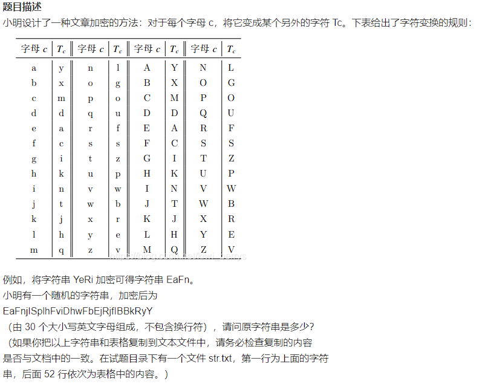
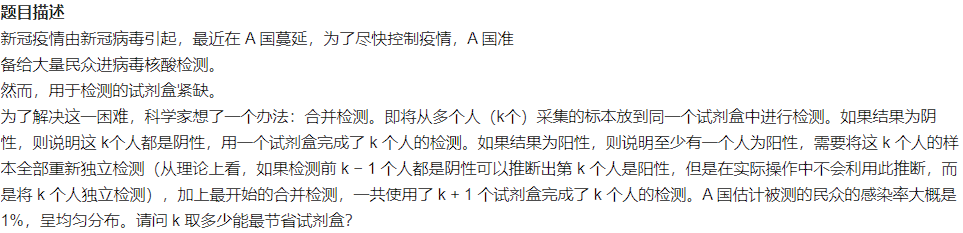
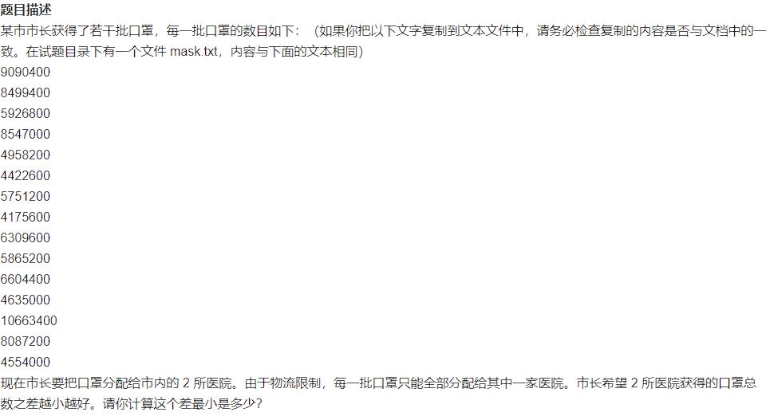
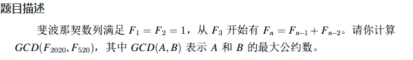
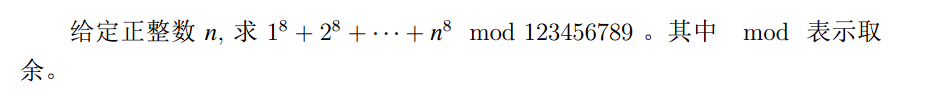
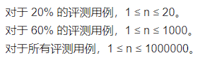
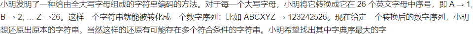
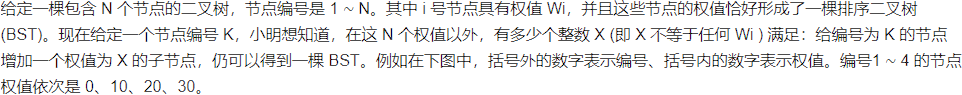
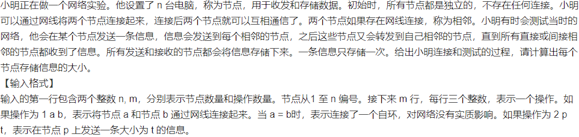

## 第十三届蓝桥杯大赛软件赛省赛_Java_B组

### 试题A：解密（5分）



#### 分析

这是一道结果填空题，直接对照着加密表改回去就行了

#### 参考答案

```bash
YeRikGSunlRzgDlvRwYkXkrGgghXaA
```

### 试题B：纪念日（5分）


#### 分析

这是一道结果填空题，但是直接手算有点麻烦，使用Java里面的Date类进行辅助计算即可

#### 参考代码

```java
public class QuestionB {
	public static void main(String[] args) throws Exception {
		SimpleDateFormat sdf = new SimpleDateFormat("yyyy-MM-dd mm:HH:ss");
		Date start = sdf.parse("1921-7-23 12:00:00");
		Date end = sdf.parse("2020-7-1 12:00:00");
		long startTime = start.getTime();
		long endTime = end.getTime();
        // 两个日期之间的秒差
		System.out.println(endTime - startTime);
        // 分钟差
		System.out.println((endTime - startTime) / 60);
	}
}
```

### 试题C：合并检测（10分）



#### 分析

这是一道结果填空题，这道题挺奇怪的

按照题目意思，设定A国总人数为`n`，按照感染率来算

阳的人数：`n/100`

阴的人数：`99n/100`

则需要 `99n / 100 + ( k + 1 ) * n / 100`，即`n / k + n / 100`

到这一步，就不知道怎么写了

但是根据我们平时做核酸来看，一管是10个人，那么这道题实在不会的话，填10就行了

答案也确实是10😂

#### 参考答案

```bash
10
```

### 试题D：分配口罩（10分）



#### 分析

这也是一道结果填空题

这道题有三种思路可以做

##### 手算（不推荐）

因为是结果填空题，如果你有耐心的话，一个个凑着试一试吧

##### 回溯

直接列举所有的可能性，然后取最小的那一种就行了

##### 转化为01背包

这道题目和[力扣1049题：最后一块石头的重量Ⅱ](https://leetcode.cn/problems/last-stone-weight-ii/)有点类似

本质就是01背包问题

#### 参考代码

##### 回溯

> PS：会很慢很慢很慢，可能跑几个小时都跑不完，至少得有 15! 种可能也就是`1307674368000`种可能

```java
public class QuestionD {
    public static void main(String[] args) {
        int[] masks = { 9090400, 8499400, 5926800, 8547000, 4958200, 4422600, 5751200, 4175600, 6309600, 5865200,
                       6604400, 4635000, 10663400, 8087200, 4554000 };
        System.out.println(backTrack(masks));
    }
    static long min;
    private static long backTrack(int[] masks) {
        min = Integer.MAX_VALUE;
        LinkedList<Integer> track = new LinkedList<>();
        boolean[] choose = new boolean[masks.length];
        backTrack(track, masks, choose);
        return min;
    }

    private static void backTrack(LinkedList<Integer> track, int[] masks, boolean[] choose) {
        if (track.size() == masks.length) {
            return;
        }
        // 更新最小值
        min = Math.min(Math.abs(sum(track) - sumUnChoose(masks, choose)), min);
        System.out.println(min);
        for (int i = 0; i < masks.length; i++) {
            if (choose[i]) {
                continue;
            }
            track.addLast(masks[i]);
            choose[i] = true;
            backTrack(track, masks, choose);
            track.removeLast();
            choose[i] = false;
        }
    }

    private static long sum(LinkedList<Integer> track) {
        return track.stream().reduce(0, Integer::sum);
    }

    private static long sumUnChoose(int[] masks, boolean[] choose) {
        long sum = 0;
        for (int i = 0; i < choose.length; i++) {
            if (!choose[i]) {
                sum += masks[i];
            }
        }
        return sum;
    }
}
```

##### 01背包

```java
public class QuestionD {
	public static void main(String[] args) {
		int[] masks = { 9090400, 8499400, 5926800, 8547000, 4958200, 4422600, 5751200, 4175600, 6309600, 5865200,
				6604400, 4635000, 10663400, 8087200, 4554000 };
		int sum = 0;
		for (int i = 0; i < masks.length; i++) {
			sum += masks[i];
		}
		long oneMax = zeroOneBag(masks, sum / 2);
		long twoMax = sum - oneMax;
		System.out.println(twoMax - oneMax);
	}

	private static long zeroOneBag(int[] masks, int target) {
		// dp[j]：容量为j的背包用所有的物品最多可以装dp[j]
		long[] dp = new long[target + 1];
		// 遍历物品
		for (int i = 0; i < masks.length; i++) {
			// 遍历背包
			for (int j = target; j >= masks[i]; j--) {
				// 装和不装取一个最大的
				dp[j] = Math.max(dp[j], dp[j - masks[i]] + masks[i]);
			}
		}
		return dp[target];
	}
}
```

### 试题E：斐波那契数列最大公约数（15分）



#### 分析

这是一道结果填空题，但是如果想通过手算得到结果，那是不可能的

下面考虑两个问题

1、如何计算F2020和F520

因为F2020的数值非常非常大，F520的数量级也不可小觑

首先来考虑一下如何计算斐波那契数列指定位置的值，如果使用递归来计算F2020的话，估计几个小时都计算不到2020的值

斐波那契数列除了递归计算，还有一种优化算法就是使用动态规划的思想来计算，状态转移方程都已经有了

这样就可以快速得出指定位置的斐波那契数

这里要注意一点，就是因为F2020数量级过于巨大，如果使用int甚至long都会产生溢出，所以要使用BigInteger或者BigDemical来计算

2、如何计算两个数的最大公约数

这个记住代码就行了

`a`和`b`的公约数记作`gcb(a,b)`

```java
static BigDecimal gcb(BigDecimal x, BigDecimal y) {
	return x.remainder(y).intValue() == 0 ? y : gcb(y, x.remainder(y));
}
```

#### 参考代码

```java
public class QuestionE {
	public static void main(String[] args) {
		BigDecimal[] dp = new BigDecimal[2021];
		dp[1] = new BigDecimal("1");
		dp[2] = new BigDecimal("1");
		for (int i = 3; i < 2021; i++) {
			dp[i] = dp[i - 1].add(dp[i - 2]);
		}
		System.out.println(gcb(dp[2020], dp[520]));
	}

	static BigDecimal gcb(BigDecimal x, BigDecimal y) {
		return x.remainder(y).intValue() == 0 ? y : gcb(y, x.remainder(y));
	}
}
```

### 试题F：分类计数（15分）


#### 分析

这个很简单，直接计数即可

#### 参考代码

```java
public class QuestionF {
	public static void main(String[] args) {
		Scanner sc = new Scanner(System.in);
		String input = sc.nextLine();
		int[] bucket = new int[3];
		char[] iArray = input.toCharArray();
		for (int i = 0; i < iArray.length; i++) {
			char t = iArray[i];
			if (t >= 'A' && t <= 'Z') {
				bucket[0]++;
			} else if (t >= 'a' && t <= 'z') {
				bucket[1]++;
			} else if (t >= '0' && t <= '9') {
				bucket[2]++;
			}
		}
		System.out.println(bucket[0]);
		System.out.println(bucket[1]);
		System.out.println(bucket[2]);
	}
}
```

### 试题G：八次求和（20分）



#### 分析

题目意思很好理解

这道题难就难在 n 的数值会很大，导致 n 的8次方很大




举个栗子

`(15 * 15 * 15 * 15) % 4`可以被拆为`(12 * 15 * 15 * 15) % 4 + (3 * 15 * 15 * 15) % 4 `

左边那个`(12 * 15 * 15 * 15) % 4 `最后的结果肯定是0，所以只需要计算右边的值`(3 * 15 * 15 * 15) % 4`

同理就变成了`(3 * 3 * 3 * 3) % 4`

`15 ^ 4`是`50625`

`3 ^ 4`是`81`

#### 参考代码

```java
public class QuestionG {
	public static void main(String[] args) {
		Scanner scanner = new Scanner(System.in);
		int n = scanner.nextInt();
		long result = 0;
		for (int counter = 1; counter <= n; counter++) {
			long temp = 1;
			for (int i = 0; i < 8; i++) {
                // 累计计算
				temp = (temp * counter) % 123456789L;
			}
            // 将结果直接取余
			result = (result + temp) % 123456789L;
		}
		System.out.println(result);
	}
}
```

### 试题H：字符串编码（20分）



#### 分析

使用回溯算法将所有的可能列举出来，在其中取得字典序最大的那种选择即可

#### 参考代码

```java

public class QuestionH {

    static int max;
    static String result;

    public static void main(String[] args) {
        Scanner scanner = new Scanner(System.in);
        char[] sArray = scanner.nextLine().toCharArray();
        System.out.println(backtrack(sArray));
    }

    private static String backtrack(char[] sArray) {
        max = Integer.MIN_VALUE;
        Map<Integer, Character> dictionary = dictionary();
        LinkedList<Character> track = new LinkedList<>();
        backtrack(sArray, track, dictionary, 0);
        return result;
    }

    private static void backtrack(char[] sArray, LinkedList<Character> track, Map<Integer, Character> dictionary, int index) {
        if (index == sArray.length) {
            updateResult(track);
            return;
        }
        char cur = sArray[index];
        // 做出第一次选择
        track.addLast(dictionary.get(spell(sArray, index, index)));
        backtrack(sArray, track, dictionary, index + 1);
        track.removeLast();
        if (cur != '1' && cur != '2') {
            return;
        }
        // 可以再追加一次选择
        if (index + 1 < sArray.length) {
            track.addLast(dictionary.get(spell(sArray, index, index + 1)));
            backtrack(sArray, track, dictionary, index + 2);
            track.removeLast();
        }
    }

    /**
     * 将sArray的[i,j]区间的字符拼起来转化为数字返回
     *
     * @param sArray
     * @param i
     * @param j
     * @return
     */
    private static int spell(char[] sArray, int i, int j) {
        int sum = 0;
        int base = 1;
        // 将sArray的i和j放一块返回数值
        for (int k = j; k >= i; k--) {
            sum += base * (sArray[k] - '0');
            base *= 10;
        }
        return sum;
    }

    /**
     * 根据当前路径生成组成的字符串，并判断是否需要更新最大值
     *
     * @param track
     */
    private static void updateResult(LinkedList<Character> track) {
        int sum = 0;
        StringBuilder sBuilder = new StringBuilder();
        for (int i = 0; i < track.size(); i++) {
            char cur = track.get(i);
            sum += cur;
            sBuilder.append(cur);
        }
        // 字典序更大的话，更新此次路径
        if (sum > max) {
            result = sBuilder.toString();
        }
    }

    /**
     * 创建一个字典
     * key是数字
     * value是对应的字符
     *
     * @return
     */
    private static Map<Integer, Character> dictionary() {
        Map<Integer, Character> map = new HashMap<>(32);
        for (int i = 1; i <= 26; i++) {
            map.put(i, (char) ('A' + i - 1));
        }
        return map;
    }
}
```

### 试题I：BST插入问题（25分）



暂时不会

### 试题J：网络分析（25分）



#### 分析

首先要理解题目意思，然后就是普通的将图构造出来，然后根据多个类型的操作对图进行添加节点之间的连接和遍历操作

#### 参考代码

```java
public class QuestionJ {
    public static void main(String[] args) {
        Scanner scanner = new Scanner(System.in);
        int n = scanner.nextInt();
        int m = scanner.nextInt();
        LinkedList<int[]> operations = new LinkedList<>();
        for (int i = 0; i < m; i++) {
            operations.add(new int[]{scanner.nextInt(), scanner.nextInt(), scanner.nextInt()});
        }
        // 记录每个节点的累计信息值
        int[] nodes = new int[n + 1];
        LinkedList<Integer>[] graph = new LinkedList[n + 1];
        for (int i = 0; i < graph.length; i++) {
            graph[i] = new LinkedList<>();
        }
        for (Iterator iterator = operations.iterator(); iterator.hasNext(); ) {
            int[] is = (int[]) iterator.next();
            // 判断操作类型
            if (is[0] == 1) {
                // 建立连接
                graph[is[1]].add(is[2]);
                graph[is[2]].add(is[1]);
            } else {
                // 传播信息，发送方和接收方都需要添加
                nodes[is[1]] += is[2];
                traverse(graph, is[1], is[2], new boolean[n + 1], nodes);
            }
        }
        System.out.println(Arrays.toString(nodes));
    }

    private static void traverse(LinkedList<Integer>[] graph, int sequence, int t, boolean[] visisted, int[] nodes) {
        visisted[sequence] = true;
        for (int neighbor : graph[sequence]) {
            // 如果邻居已经访问过了，就不需要访问了
            if (visisted[neighbor]) {
                continue;
            }
            nodes[neighbor] += t;
            traverse(graph, neighbor, t, visisted, nodes);
        }
    }
}
```

