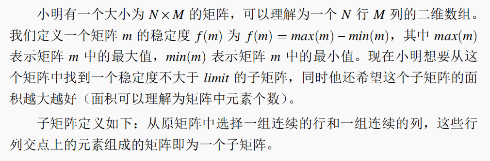
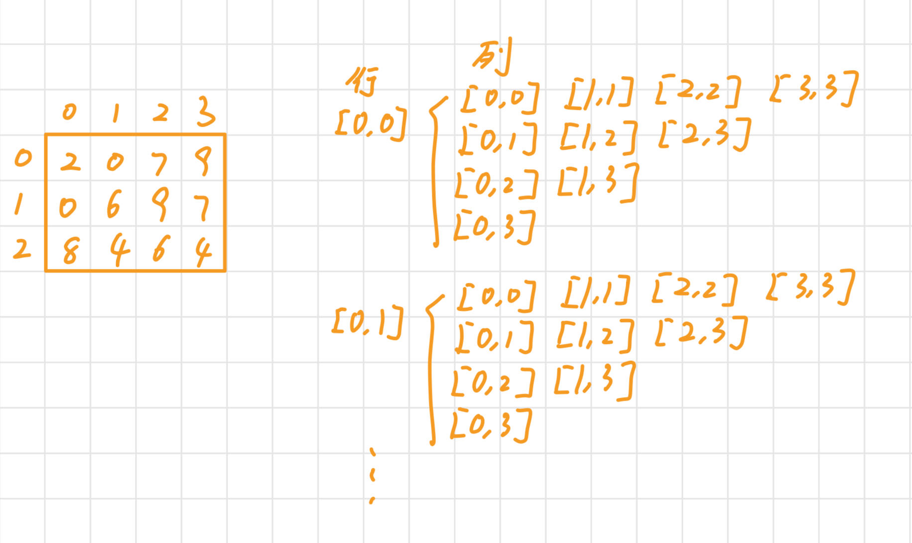

## 第十三届蓝桥杯大赛软件赛省赛_Java_B组

```bash
# 题目PDF链接: https://pan.quark.cn/s/65291782013a
```

> PS：只讲解了我会的题

### 试题A：星期计算


#### 分析

直接使用程序计算即可

#### 示例代码

```java
public class QuestionA {
	public static void main(String[] args) {
		System.out.println((6 + Math.pow(20, 22)) % 7 + 1);
	}
}
```

### 试题B：山


#### 分析

首先明确这道题中的”山“的定义

1、左右回文

2、先单调不减后单调不增

只有同时满足了这两个条件，这个数才是”山“

所以核心问题在于如何判断正整数是否是”山“

我用两种思路来解决问题

##### 双指针

借鉴判断回文串的思路，使用左右指针向中间逼近


> 示例代码

```java
private static boolean isValid(String str) {
    int left = 0;
    int right = str.length() - 1;
    while (left < right) {
        // 如果出现了左右不等的情况，说明前后不一致，不是山
        if (str.charAt(left) != str.charAt(right)) {
            break;
        }
        left++;
        right--;
    }
    return left >= right;
}
```

这就满足了第一个定义：左右对称

接下来就要满足先单调不减，后单调不增的定义

因为是左右对称的，所以只要左边是单调不减，右边一定是单调不增

问题转移到如何判断前半部分单调不增

这就很简单了，将前一个和后一个相比，如果后一个比前一个大那么就不满足定义

> 示例代码

```java
private static boolean isValid(String str) {
    int left = 0;
    int right = str.length() - 1;
    while (left < right) {
        // 如果出现了左右不等的情况，说明前后不一致，不是山
        if (str.charAt(left) != str.charAt(right)) {
            break;
        }
        left++;
        right--;
    }
    // 不是回文串
    if (left < right) {
        return false;
    }
    // 将left指向第二个元素
    left = 1;
    // leftChar初始化位第一个元素
    char leftChar = str.charAt(0);
    // 遍历左半部分
    while (left < str.length() / 2) {
        // 只要出现后一个比前一个大，直接返回false
        if (leftChar > str.charAt(left)) {
            return false;
        }
        // 更新leftChar
        leftChar = str.charAt(left++);
    }
    // 说明满足了两个定义
    return true;
}
```

现在两个定义都 ok 了，但是上面的代码可以优化如下

将两个定义的判断放在了同一个循环中进行

> 示例代码

```java
private static boolean isValid(String str) {
    int left = 0;
    int right = str.length() - 1;
    // 初始化位第一个元素
    char leftChar = str.charAt(left);
    while (left < right) {
        char leftNextChar = str.charAt(left + 1);
        // 如果左边的元素比下一个元素大，说明不是单调不减的，直接返回
        if (leftChar > leftNextChar) {
            break;
        }
        // 如果出现了左右不等的情况，说明前后不一致，不是山
        if (str.charAt(left) != str.charAt(right)) {
            break;
        }
        left++;
        right--;
    }
    return left >= right;
}
```

##### 拆解法

将前半部分截取下来，截取的过程中判断是否符合第二条定义

再和后半部分对比是否相同

```java
private static boolean isValid2(String str) {
    // loop就是str左半部分的长度
	int loop = str.length() / 2;
	// 保存前半部分
	char[] leftPart = new char[loop];
	char leftChar = str.charAt(0);
	leftPart[0] = leftChar;
	for (int i = 1; i < loop; i++) {
		if (str.charAt(i) < leftChar) {
			return false;
		}
		leftChar = str.charAt(i);
		leftPart[i] = leftChar;
	}
	if (str.length() % 2 != 0) {
		loop++;
	}
    // 将leftPart从后往前遍历
	for (int i = leftPart.length - 1; i >= 0; i--) {
        // 不一致了
		if (leftPart[i] != str.charAt(loop++)) {
			return false;
		}
	}
	return true;
}
```

#### 示例代码

```java
class QuestionB{
    public static void main(String[] args) {
        int start = 2022;
        int end = 2022222022;
        int counter = 1;
        for (int i = start; i <= end; i++) {
            if (isValid(i + "")) {
                // System.out.println(i);
                counter++;
            }
        }
        System.out.println(counter);
    }

    private static boolean isValid(String str) {
        int left = 0;
        int right = str.length() - 1;
        char leftChar = str.charAt(left);
        while (left < right) {
            char leftNextChar = str.charAt(left + 1);
            // 如果左边的元素比下一个元素大，说明不是单调不减的，直接返回
            if (leftChar > leftNextChar) {
                break;
            }
            // 如果出现了左右不等的情况，说明前后不一致，不是山
            if (str.charAt(left) != str.charAt(right)) {
                break;
            }
            left++;
            right--;
        }
        return left >= right;
    }
}
```

### 试题C：字符统计


#### 分析

题目很好理解，就看怎么去实现

常规思路就是使用一个map来保存每个字符及其对应的出现次数，找到最大值

这道题目中有个关键词，`只包含大写字母`

这几个字告诉我们字符串 S 中只会出现 26 个大写字母，不会出现其他的字符

这样的情况下，map就可以用数组来实现，数组的索引充当字符，数组的值充当出现次数

#### 示例代码

```java
public class QuestionC {
	public static void main(String[] args) {
		String string = "BABBACAC";
		printS(string);
	}

	private static void printS(String string) {
		// 26个字母
		int[] alphabet = new int[26];
        // 用来保存结果的
		List<Character> temp = new ArrayList<>();
		char[] sArray = string.toCharArray();
		int maxSum = 0;
		for (int i = 0; i < sArray.length; i++) {
            // 取得当前字符在alphabet中的索引
			int index = sArray[i] - 'A';
            // 出现次数加一
			alphabet[index]++;
            // 如果出现次数大于现在的最大值
            // 更新最大值
            // 清空temp，并且将当前字符放入temp
			if (alphabet[index] > maxSum) {
				maxSum = alphabet[index];
				temp.clear();
				temp.add(sArray[i]);
			} else if (alphabet[index] == maxSum) {
                // 出现多个和最大值一样的字符
				temp.add(sArray[i]);
			}
		}
        // 按照升序排序
		temp.sort((a, b) -> a - b);
        // 打印
		temp.forEach(System.out::println);
	}
}
```

### 试题D：最大刷题数


#### 分析

这题目乍一看就让人懵了，但是看到数据之后就清楚多了

班上有 5 个学生他们的刷题数如下：`12 10 15 20 6`

对于每一位学生，要刷多少题才可以使全班比他刷题多的学生数不超过（即<=）刷题比他少的学生数

比如对于 0 号同学他刷了 12 道题，班上比他刷题多的有 2 个人，比他少的有 2 个人

那他就不需要再刷题了，已经满足比他刷题多的学生数不超过（即<=）刷题比他少的学生数

对于 1 号同学他刷了 10 道题，班上比他刷题多的有3个人，比他少的有1个人

那么他就要刷 3 道题，变为 13 道题，这样的话班上比他刷题多的有 2 个人，比他少的有 2 个人，满足条件

这道题只需要将数组升序排序后，得到每个同学到中间位置还需要多少题数即可

#### 示例代码

> PS：细细体会以下这个Unit的作用

```java
public class QuestionD {
	public static void main(String[] args) {
		int[] scores = { 12, 10, 15, 20, 6 };
		int[] need = brushQuestions(scores);
		for (int i = 0; i < need.length; i++) {
			System.out.println(need[i]);
		}
	}

	private static int[] brushQuestions(int[] scores) {
		Unit[] units = new Unit[scores.length];
        // 初始化units
		for (int i = 0; i < scores.length; i++) {
			units[i] = new Unit(scores[i], i);
		}
		// 按照刷题数升序排序
		Arrays.sort(units, (a, b) -> a.score - b.score);
		int half = units.length / 2;
		int[] need = new int[scores.length];
		for (int i = 0; i < half; i++) {
            // 在此人原本的索引处填写需要再刷的题目数
			need[units[i].index] = units[half].score - units[i].score + 1;
		}
		return need;
	}

	static class Unit {
		int score;
        // 保存index的作用是之后可以直接给对应的地方赋值
		int index;
		public Unit(int score, int index) {
			super();
			this.score = score;
			this.index = index;
		}
	}
}

```

### 试题E：求阶乘


#### 分析

这道题就很中规中矩，题目意思很好理解，但是如果把重心放在如何快速求 N 的阶乘，那你就输了

核心问题不在于如何快速求 N 的阶乘

而是如何快速求 N 的阶乘末尾有几个0

这两者之间是有很差距的

10 的阶乘的计算过程如下所示

```bash
1 x 2 x 3 x 4 x 5 x 6 x 7 x 8 x 9 x 10 = 3628800
```

如果我不想知道 3628800 这个结果数，我只想知道末尾有 2 个0

众所周知，10 可以拆成`2 x 5`，那我只需要知道这个阶乘中有多少这样的组合即可

就比如 10 的阶乘中

因子有 6 个 2（2 有 1 个，4 有 2 个，6 有 1 个，8 有 3 个，10 有1个）

因子有 2 个 5（5 有 1 个，10 有 1 个）

那么就是 2 个组合，那就是`2 x 10`也就是 2 个0

接下来的问题就转化为给定一个数，求得这个数有多少个为 2 的因子，有多少个为 5 的因子

#### 示例代码

```java
public class QuestionE {
	public static void main(String[] args) {
		System.out.println(calculate(10));
	}

	private static long calculate(int n) {
		long max = Long.MAX_VALUE;
		for (int i = 1; i < max; i++) {
			int sum2 = 0;
			int sum5 = 0;
            // 计算sum2和sum5
			for (int j = 1; j <= i; j++) {
				sum2 += hasManyX(j, 2);
				sum5 += hasManyX(j, 5);
			}
            // sum2和sum5的最小值就是有几个0
            // 如果和 n 相等即找到了
			if (Math.min(sum2, sum5) == n) {
				return i;
			}
		}
        // 没找到
		return -1;
	}

	private static int hasManyX(long val, int x) {
		int res = 0;
		while (val != 0 && val % x == 0) {
			res++;
			val /= x;
		}
		return res;
	}
}
```

### 试题F：最大子矩阵



#### 分析

这道题我是没想到什么简单的方法，只能使用穷举法，列举每一种情况

子矩阵定义如下：从原矩阵中选择一组连续的行和一组连续的列，这些行列交点上的元素组成的矩阵即为一个子矩阵

我们就按照这个定义去穷举

举个栗子：一个 3 x 4 的矩阵

行列举情况如下

```bash
[0,0] [0,1] [0,2] [1,1] [1,2] [2,2]
```

每一种行列举下又需要列举以下列的情况

```bash
[0,0] [0,1] [0,2] [0,3]
[1,1] [1,2] [1,3]
[2,2] [2,3]
[3,3]
```

这样看肯定有点犯迷糊了，我画了张图



其实就是一个四层的循环

#### 示例代码

```java
public class QuestionF {
    public static void main(String[] args) {
        int[][] matrix = { { 2, 0, 7, 9 }, { 0, 6, 9, 7 }, { 8, 4, 6, 4 } };
        System.out.println(maxChildMatrix(matrix, 8));
    }

    private static int maxChildMatrix(int[][] matrix, int limit) {
        // 矩阵的高
        int height = matrix.length;
        // 矩阵的宽
        int weight = matrix[0].length;
        // 当前符合要求的面积，初始化为0
        int maxArea = 0;
        for (int iLeft = 0; iLeft < height; iLeft++) {
            for (int iRight = iLeft; iRight < height; iRight++) {
                // 行区间是[iLeft,iRight]
                for (int jLeft = 0; jLeft < weight; jLeft++) {
                    for (int jRight = jLeft; jRight < weight; jRight++) {
                        // 列区间是[jLeft,jRight]
                        int fm = max(matrix, iLeft, iRight, jLeft, jRight) - min(matrix, iLeft, iRight, jLeft, jRight);
                        // 稳定度不满足要求
                        if (fm > limit) {
                            continue;
                        }
                        // 更新最大面积
                        int area = (iRight - iLeft + 1) * (jRight - jLeft + 1);
                        maxArea = Math.max(maxArea, area);
                    }
                }
            }
        }
        return maxArea;
    }

    /**
	 * 返回在matrix中以[iLeft,jLeft]、[iLeft,jRight]、[iRight,jLeft]、[iRight,jRight]为顶点的子矩阵的最大值
	 */
    private static int max(int[][] matrix, int iLeft, int iRight, int jLeft, int jRight) {
        int max = matrix[iLeft][jLeft];
        for (int i = iLeft; i <= iRight; i++) {
            for (int j = jLeft; j <= jRight; j++) {
                max = Math.max(max, matrix[i][j]);
            }
        }
        return max;
    }
    
    /**
	 * 返回在matrix中以[iLeft,jLeft]、[iLeft,jRight]、[iRight,jLeft]、[iRight,jRight]为顶点的子矩阵的最小值
	 */
    private static int min(int[][] matrix, int iLeft, int iRight, int jLeft, int jRight) {
        int min = matrix[iLeft][jLeft];
        for (int i = iLeft; i <= iRight; i++) {
            for (int j = jLeft; j <= jRight; j++) {
                min = Math.min(min, matrix[i][j]);
            }
        }
        return min;
    }
}
```

### 试题G：数组切分


#### 分析

这道题我第二次做没做出来

第一次做的时候做出来的

#### 示例代码

```java
public class QuestionG {
    public static void main(String[] args) {
        int[] nums = { 1, 3, 2, 4 };
        System.out.println(partion(nums));
    }

    private static long partion(int[] nums) {
        // 队列
        LinkedList<LinkedList<String>> queue = new LinkedList<>();
        // 初始状态是 [1, 3, 2, 4]
        LinkedList<String> first = new LinkedList<>();
        for (int i = 0; i < nums.length; i++) {
            first.addLast(String.valueOf(nums[i]));
        }
        queue.offer(first);
        // 初始是每个元素单独一个为一种情况
        long counter = 1;
        while (!queue.isEmpty()) {
            int size = queue.size();
            for (int i = 0; i < size; i++) {
                LinkedList<String> poll = queue.poll();
                // 取连续两个
                for (int j = 0; j < poll.size() - 1; j++) {
                    String concat = poll.get(j) + poll.get(j + 1);
                    // 如果连续两个加一块是自然序列
                    if (isNature(concat)) {
                        LinkedList<String> list = new LinkedList<>();
                        StringBuilder temp = new StringBuilder();
                        for (int k = 0; k < j; k++) {
                            list.addLast(poll.get(k));
                            temp.append(poll.get(k));
                        }
                        String tempStr = temp.toString();
                        // 看看前面是不是自然序列
                        if (!"".equals(tempStr) && !isNature(tempStr)) {
                            continue;
                        }
                        list.addLast(concat);
                        temp = new StringBuilder();
                        for (int k = j + concat.length(); k < poll.size(); k++) {
                            list.addLast(poll.get(k));
                            temp.append(poll.get(k));
                        }
                        tempStr = temp.toString();
                        // 看看后面是不是自然序列
                        if (!"".equals(tempStr) && !isNature(tempStr)) {
                            continue;
                        }
                        // 是正确的切分
                        counter++;
                        queue.offer(list);
                    }
                }
            }
        }
        return counter % 1000000007;
    }

    /**
    * 返回str是否是自然序列组成的
    */
    private static boolean isNature(String str) {
        char[] charArray = str.toCharArray();
        Arrays.sort(charArray);
        for (int i = 0; i < charArray.length - 1; i++) {
            if (charArray[i + 1] - charArray[i] != 1) {
                return false;
            }
        }
        return true;
    }
}
```

### 试题I：红绿灯


#### 分析

像这种题目就是需要将要求一点点拆出来，不要着急

第一步将红绿灯抽象出来

```java
static class Lamp {
    // 是否可以通行
    // true就是绿灯
    // false就是红灯
    boolean through;
    // 红灯或者绿灯的剩余时间
    double redOrGreenLeft;
    // 红灯时长
    final int redTime;
    // 绿灯时长
    final int greenTime;
    // 距离起点的位置
    final int distance;
    public Lamp(int distance, int greenTime, int redTime) {
        super();
        this.redTime = redTime;
        this.greenTime = greenTime;
        this.distance = distance;
        // 一开始是可以通行的
        this.through = true;
        // 一开始都是绿灯
        this.redOrGreenLeft = greenTime;
    }
    @Override
    public String toString() {
        return "Lamp [through=" + through + ", redOrGreenLeft=" + redOrGreenLeft + ", redTime=" + redTime
                + ", greenTime=" + greenTime + ", distance=" + distance + "]";
    }
}
```

接着抽象一个方法出来，用来修改一组红绿灯经过指定秒后的状态

```java
/**
 * 所有的红绿灯经过seconds秒后的样子
 *
 * @param lamps
 * @param seconds
 */
private static void afterNsecond(Lamp[] lamps, double seconds) {
    for (int i = 0; i < lamps.length; i++) {
        Lamp lamp = lamps[i];
        lamp.redOrGreenLeft = lamp.redOrGreenLeft - seconds;
        // 这里需要使用循环的原因是可能会经过多个周期
        while (lamp.redOrGreenLeft <= 0) {
            if (lamp.through) {
                // 如果可以通过，说明当前是绿灯，要变为红灯了
                lamp.redOrGreenLeft = lamp.redTime + lamp.redOrGreenLeft;
            } else {
                // 如果不可以通过，说明当前是红灯，要变为绿灯了
                lamp.redOrGreenLeft = lamp.greenTime + lamp.redOrGreenLeft;
            }
            lamp.through = !lamp.through;
        }
    }
}
```

写完这些后，先测试一下这个方法是否能够正确运作

```java
public static void main(String[] args) {
    Scanner scanner = new Scanner(System.in);
    Lamp[] lamps = new Lamp[m];
    for (int i = 0; i < m; i++) {
        lamps[i] = new Lamp(scanner.nextInt(), scanner.nextInt(), scanner.nextInt());
    }
    Arrays.sort(lamps, (a, b) -> a.distance - b.distance);
    System.out.println("初始状态如下:");
    prinitLamps(lamps);
    System.out.println("===========");
    afterNsecond(lamps, 10);
    prinitLamps(lamps);
    afterNsecond(lamps, 21);
    prinitLamps(lamps);
    afterNsecond(lamps, 13);
    prinitLamps(lamps);
    afterNsecond(lamps, 63);
    prinitLamps(lamps);
    System.out.println("===========");
}
private static void prinitLamps(Lamp[] lamps) {
    for (int i = 0; i < lamps.length; i++) {
        System.out.println(lamps[i]);
    }
    System.out.println();
}
```

> 验证结果如下所示


接着就是遍历每一个红绿灯通过即可，还需要考虑是否可以使用氮气加速

#### 示例代码

```java
import java.util.Arrays;
import java.util.Scanner;

public class QuestionIT {
    public static void main(String[] args) {
        Scanner scanner = new Scanner(System.in);
        int n = scanner.nextInt();
        int m = scanner.nextInt();
        int k = scanner.nextInt();
        int v = scanner.nextInt();
        Lamp[] lamps = new Lamp[m];
        for (int i = 0; i < m; i++) {
            lamps[i] = new Lamp(scanner.nextInt(), scanner.nextInt(), scanner.nextInt());
        }
        Arrays.sort(lamps, (a, b) -> a.distance - b.distance);
        System.out.println(minTime(n, k, v, lamps));
    }

    private static double minTime(int n, int k, int v, Lamp[] lamps) {
        double speed = 1.0 / v;
        double time = 0;
        int distance = 0;
        for (int i = 0; i < lamps.length; i++) {
            Lamp lamp = lamps[i];
            // 时间 = 距离 / 速度
            double t = 0;
            // 不可以氮气加速
            if (i % k != 0) {
                t += (lamp.distance - distance) / speed;
                // 将所有红绿灯
                afterNsecond(lamps, t);
            }
            // 如果不能通过
            if (!lamp.through) {
                // 等红绿灯
                t += lamp.redOrGreenLeft;
                // 更新所有的红绿灯状态
                afterNsecond(lamps, lamp.redOrGreenLeft);
            }
            time += t;
            distance = lamp.distance;
        }
        return time;
    }

    /**
     * 更新这组红绿灯经过seconds秒后的状态
     *
     * @param lamps
     * @param seconds
     */
    private static void afterNsecond(Lamp[] lamps, double seconds) {
        for (int i = 0; i < lamps.length; i++) {
            Lamp lamp = lamps[i];
            lamp.redOrGreenLeft = lamp.redOrGreenLeft - seconds;
            while (lamp.redOrGreenLeft <= 0) {
                if (lamp.through) {
                    lamp.redOrGreenLeft = lamp.redTime + lamp.redOrGreenLeft;
                } else {
                    lamp.redOrGreenLeft = lamp.greenTime + lamp.redOrGreenLeft;
                }
                lamp.through = !lamp.through;
            }
        }
    }

    private static void prinitLamops(Lamp[] lamps) {
        for (int i = 0; i < lamps.length; i++) {
            System.out.println(lamps[i]);
        }
        System.out.println();
    }

    static class Lamp {
        // 是否可以通行
        // true就是绿灯
        // false就是红灯
        boolean through;
        double redOrGreenLeft;
        final int redTime;
        final int greenTime;
        final int distance;
        public Lamp(int distance, int greenTime, int redTime) {
            super();
            this.redTime = redTime;
            this.greenTime = greenTime;
            this.distance = distance;
            // 一开始是可以通行的
            this.through = true;
            // 一开始都是绿灯
            this.redOrGreenLeft = greenTime;
        }
        @Override
        public String toString() {
            return "Lamp [through=" + through + ", redOrGreenLeft=" + redOrGreenLeft + ", redTime=" + redTime
                + ", greenTime=" + greenTime + ", distance=" + distance + "]";
        }
    }
}
```


