## 第十二届蓝桥杯大赛软件赛省赛_Java_B组

### 试题A：ASC

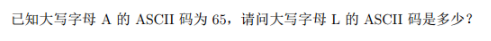

#### 分析

直接打印输出就可以得到答案了

#### 参考答案

```java
public class QuestionA {
	public static void main(String[] args) {
        // 65
		System.out.println('A' - 0);
        // 76
		System.out.println('L' - 0);
	}
}
```

### 试题B：卡片

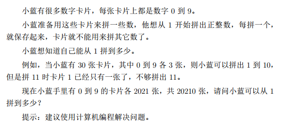

#### 分析

这道题只需要知道如何求得一个数的每一位的值即可，很基础

#### 参考答案

```java
public class QuestionB {
	public static void main(String[] args) {
		int[] buckets = new int[10];
		// 将桶中每一位都初始化为2021
		Arrays.fill(buckets, 2021);
        // 计数
		int counter = 1;
		out: while (true) {
			int temp = counter;
            // 不断取出temp的最后一位
			while (temp != 0) {
                // 将这一位的值得卡片的数目自减1
				buckets[temp % 10]--;
                // 如果这一位的卡片用完了
				if (buckets[temp % 10] == -1) {
					// 如果桶中没有元素了
					break out;
				}
				temp /= 10;
			}
            // 将counter自增1
			counter++;
		}
        // 真实可以拼到的数字是counter-1
		System.out.println(counter - 1);
	}
}
```

### 试题C：直线

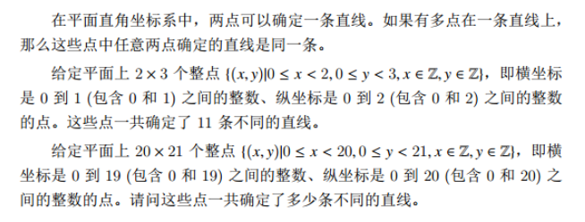

#### 分析

一条直线可以由两个参数就可以确定下来

一个是斜率 k 一个是截距 b ，所以只需要通过判断这两个参数就可以判断两个直线是否是同一个直线了

并且两点就可以确定一条直线，也就是两点就可以确定 k 和 b 

现在有了两点，点A ( x1 , y1 )和点B ( x2 , y2 )，计算公式如下

> k 的计算公式

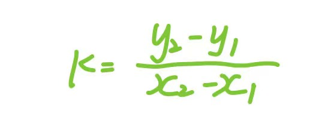

> 直线计算

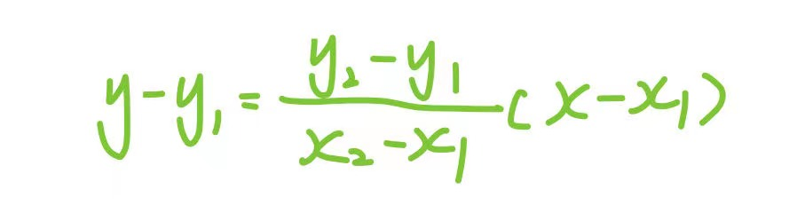

化简一下

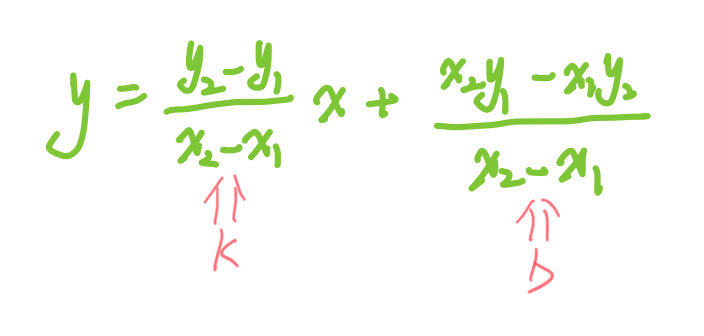

但是需要注意两点

1、平行于 x 轴的直线没有斜率，为了方便，与 y 轴平行的直线也单独考虑

2、k 的计算需要使用

直接使用四重循环计算即可

#### 参考答案

```java

public class QuestionC {
	static HashSet<Line> lines = new HashSet<>();

	public static void main(String[] args) {
		Scanner scanner = new Scanner(System.in);
		int[] xs = new int[scanner.nextInt()];
		for (int i = 0; i < xs.length; i++) {
			xs[i] = i;
		}
		int[] ys = new int[scanner.nextInt()];
		for (int i = 0; i < ys.length; i++) {
			ys[i] = i;
		}
		// 遍历x
		for (int x1 = 0; x1 < xs.length; x1++) {
			for (int x2 = 0; x2 < xs.length; x2++) {
				// 遍历y
				for (int y1 = 0; y1 < ys.length; y1++) {
					for (int y2 = 0; y2 < ys.length; y2++) {
						calculate(x1, y1, x2, y2);
					}
				}
			}
		}
		System.out.println(lines.size() + xs.length + ys.length);
	}

	private static void calculate(int x1, int y1, int x2, int y2) {
		// 说明是与x轴或者y轴平行的线，直接返回即可，不需要放入lines集合中
		if (x1 == x2 || y1 == y2) {
			return;
		}
		Line line = new Line();
		line.k = new BigDecimal(y2 - y1).divide(new BigDecimal(x2 - x1), RoundingMode.FLOOR);
		line.b = new BigDecimal(x2 * y1 - x1 * y2).divide(new BigDecimal(x2 - x1), RoundingMode.FLOOR);
		lines.add(line);
	}

	static class Line {
		BigDecimal k;
		BigDecimal b;

		@Override
		public int hashCode() {
			return Objects.hash(b, k);
		}

		@Override
		public boolean equals(Object obj) {
			if (this == obj)
				return true;
			if (obj == null)
				return false;
			if (getClass() != obj.getClass())
				return false;
			Line other = (Line) obj;
            // 这里的比较需要使用compareTo，它不会比较两者的精度
            // equals中会比较两者的精度
			return b.compareTo(other.b) == 0 && k.compareTo(other.k) == 0;
		}
	}
}
```

### 试题D：货物摆放

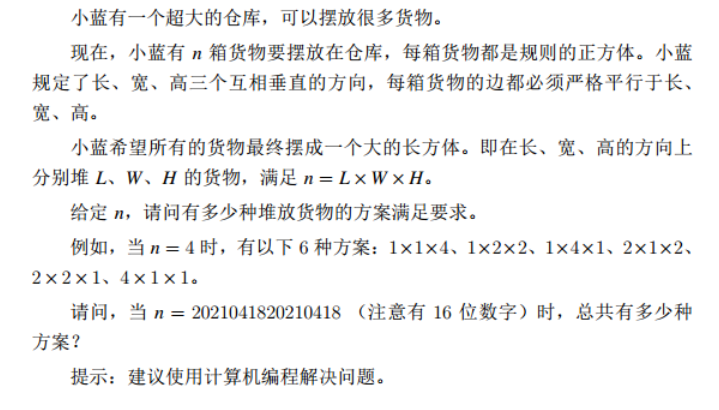

#### 分析

使用回溯将所有组合求出来即可

但是因为这个 n 很大，所以最好先把它的因子求出来，然后再使用回溯组合求解方案数

求得一个数的所有因子

```java
public static LinkedList<Long> list(long n) {
    LinkedList<Long> integers = new LinkedList<>();
    double q = Math.sqrt(n);
    for (long i = 2; i <= q; i++) {
        if (n % i == 0) {
            integers.add(i);
        }
    }
    integers.add(n);
    return integers;
}
```

然后将这些因子组合计算即可

#### 参考答案

```java
public class QuestionE {
    static BigDecimal target;

    public static void main(String[] args) {
        Scanner scanner = new Scanner(System.in);
        long n = scanner.nextLong();
        target = new BigDecimal(n);
        System.out.println(backtrack(n));
    }

    private static int backtrack(long n) {
        LinkedList<Long> track = new LinkedList<>();
        LinkedList<LinkedList<Long>> result = new LinkedList<>();
        backtrack(list(n), track, result);
        // 打印出所有的组合
        System.out.println(result);
        return result.size();
    }

    private static void backtrack(LinkedList<Long> chooses, LinkedList<Long> track, LinkedList<LinkedList<Long>> result) {
        if (track.size() == 3) {
            updateResult(track, result);
            return;
        }
        for (Long choose : chooses) {
            track.addLast(choose);
            backtrack(chooses, track, result);
            track.removeLast();
        }
    }

    private static void updateResult(LinkedList<Long> track, LinkedList<LinkedList<Long>> result) {
        BigDecimal sum = new BigDecimal("1");
        for (int i = 0; i < track.size(); i++) {
            sum = sum.multiply(new BigDecimal(track.get(i)));
        }
        // 用来调试观察
        System.out.println("sum:" + sum);
        // 使用compareTo比较大小，如果相等返回的就是0
        if (sum.compareTo(target) != 0) {
            return;
        }
        // 符合要求
        result.add(new LinkedList<>(track));
    }

    public static LinkedList<Long> list(long n) {
        LinkedList<Long> integers = new LinkedList<>();
        double q = Math.sqrt(n);
        for (long i = 1; i <= q; i++) {
            if (n % i == 0) {
                integers.add(i);
            }
        }
        integers.add(n);
        return integers;
    }
}
```

### 试题E：路径

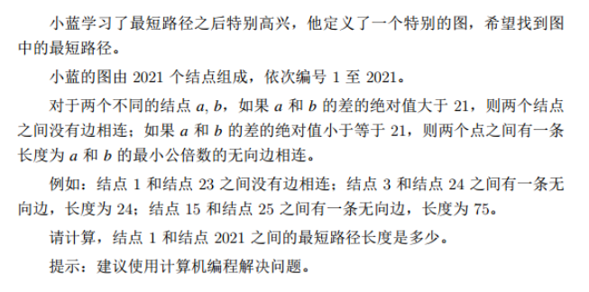

这里暂时留个坑🕳，后面填

### 试题F：时间显示

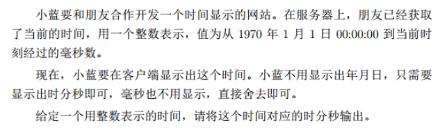

#### 分析

调用Java的API即可

#### 参考答案

```java
public class QuestionF {
	public static void main(String[] args) {
		Scanner scanner = new Scanner(System.in);
		LocalDateTime base = LocalDateTime.of(1970, 1, 1, 0, 0, 0);
		long plus = scanner.nextLong() * 1000 * 1000;
		LocalDateTime next = base.plusNanos(plus);
		System.out.println(base);
		System.out.println(next);
		DateTimeFormatter sdf = DateTimeFormatter.ofPattern("HH:mm:ss");
        // 输出的就是最后的答案
		System.out.println(next.format(sdf));
	}
}
```

### 试题G：最少砝码

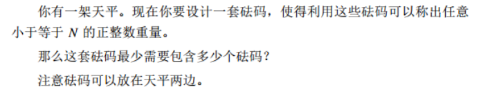

不会，题解见: [最少砝码题解](https://blog.csdn.net/weixin_54522345/article/details/121576906)

### 试题H：杨辉三角

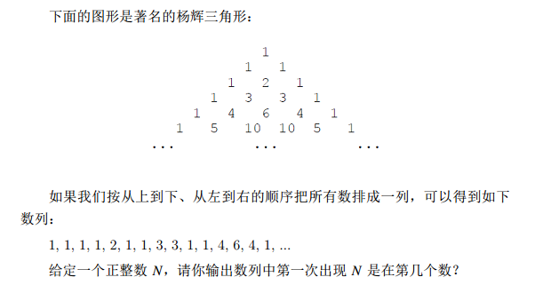

#### 分析

每一层的数列依赖于上一层的数值，所以只需要保存当前这一层，下一层基于上一层计算后覆盖原来那一层即可

并且维护一个数字size，表示当前是第几个元素

计算过程中找到 n 即可停止计算，返回size

#### 参考答案

```java
public class QuestionH {
	public static void main(String[] args) {
		int n = new Scanner(System.in).nextInt();
		if (n == 1) {
			System.out.println(1);
			return;
		}
        // 记录现在有多少元素了
		long size = 3;
        // 记录当前这一层的列表
        // 初始在第二层
		LinkedList<Integer> temp = new LinkedList<>();
		temp.add(1);
		temp.add(1);
		out: while (true) {
			LinkedList<Integer> inner = new LinkedList<>();
            // 第一个元素1加入后size++
			size++;
			inner.add(1);
			for (int i = 0; i < temp.size() - 1; i++) {
				int cur = temp.get(i) + temp.get(i + 1);
				inner.add(cur);
				size++;
                // 找到了，直接退出循环
				if (cur == n) {
					break out;
				}
			}
            // 最后一个元素1加入后size++
			size++;
			inner.add(1);
            // 更新temp
			temp = inner;
		}
        // size就是n所在的位置
		System.out.println(size);
	}
}
```

### 试题I：双向排序

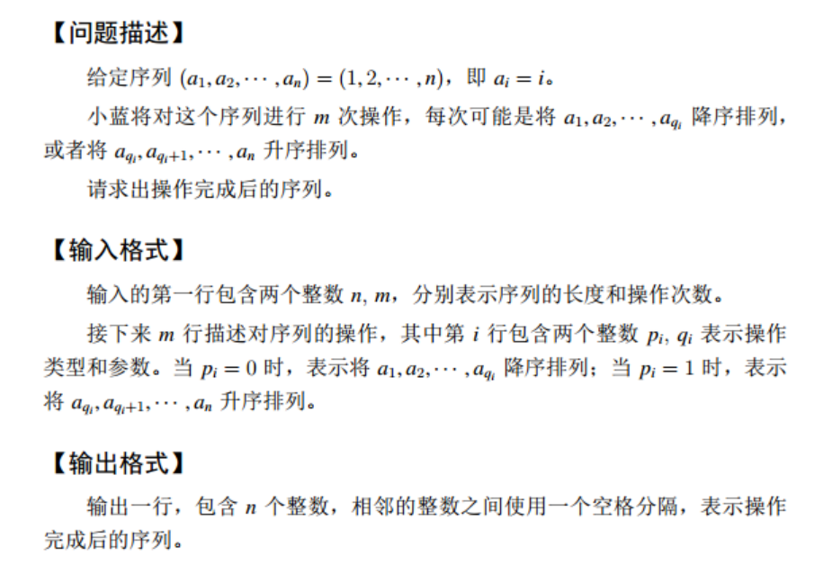

#### 分析

题目意思很好理解，就是不断地对指定区间作排序

这题用常规方法做肯定会超时，需要找一些技巧性的东西

但是那种技巧性的东西如果之前没遇到过，这里肯定是想不到的

直接自己写一个归并排序，尽可能顶住大数据，尽可能多拿点分就行了

#### 参考答案

```java
public class QuestionI {
	public static void main(String[] args) {
		Scanner scanner = new Scanner(System.in);
		int n = scanner.nextInt();
		int m = scanner.nextInt();
        // 记录所有的操作
		int[][] ops = new int[m][2];
		for (int i = 0; i < ops.length; i++) {
			ops[i][0] = scanner.nextInt();
			ops[i][1] = scanner.nextInt();
		}
        // 根据n初始化数组
		int[] arr = new int[n];
		for (int i = 0; i < arr.length; i++) {
			arr[i] = i + 1;
		}
        // 双向排序
		function(arr, ops);
		System.out.println(Arrays.toString(arr));
	}

	private static void function(int[] arr, int[][] ops) {
        // 辅助数组
		int[] temp = new int[arr.length];
		for (int i = 0; i < ops.length; i++) {
			int[] op = ops[i];
			int h = op[1];
			if (op[0] == 0) {
				desc(arr, temp, 0, h - 1);
			} else {
				asc(arr, temp, h - 1, arr.length - 1);
			}
		}
	}

    // 升序排序
	private static void asc(int[] arr, int[] temp, int i, int j) {
		if (i == j) {
			return;
		}
		int mid = (i + j) / 2;
		asc(arr, temp, i, mid);
		asc(arr, temp, mid + 1, j);
		System.arraycopy(arr, i, temp, i, j - i + 1);
		int leftIndex = i;
		int rightIndex = mid + 1;
		for (int k = i; k <= j; k++) {
			if (leftIndex == mid + 1) {
				arr[k] = temp[rightIndex++];
			} else if (rightIndex == j + 1) {
				arr[k] = temp[leftIndex++];
			} else if (temp[leftIndex] >= temp[rightIndex]) {
				arr[k] = temp[rightIndex++];
			} else if (temp[leftIndex] < temp[rightIndex]) {
				arr[k] = temp[leftIndex++];
			}
		}
	}

    // 降序排序
	private static void desc(int[] arr, int[] temp, int i, int j) {
		if (i == j) {
			return;
		}
		int mid = (i + j) / 2;
		desc(arr, temp, i, mid);
		desc(arr, temp, mid + 1, j);
		System.arraycopy(arr, i, temp, i, j - i + 1);
		int leftIndex = i;
		int rightIndex = mid + 1;
		for (int k = i; k <= j; k++) {
			if (leftIndex == mid + 1) {
				arr[k] = temp[rightIndex++];
			} else if (rightIndex == j + 1) {
				arr[k] = temp[leftIndex++];
			} else if (temp[leftIndex] >= temp[rightIndex]) {
				arr[k] = temp[leftIndex++];
			} else if (temp[leftIndex] < temp[rightIndex]) {
				arr[k] = temp[rightIndex++];
			}
		}
	}
}
```

### 试题J：括号序列

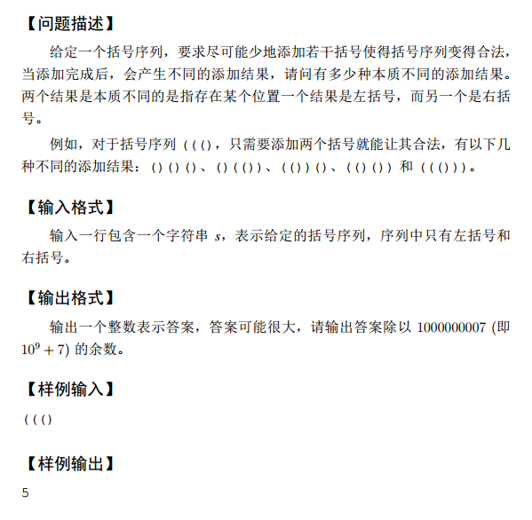

#### 分析

这道题我的理解就是计算给定的字符串中需要组成多少对括号

也就是左括号和右括号的最大值 n

然后将问题转化为用 n 个左括号和右括号，最多可以组成多少个合法的括号序列

#### 参考答案

```java

public class QuestionJ {
	static char LEFT_BRACKET = '(';
	static char RIGHT_BRACKET = ')';

	public static void main(String[] args) {
		Scanner scanner = new Scanner(System.in);
		String line = scanner.nextLine();
		System.out.println(function(line));
	}

	static long sum;

	private static long function(String line) {
		char[] sArray = line.toCharArray();
		int brackets = calculate(sArray);
		sum = 0;
		assembleBracket(brackets, brackets);
		return sum;
	}

	private static void assembleBracket(int leftLeft, int rightLeft) {
		if (leftLeft < 0 || rightLeft < 0) {
			return;
		}
		if (rightLeft < leftLeft) {
			return;
		}
		if (leftLeft == 0 && leftLeft == rightLeft) {
			sum++;
			return;
		}
		assembleBracket(leftLeft - 1, rightLeft);
		assembleBracket(leftLeft, rightLeft - 1);
	}

	private static int calculate(char[] sArray) {
		int left = 0;
		int right = 0;
		for (int i = 0; i < sArray.length; i++) {
			if (sArray[i] == '(') {
				left++;
			} else if (sArray[i] == ')') {
				right++;
			} else {
				throw new IllegalArgumentException("参数不合法");
			}
		}
		return Math.max(left, right);
	}
}
```


