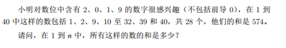

## 第十届蓝桥杯大赛软件赛省赛_Java_B组

### 试题A：组队


#### 分析

直接看表计算即可，注意同一个人只能作为一个位置的球员

#### 参考答案

```bash
98(17) + 99(20) + 98(15) + 97(11) + 98(12) = 98 * 5 = 490
97(1) + 99(10) + 99(17) + 97(11) + 98(15) = 98 * 5 = 490
```

### 题目B：不同子串


#### 分析

子串的定义是在原字符串中找到一组连续的序列

题目要求的求得不同的子串有几个

使用一个set去重即可

#### 参考答案

```java
public class QuestionB {
	public static void main(String[] args) {
		String string = "0100110001010001";
		HashSet<String> set = new HashSet<>();
		char[] sArray = string.toCharArray();
		for (int i = 0; i < sArray.length; i++) {
			for (int j = i; j < sArray.length; j++) {
				set.add(new String(sArray, i, j - i + 1));
			}
		}
		System.out.println(set);
        // 集合长度就是答案
		System.out.println(set.size());
	}
}
```

### 题目C：数列求值


#### 分析

按照题意进行计算就可以了

需要注意一点就是，题目问的是最后四位数字是啥，这说明了两点

1、只需要知道最后四位是啥就可以了

2、最后的数值很大很大，可能要几百位，不能直接求出来最后的值，那样可能需要很长时间

这样就会超时，可能要算几个小时

```java
public class QuestionC {
	public static void main(String[] args) {
		int end = 20190324;
		BigDecimal[] dp = new BigDecimal[end + 1];
		dp[0] = new BigDecimal("1");
		dp[1] = new BigDecimal("1");
		dp[2] = new BigDecimal("1");
		for (int i = 3; i < dp.length; i++) {
			dp[i] = dp[i - 1].add(dp[i - 2].add(dp[i - 3]));
			System.out.println(i);
            // 防止OOM
			dp[i - 3] = null;
		}
		System.out.println(dp[end]);
	}
}
```

#### 参考答案

```java
public class QuestionC {
    public static void main(String[] args) {
        int stop = 20190324;
        int[] dp = new int[stop];
        dp[0] = 1;
        dp[1] = 1;
        dp[2] = 1;
        for (int i = 3; i < dp.length; i++) {
            // 只需要最后四位，所以直接取余就可以了
            dp[i] = (dp[i - 1] + dp[i - 2] + dp[i - 3]) % 10000;
        }
        System.out.println(dp[stop - 1]);
    }
}
```

### 题目D：数的分解


#### 分析

回溯或者三重循环直接求就行

需要筛掉数字中包含 2 和 4 的

#### 参考答案

##### 回溯

```java
public class QuestionD {
    public static void main(String[] args) {
        QuestionD q = new QuestionD();
        System.out.println(q.backTrack(2019));
    }

    private long backTrack(int target) {
        LinkedList<Integer> track = new LinkedList<>();
        // 为了去重
        HashSet<Unit> set = new HashSet<>();
        // 回溯求解
        backTrack(track, 0, target, set);
        System.out.println(set);
        return set.size();
    }

    private boolean notValid(int number) {
        String numberString = String.valueOf(number);
        // 不能包含2和4
        return numberString.matches("\\d*[2|4]\\d*");
    }

    private void backTrack(LinkedList<Integer> track, long nowSum, int target,
                           HashSet<Unit> set) {
        // 路径长度到达3了
        if (track.size() == 3) {
            // 判断现在的总和是否和target一致
            if (nowSum == target) {
                set.add(new Unit(track));
            }
            return;
        }
        for (int i = 1; i <= target - nowSum; i++) {
            // 数字中不能包含2或者4
            // 不能包含重复数字
            if (notValid(i) || track.contains(i)) {
                continue;
            }
            // 做出选择
            track.addLast(i);
            // 回溯
            backTrack(track, nowSum + i, target, set);
            // 撤销选择
            track.removeLast();
        }
    }

    class Unit {
        int a;
        int b;
        int c;

        public Unit(LinkedList<Integer> track) {
            // 先排序
            // a、b、c是升序的，为了后面去重
            // 18，1000，1001就代表了6种排序
            List<Integer> temp = track.stream().sorted().collect(Collectors.toList());
            a = temp.get(0);
            b = temp.get(1);
            c = temp.get(2);
        }

        @Override
        public boolean equals(Object o) {
            if (this == o) {
                return true;
            }
            if (o == null || getClass() != o.getClass()) {
                return false;
            }
            Unit unit = (Unit) o;
            return a == unit.a && b == unit.b && c == unit.c;
        }

        @Override
        public int hashCode() {
            return Objects.hash(a, b, c);
        }

        @Override
        public String toString() {
            return "[" + a + "," + b + "," + c + "]";
        }
    }
}
```

##### 三重循环

```java
public class QuestionD {
	public static void main(String[] args) {
		int target = 2019;
		long count = 0;
		for (int i = 1; i < target; i++) {
			for (int j = i + 1; j < target; j++) {
				for (int k = j + 1; k < target; k++) {
                    // 三个数字都不能包含2或者4
					if (notValid(i) || notValid(k) || notValid(j)) {
						continue;
					}
                    // 判断总和是否是target
					if (i + j + k == target) {
						count++;
					}
				}
			}
		}
		System.out.println(count);
	}
}
```

> PS：
>
> 回溯平均时间：7000ms
>
> 三重循环平均时间：390_000ms

### 题目E：迷宫


#### 分析

经典的迷宫问题，使用BFS和DFS都可以解决问题，但是优先使用BFS解题，因为要求的是最短路径，并且是字典序最小的

#### 参考答案

##### BFS（推荐）

```java
public class QuestionE_2 {
    // 向下走
    static int[] DOWN = {1, 0};
    // 向左走
    static int[] LEFT = {0, -1};
    // 向右走
    static int[] RIGHT = {0, 1};
    // 向上走
    static int[] UP = {-1, 0};
    // 将所有的选择都放到一个二维数组中
    static int[][] chooses = {DOWN, LEFT, RIGHT, UP};
    // 将选择和字符串做出映射
    static HashMap<int[], String> map = new HashMap<>();
    static int height;
    static int width;

    static {
        map.put(DOWN, "D");
        map.put(LEFT, "L");
        map.put(RIGHT, "R");
        map.put(UP, "U");
    }

    public static void main(String[] args) {
//        int[][] maze = {{0, 1, 0, 0, 0, 0}, {0, 0, 0, 1, 0, 0}, {0, 0, 1, 0, 0, 1}, {1, 1, 0, 0, 0, 0}};
        // try-with-resources模式
        try (BufferedReader br = new BufferedReader(new FileReader("maze.txt"))) {
            LinkedList<String> lines = new LinkedList<>();
            String temp;
            while ((temp = br.readLine()) != null) {
                lines.addLast(temp);
            }
            int[][] maze = new int[lines.size()][lines.get(0).length()];
            for (int i = 0; i < lines.size(); i++) {
                String line = lines.get(i);
                for (int j = 0; j < line.length(); j++) {
                    maze[i][j] = line.charAt(j) - '0';
                }
            }
            System.out.println(bfs(maze));
        } catch (IOException e) {
            e.printStackTrace();
        }
    }

    private static String bfs(int[][] maze) {
        height = maze.length;
        width = maze[0].length;
        // 新建一个队列
        Queue<Node> queue = new LinkedList<>();
        // 用来保存结果的
        LinkedList<String> resList = new LinkedList<>();
        // 起始位置
        queue.offer(new Node(0, 0, null, null));
        // 起点标为1
        maze[0][0] = 1;
        while (!queue.isEmpty()) {
            Node node = queue.poll();
            // 到了终点
            if (node.x == height - 1 && node.y == width - 1) {
                // 将走法拼接起来
                StringBuilder s = new StringBuilder();
                while (node.preNode != null) {
                    s.append(node.direction);
                    node = node.preNode;
                }
                // 翻转放入resList中
                resList.addLast(s.reverse().toString());
                // 不用做选择了
                continue;
            }
            // 做四次选择
            for (int i = 0; i < chooses.length; i++) {
                int[] choose = chooses[i];
                // newX和newY是经过变换后的坐标
                int newX = node.x + choose[0];
                int newY = node.y + choose[1];
                // 越界
                if (newX < 0 || newX >= height || newY < 0 || newY >= width) {
                    continue;
                }
                // 有障碍或者走过了
                if (maze[newX][newY] == 1) {
                    continue;
                }
                // 置为走过了
                maze[newX][newY] = 1;
                // 将新状态放入队列
                queue.offer(new Node(newX, newY, node, map.get(choose)));
            }
        }
        // 将resList按照字符长度升序排序
        resList.sort(Comparator.comparingInt(String::length));
        String result = resList.get(0);
        for (int i = 1; i < resList.size(); i++) {
            String c = resList.get(i);
            // 如果字典序比result小，则更新result
            if (c.compareTo(result) < 0) {
                result = c;
            }
        }
        return result;
    }

    static class Node {
        private int x;
        private int y;
        private Node preNode;
        private String direction;

        public Node(int x, int y, Node preNode, String direction) {
            super();
            this.x = x;
            this.y = y;
            this.preNode = preNode;
            this.direction = direction;
        }

        @Override
        public String toString() {
            return "Node{" +
                    "x=" + x +
                    ", y=" + y +
                    ", preNode=" + preNode +
                    ", direction='" + direction + '\'' +
                    '}';
        }
    }
}
```

##### DFS

```java
public class QuestionE {
    static int[] DOWN = {1, 0};
    static int[] LEFT = {0, -1};
    static int[] RIGHT = {0, 1};
    static int[] UP = {-1, 0};
    static int[][] chooses = {DOWN, LEFT, RIGHT, UP};
    static HashMap<int[], Character> map = new HashMap<>();
    static int height;
    static int width;

    static {
        map.put(DOWN, 'D');
        map.put(LEFT, 'L');
        map.put(RIGHT, 'R');
        map.put(UP, 'U');
    }

    public static void main(String[] args) {
        //        int[][] maze = {{0, 1, 0, 0, 0, 0}, {0, 0, 0, 1, 0, 0}, {0, 0, 1, 0, 0, 1}, {1, 1, 0, 0, 0, 0}};
        try (BufferedReader br = new BufferedReader(new FileReader("maze.txt"))) {
            LinkedList<String> lines = new LinkedList<>();
            String temp;
            while ((temp = br.readLine()) != null) {
                lines.addLast(temp);
            }
            int[][] maze = new int[lines.size()][lines.get(0).length()];
            for (int i = 0; i < lines.size(); i++) {
                String line = lines.get(i);
                for (int j = 0; j < line.length(); j++) {
                    maze[i][j] = line.charAt(j) - '0';
                }
            }
            System.out.println(backTrack(maze));
        } catch (IOException e) {
            e.printStackTrace();
        }
    }

    private static String backTrack(int[][] maze) {
        // 记录路径
        LinkedList<Character> track = new LinkedList<>();
        // 记录最后的结果的
        LinkedList<Character> result = new LinkedList<>();
        height = maze.length;
        width = maze[0].length;
        // 回溯
        backTrack(0, 0, maze, track, result);
        StringBuilder result = new StringBuilder();
        for (int i = 0; i < result.size(); i++) {
            result.append(result.get(i));
        }
        return result.toString();
    }

    private static void backTrack(int x, int y, int[][] maze, LinkedList<Character> track,
                                  LinkedList<Character> result) {
        if (x == height - 1 && y == width - 1) {
            // 到终点了，更新结果集
            updateResult(track, result);
            return;
        }
        // 遍历四种选择
        for (int i = 0; i < chooses.length; i++) {
            int[] choose = chooses[i];
            int newX = x + choose[0];
            int newY = y + choose[1];
            // 越界
            if (newX < 0 || newX >= height || newY < 0 || newY >= width) {
                continue;
            }
            // 有障碍或者已经走过了
            if (maze[newX][newY] == 1) {
                continue;
            }
            // 做出选择
            track.addLast(map.get(choose));
            // 做出选择
            maze[newX][newY] = 1;
            backTrack(newX, newY, maze, track, result);
            // 撤销选择
            maze[newX][newY] = 0;
            // 撤销选择
            track.removeLast();
        }
    }

    private static void updateResult(LinkedList<Character> track, LinkedList<Character> result) {
        // 如果结果集还是空的，直接将track放入result中
        if (result.isEmpty()) {
            result.addAll(track);
            return;
        }
        int trackSize = track.size();
        int resultSize = result.size();
        if (trackSize > resultSize) {
            return;
        }
        // trackSize更小
        if (trackSize < resultSize) {
            result.clear();
            result.addAll(track);
            return;
        }
        // 两者一样长，比较字典序
        for (int i = 0; i < trackSize; i++) {
            if (track.get(i) < result.get(i)) {
                result.clear();
                result.addAll(track);
                return;
            }
        }
    }
}
```

### 题目F：特别数的和



#### 分析

将数字转化为字符串后，使用正则表达式去匹配字符串中是否存在2、0、1、9这其中的数字即可

正则表达式如下：`\d*[2|0|1|9]\d*`

#### 参考答案

```java
public class QuestionF {
	public static void main(String[] args) {
		Scanner scanner = new Scanner(System.in);
		int n = scanner.nextInt();
		QuestionF q = new QuestionF();
		System.out.println(q.calculate(n));
	}

	private LinkedList<Integer> calculate(int n) {
		LinkedList<Integer> resList = new LinkedList<>();
		for (int i = 1; i <= n; i++) {
			if (valid(i)) {
				resList.add(i);
			}
		}
		return resList;
	}

	private boolean valid(int x) {
		return String.valueOf(x).matches("\\d*[2|0|1|9]\\d*");
	}
}
```

### 题目G：外卖店优先级


#### 分析

按照题目意思做就行

注意几点：

1、有订单的话，优先级是不需要减 1 的、

2、优先级是大于 5 ，是严格大于 5

#### 参考答案

```java
public class QuestionG {
    public static void main(String[] args) {
        Scanner scanner = new Scanner(System.in);
        int n = scanner.nextInt();
        int m = scanner.nextInt();
        int t = scanner.nextInt();
        int[][] ops = new int[m][2];
        for (int i = 0; i < m; i++) {
            ops[i][0] = scanner.nextInt();
            ops[i][1] = scanner.nextInt();
        }
        QuestionG q = new QuestionG();
        System.out.println(q.calculate(n, t, ops));
    }

    private int calculate(int n, int time, int[][] ops) {
        // 按时间点升序排序
        Arrays.sort(ops, (a, b) -> a[0] - b[0]);
        //记录每家店的优先级
        int[] takeawayPriority = new int[n + 1];
        // 缓存
        LinkedHashSet<Integer> cache = new LinkedHashSet<>();
        // 记录操作到哪了
        int index = 0;
        // 走完time个时间点
        for (int i = 0; i <= time; i++) {
            // 找到所有符合当前时间点的操作
            while (index < ops.length && ops[index][0] == i) {
                // 找到店铺id
                int shopId = ops[index][1];
                // 这里加三是为了方便操作
                // 下面统一减一即可，不需要做额外的判断了
                // 也就是加了2
                takeawayPriority[shopId] += 3;
                // 如果加了优先级之后，大于5则将其加入到缓存中
                if (takeawayPriority[shopId] > 5) {
                    cache.add(shopId);
                }
                // 将操作的索引自增1
                index++;
            }
            // 将每家店的优先级都减1
            for (int j = 0; j < takeawayPriority.length; j++) {
                // 大于0的情况下再减
                if (takeawayPriority[j] > 0) {
                    takeawayPriority[j]--;
                    // 如果小于 3 了，则将其移除缓存，不管其在不在缓存
                    if (takeawayPriority[j] <= 3) {
                        cache.remove(j);
                    }
                }
            }
        }
        // 返回缓存的数字
        return cache.size();
    }
}
```

### 题目H：人物相关性分析


#### 分析

使用正则表达式

#### 参考答案

```java
public class QuestionH {
    public static void main(String[] args) {
        Scanner scanner = new Scanner(System.in);
        int k = Integer.parseInt(scanner.nextLine());
        String target = scanner.nextLine();
        QuestionH q = new QuestionH();
        System.out.println(q.calculate(k, target));
    }

    private int calculate(int k, String target) {
        // 匹配Alice...Bob顺序的字符串
        String regex = buildRegex(k);
        // 匹配Bob...Alice顺序的字符串
        String reverseRegex = buildReverseRegex(k);
        // 将两者的匹配次数加起来
        return count(regex, target) + count(reverseRegex, target);
    }

    private int count(String regex, String target) {
        // 将正则表达式编译
        Pattern pattern = Pattern.compile(regex);
        // 得到对应的matcher
        Matcher matcher = pattern.matcher(target);
        // 计数
        int count = 0;
        while (matcher.find()) {
            count++;
        }
        // 返回总数
        return count;
    }

    private String buildRegex(int k) {
        return "\\bAlice.{0," + k + "}Bob\\b";
    }
    
    private String buildReverseRegex(int k) {
        return "\\bBob.{0," + k + "}Alice\\b";
    }
}
```

### 题目I：后缀表达式


#### 分析

题目提到了后缀表达式计算表达式的值

但是其实本质就是问给你N+M+1个数，给你N个加号，M个减号，然后组合求最大

即：MAX - (MIN)

#### 参考答案

```java
public class QuestionI {
	public static void main(String[] args) {
		Scanner sc = new Scanner(System.in);
		int N = sc.nextInt();
		int M = sc.nextInt();
		int[] A = new int[N + M + 1];
		long sum = 0;
		// 输入N+M+1个整数
		for (int i = 0; i < N + M + 1; i++) {
			A[i] = sc.nextInt();
		}
		// 没减号,直接全部加起来就是最大的
		if (M == 0) {
			for (int item : A)
				sum += item;
		} else {
            // 先排序
			Arrays.sort(A);
            // 减去最小的
			sum -= A[0];
            // 加上最大的
			sum += A[N + M];
			for (int i = 1; i < N + M; i++)
				sum += Math.abs(A[i]);
		}
		System.out.println(sum);
	}
}
```

### 题目J：零能传输

