## 最后K个数的乘积

请你实现一个「数字乘积类」`ProductOfNumbers`，要求支持下述两种方法：

1.` add(int num)`

- 将数字 `num` 添加到当前数字列表的最后面。

2.` getProduct(int k)`

- 返回当前数字列表中，最后 `k` 个数字的乘积。
- 你可以假设当前列表中始终 **至少** 包含 `k` 个数字。

题目数据保证：任何时候，任一连续数字序列的乘积都在 32-bit 整数范围内，不会溢出。

**示例：**

```
输入：
["ProductOfNumbers","add","add","add","add","add","getProduct","getProduct","getProduct","add","getProduct"]
[[],[3],[0],[2],[5],[4],[2],[3],[4],[8],[2]]

输出：
[null,null,null,null,null,null,20,40,0,null,32]

解释：
ProductOfNumbers productOfNumbers = new ProductOfNumbers();
productOfNumbers.add(3);        // [3]
productOfNumbers.add(0);        // [3,0]
productOfNumbers.add(2);        // [3,0,2]
productOfNumbers.add(5);        // [3,0,2,5]
productOfNumbers.add(4);        // [3,0,2,5,4]
productOfNumbers.getProduct(2); // 返回 20 。最后 2 个数字的乘积是 5 * 4 = 20
productOfNumbers.getProduct(3); // 返回 40 。最后 3 个数字的乘积是 2 * 5 * 4 = 40
productOfNumbers.getProduct(4); // 返回  0 。最后 4 个数字的乘积是 0 * 2 * 5 * 4 = 0
productOfNumbers.add(8);        // [3,0,2,5,4,8]
productOfNumbers.getProduct(2); // 返回 32 。最后 2 个数字的乘积是 4 * 8 = 32 
```


**提示：**

- `add` 和 `getProduct` 两种操作加起来总共不会超过 `40000` 次。
- `0 <= num <= 100`
- `1 <= k <= 40000`

Related Topics

* 设计
* 队列
* 数组
* 数学
* 数据流

### 法一：暴力

这题很好理解，但是如果想要写出一个复杂度低的算法不是一件简单的事情

下面我们先来用最简单最通俗易懂的方法来实现

因为数组长度不定，所以使用`source`用来存储原数组

返回最后k个数字的乘积`getProduct`，那我只需要遍历`source`的最后k个数字并将其相乘返回即可

```java
public class ProductOfNumbers {
    private List<Integer> source;

    public ProductOfNumbers() {
        source = new ArrayList<>();
    }

    public void add(int num) {
        source.add(num);
    }

    public int getProduct(int k) {
        int res = 1;
        for (int i = k; i > 0; i--) {
            res *= source.get(source.size() - i);
        }
        return res;
    }
}
```

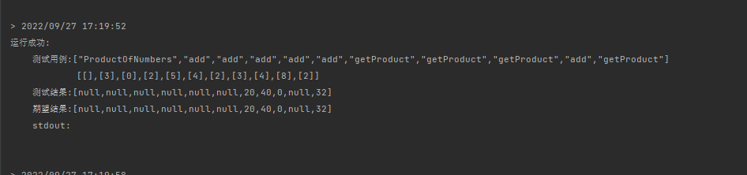

好，没有问题，提交！

但是**Medium**的题目会这么简单吗？NO！

只有通过大测试数据，算法才算通过

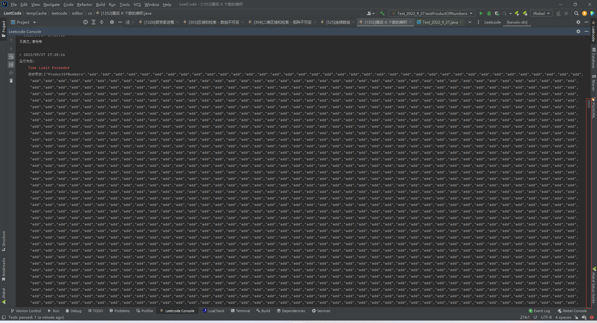

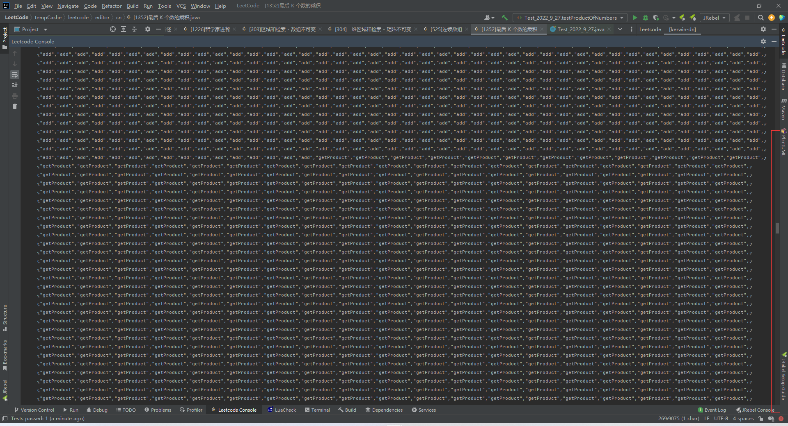

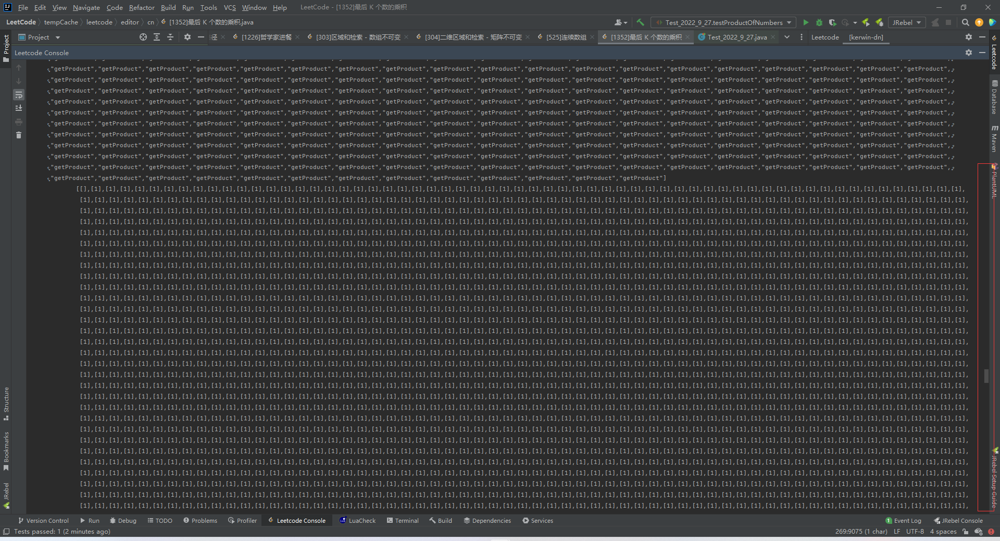

这种简单的算法，虽然好想，但是扛不住大数据，接下来介绍一种新解法

### 法二：前缀积

在看这个之前，最好先了解过前缀和的知识，可以移步这篇文章[【303-Easy】区域和检索-数组不可变]()

且听我解释各变量的作用，再看代码

`source`和之前的作用是一样的，是用来存储原数组的

`size`就是原数组的长度

`zeroIndex`代表的是 0 最后一次出现的位置

`preMultiply`的作用是存储前缀积的结果的，但是这里的`preMultiply`和之前的前缀和的定义略有不同

这里`preMultiply.get(i)`的定义是

> i  >  zeroIndex

原数组在`[zeroIndex+1,i]`的累乘

>i  <  zeroIndex

无定义

```java
public class ProductOfNumbers {
    private List<Integer> source;
    private List<Integer> preMultiply;
    private int size;
    private int zeroIndex;

    public ProductOfNumbers() {
        size = 0;
        zeroIndex = -1;
        source = new ArrayList<>();
        preMultiply = new ArrayList<>();
        preMultiply.add(1);
    }

    public void add(int num) {
        source.add(num);
        if (num == 0) {
            preMultiply.clear();
            preMultiply.add(1);
            zeroIndex = size;
        } else {
            preMultiply.add(preMultiply.get(size - zeroIndex - 1) * num);
        }
        size++;
    }

    public int getProduct(int k) {
        if (k > size - zeroIndex - 1) {
            return 0;
        }
        return preMultiply.get(size - zeroIndex - 1) / preMultiply.get(size - zeroIndex - k - 1);
    }
}
```

#### 图解

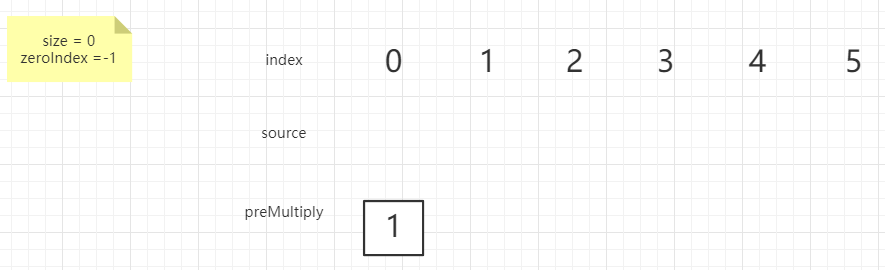

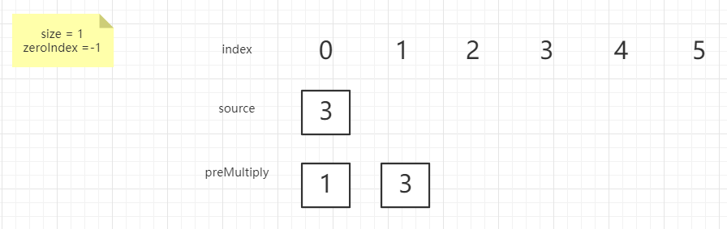

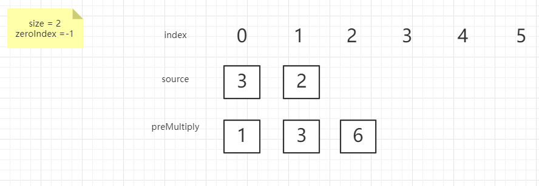

这一步比较特殊，当我出现了 0 的时候所有的前缀积都无效了，所以直接清除，然后记录 0 出现的位置

 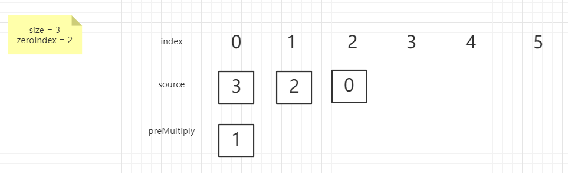

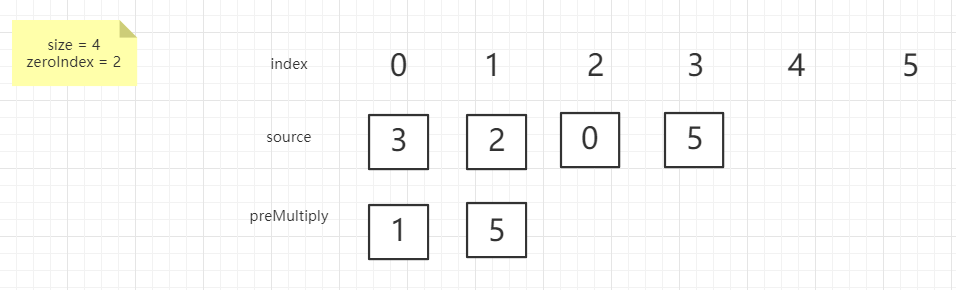

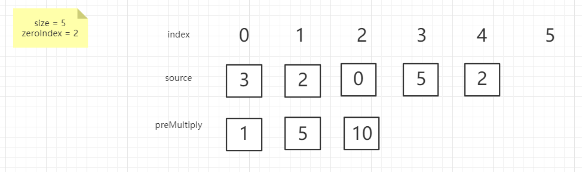

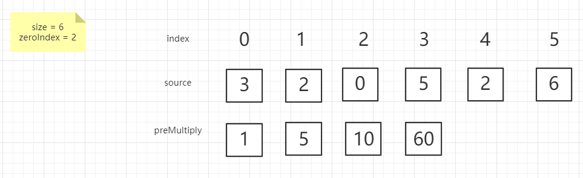

接下来解释一下代码

#### 1、构造函数

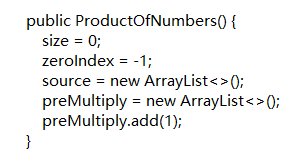

构造函数做的事就是初始化一些变量，这些变量的意义前面讲述过了这里就不赘述了

#### 2、add函数

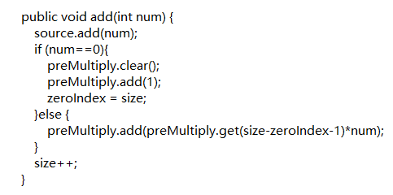

首先将其直接放入source集合中

接下来对于不同的`num`做出不同的处理

> `num`为 0 

重置前缀积集合，即清空集合，并放入 1 

更新`zeroIndex`

（这里直接将`size`赋值给`zeroIndex`的原因是`size`是方法结束之后才自增的，自增前的size表示的就是当前元素的索引）

> `num`不为0

更新前缀积集合，这里的`size-zeroIndex-1`需要理解（这里我当时是通过画图推敲得知）

我的理解就是将当前值乘以原数组 0 之后的所有数的乘积得到的值放入前缀积

#### 3、getProduct函数

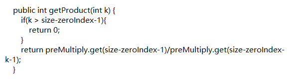

`size-zeroIndex-1`就是原数组 0 之后有几个数字

如果这个数字比 k 小，则可以直接返回 0 

不然，则返回`preMultiply.get(size-zeroIndex-1)/preMultiply.get(size-zeroIndex-k-1);`

`preMultiply.get(size-zeroIndex-1)`是原数组在 0 之后所有数字的乘积

`preMultiply.get(size-zeroIndex-k-1)`是原数组在 0 之后所有数字，倒数第 k 个数到 0 后第一个数的乘积

> 注：如果`size-zeroIndex-k-1`为 0 ，则没有意义，就是 1 ，占位用的


