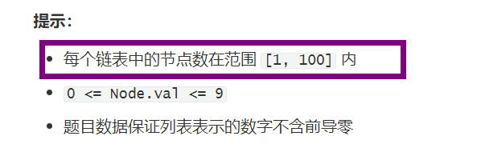

## 两数相加

给你两个 **非空** 的链表，表示两个非负的整数。它们每位数字都是按照 **逆序** 的方式存储的，并且每个节点只能存储 **一位** 数字。

请你将两个数相加，并以相同形式返回一个表示和的链表。

你可以假设除了数字 0 之外，这两个数都不会以 0 开头。

ListNode

```java
//Definition for singly-linked list.
public class ListNode {
    int val;
    ListNode next;
    ListNode() {}
    ListNode(int val) { this.val = val; }
    ListNode(int val, ListNode next) { this.val = val; this.next = next; }
}
```

**示例1:**

```
输入：l1 = [2,4,3], l2 = [5,6,4]
输出：[7,0,8]
解释：342 + 465 = 807.
```

**示例 2：**

```
输入：l1 = [0], l2 = [0]
输出：[0]
```

**示例 3：**

```
输入：l1 = [9,9,9,9,9,9,9], l2 = [9,9,9,9]
输出：[8,9,9,9,0,0,0,1]
```

**图示1：**


**图示2：**


**提示：**

- 每个链表中的节点数在范围 `[1, 100]` 内
- `0 <= Node.val <= 9`
- 题目数据保证列表表示的数字不含前导零

**Related Topics**

* 递归
* 链表
* 数学

### 链表转值计算

遇到这种链表的题，第一步就是将逻辑图画出来

经过观察可知，链表的第一位表示该数字的个位，第二位代表该数字的十位，以此类推。

我第一个想到的解题思路就是

1、将链表表示的数字算出来

2、将两个数字加起来

3、用该数字构建出来结果链表并返回

> 示例代码

```java
class Solution {
    public ListNode addTwoNumbers(ListNode l1, ListNode l2) {
        long sum = compute(l1) + compute(l2);
        ListNode listNode = new ListNode();
        // 这里的listNode是虚拟节点，最后返回的是该节点的下一个节点
        ListNode temp = listNode;
        while (sum != 0) {
            // 这里需要使用强转
            // (sum % 10)的结果是long类型，直接赋值给ListNode的int型的val会报错
            temp.next = new ListNode((int) (sum % 10));
            temp = temp.next;
            sum /= 10;
        }
        return listNode.next;
    }

    /**
     * 该函数是为了计算链表所表示的值
     */
    private long compute(ListNode node) {
        long result = 0;
        for (long i = 1; node != null; node = node.next, i *= 10L) {
            result += node.val * i;
        }
        return result;
    }
}
```

来算一下`long`的最大值是多少

`long`在`Java`里面使用8个字节也就是64位，最大值也就是2^64-1，也就是`9_223_372_036_854_775_807`

此方法乍一看确实没问题

但是题目提示有以下要求



测试的时候可能会出现100位的数字，`long`类型最大值远远不够

当链表很长的时候，该方法就会超时并且发生溢出错误

### 递归

现在有两个链表，要清楚两点

1、两个链表的长度不一定相同

2、两个链表相加后，长度不一定不变

递归需要先将递归退出条件写出来，即两者都到尾部，先就简单看看我画的思路图


> 示例代码 1

```java
class Solution {
    public ListNode addTwoNumbers(ListNode l1, ListNode l2) {
        ListNode listNode = new ListNode();
        add(l1,l2,listNode);
        return listNode;
    }
    public ListNode add(ListNode a,ListNode b,ListNode temp){
        // 当两个链表都到头了，则退出递归
        if(a==null&&b==null){
            return temp;
        }
        // 此变量是用来标注下一次递归的时候两个链表是否是都尾部了
        boolean flag=false;
        // 当a到尾部的时候，将temp的数据域变为自身加上b的数据域的值
        if(a==null){
            temp.val+=b.val;
            // 在a已经到尾部的情况下，b的next为null，即b将在下一次递归到尾部了，则将flag变为true
            if(b.next==null){
                flag=true;
            }
            // 当b到头的时候，将temp的数据域变为自身加上b的数据域的值
        }else if(b==null){
            temp.val+=a.val;
            // 在b已经到尾部的情况下，a的next为null，即a将在下一次递归到尾部了，则将flag变为true
            if(a.next==null){
                flag=true;
            }
        }else {
            temp.val+=a.val+b.val;
            if(a.next==null&&b.next==null){
                flag=true;
            }
        }
        // left用来存储当前这一位的值是否>=10，如果满足，则进1
        int left=temp.val>=10?1:0;
        // 将left作为初始值new出来temp的下一个指针
        temp.next = new ListNode(left);
        // 为了防止超过十，所以这里做了取余的操作，
        temp.val = temp.val%10;
        // 如果下一次递归的时候两者都到了尾部，并且没有进1，则不需要new出来temp的next 
        if(flag&&left==0){
            temp.next=null;
        }
        //递归调用
        return add(a==null?null:a.next,b==null?null:b.next,temp.next);
    }
}
```

其实这种递归就是化简为繁了

下面这种做法才是我觉得比较好的

> 示例代码 2

```java
class Solution {
    public ListNode addTwoNumbers(ListNode l1, ListNode l2) {
        return addTwoNumbers(l1, l2, 0);
    }

    private ListNode addTwoNumbers(ListNode l1, ListNode l2, int flag) {
        // 两者都为null才会结束递归
        if (l1 == null && l2 == null) {
            ListNode tail = null;
            // 可能最后还需要进位
            if (flag == 1) {
                tail = new ListNode(1);
            }
            return tail;
        }
        int sum = flag;
        if (l1 != null) {
            sum += l1.val;
            l1 = l1.next;
        }
        if (l2 != null) {
            sum += l2.val;
            l2 = l2.next;
        }
        // 新建节点
        ListNode node = new ListNode(sum % 10);
        // 节点的next就递归处理
        node.next = addTwoNumbers(l1, l2, sum / 10);
        // 返回这个新建的节点，最后一层返回的也就是头节点
        return node;
    }
}
```

### 齐头并进遍历

直接两条链表一起遍历

用一个变量存储是否需要进位

这个思路其实和第二种递归的写法思路是一样的

```java
class Solution {
    public ListNode addTwoNumbers(ListNode l1, ListNode l2) {
        int flag = 0;
        // 虚拟头节点
        ListNode dummy = new ListNode(0);
        ListNode node = dummy;
        // 只有有一个没有到尾部，就一直循环
        while (l1 != null || l2 != null) {
            int sum = flag;
            if (l1 != null) {
                sum += l1.val;
                l1 = l1.next;
            }
            if (l2 != null) {
                sum += l2.val;
                l2 = l2.next;
            }
            // 记录是否需要进位
            flag = sum / 10;
            // 新建节点并接到node后面
            node.next = new ListNode(sum % 10);
            node = node.next;
        }
        // 如果最后一次需要进位，需要修补一下
        if (flag == 1) {
            node.next = new ListNode(1);
        }
        // 判断dummy的next是否为空
        // 为空的时候就是l1和l2都是null，那么就返回dummy即可
        // 不为空的时候就说明l1或者l2有一个不空，那就直接返回dummy的next即可
        return dummy.next == null ? dummy : dummy.next;
    }
}
```
