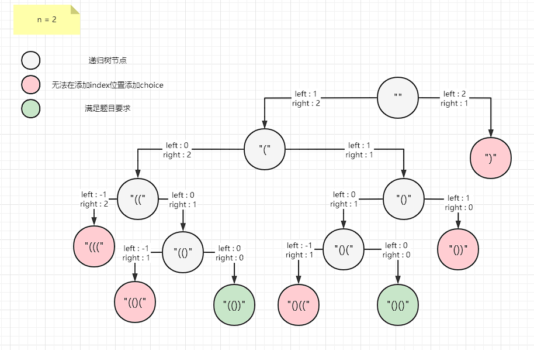
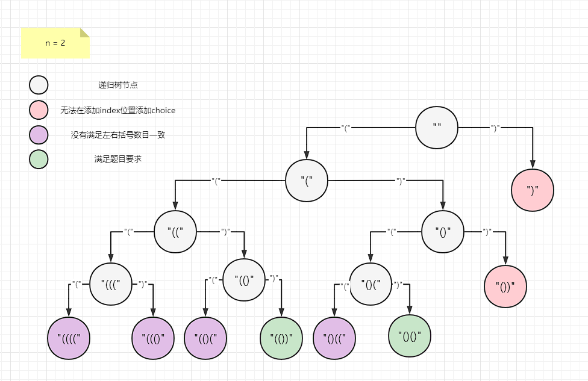

## 括号生成

数字 `n` 代表生成括号的对数，请你设计一个函数，用于能够生成所有可能的并且 **有效的** 括号组合。

**示例 1：**

```
输入：n = 3
输出：["((()))","(()())","(())()","()(())","()()()"]
```

**示例 2：**

```
输入：n = 1
输出：["()"]
```


**提示：**

- `1 <= n <= 8`

Related Topics

* 字符串
* 动态规划
* 回溯

### 回溯

直接穷举所有情况

```java
public List<String> generateParenthesis(int n) {
    // 结果集
    LinkedList<String> res = new LinkedList<>();
    // 路径
    char[] track = new char[n * 2];
    // 回溯
    generateParenthesis(track, 0, res, n);
    return res;
}

private void generateParenthesis(char[] track, int index, LinkedList<String> res, int n) {
    // 走到头了
    if (index == track.length) {
        // 判断路径组成的字符串是否合法
        if (isValid(track)) {
            res.add(new String(track));
        }
        return;
    }
    // 判断这次是否可以加入左括号
    if (canAdd(track, index, LEFT_BRACKET)) {
        track[index] = LEFT_BRACKET;
        generateParenthesis(track, index + 1, res, n);
    }
    // 判断这次是否可以加入右括号
    if (canAdd(track, index, RIGHT_BRACKET)) {
        track[index] = RIGHT_BRACKET;
        generateParenthesis(track, index + 1, res, n);
    }
}


private boolean isValid(char[] sArray) {
    // left为剩余多少左括号没有被匹配
    int left = 0;
    for (int i = 0; i < sArray.length; i++) {
        char curr = sArray[i];
        if (curr == LEFT_BRACKET) {
            left++;
        } else if (curr == RIGHT_BRACKET) {
            left--;
            // 每出现一个右括号，就对应一个左括号被匹配
            if (left < 0) {
                return false;
            }
        }
    }
    // 如果全部匹配成功，说明合法
    return left == 0;
}

private boolean canAdd(char[] sArray, int index, char bracket) {
    int left = 0;
    int right = 0;
    for (int i = 0; i < index; i++) {
        char curr = sArray[i];
        if (curr == LEFT_BRACKET) {
            left++;
        } else if (curr == RIGHT_BRACKET) {
            left--;
            right++;
        }
        // 如果右括号数目已经比左括号多了，说明已经不合法了
        if (right > left) {
            return false;
        }
    }
    if (bracket == RIGHT_BRACKET) {
        right++;
    } else {
        left++;
    }
    // 左括号数目比右括号多即可
    return left >= right;
}
```

这种方法的递归树会很大

原因在于修剪的力度不够大，`canAdd`只能判断当前的`index`位是否可以加入`choice`

但是无法保证最后生成的字符串是符合左右括号数目相等的

所以需要在满足推出条件的时候，再次判断是否符合左右括号数目一致

原因在于我无法根据**已作出选择的左右括号数量**来判断最后是否合法

换下思路，用左右括号的剩余数量就可以来判断最后是否合法，只要`right>=left`即可

> 代码优化

```java
public List<String> generateParenthesis(int n) {
    LinkedList<String> res = new LinkedList<>();
    char[] track = new char[n * 2];
    // index从0开始
    // 还剩下n个左括号
    // 还剩下n个右括号
    // trace用来记录路径
    // res用来收集结果
    generateParenthesis(track, 0, n, n, res);
    return res;
}

private void generateParenthesis(char[] track, int index, int leftBract, int rightBract, LinkedList<String> res) {
    // 如果剩余的左括号个数小于0，说明左括号已经超标了
    if (left < 0){
        return;
    }
    // 如果剩下的右括号比左括号少
    // n = 5 
    // 剩下了4个左括号，1个右括号 ，这是错的情况
    // 剩下了4个右括号，1个左括号 ，这是对的情况
    // 剩下了3个右括号，3个左括号 ，这是对的情况
    // 说明左括号多放了
    if (rightBract < leftBract) {
        return;
    }
    // 长度到达要，因为不符合要求的字符串已经被修剪
    // 所以能走到这里的肯定是合法的字符串了
    // 将其加入到结果集合中
    if (index == track.length) {
        res.add(new String(track));
        return;
    }
    // 选择左括号
    track[index] = LEFT_BRACKET;
    generateParenthesis(track, index + 1, leftBract - 1, rightBract, res);
    // 选择右括号
    track[index] = RIGHT_BRACKET;
    generateParenthesis(track, index + 1, leftBract, rightBract - 1, res);
}

```

这里给出优化后 `n=2` 的递归树



优化前的 `n=2` 的递归树



`n=2` 看不出优化后明显的增加修剪的力度

感兴趣的可以自己画一画 `n=3` 的递归树，你就会发现有很明显的区别

