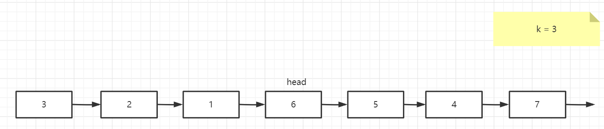

## 以k个节点为一组逆转单链表

给你一个链表，每 *k* 个节点一组进行翻转，请你返回翻转后的链表。

*k* 是一个正整数，它的值小于或等于链表的长度。

如果节点总数不是 *k* 的整数倍，那么请将最后剩余的节点保持原有顺序。

**进阶：**

- 你可以设计一个只使用常数额外空间的算法来解决此问题吗？
- **你不能只是单纯的改变节点内部的值**，而是需要实际进行节点交换。

**示例 1：**


```
输入：head = [1,2,3,4,5], k = 2
输出：[2,1,4,3,5]
```

**示例 2：**


```
输入：head = [1,2,3,4,5], k = 3
输出：[3,2,1,4,5]
```

**示例 3：**

```
输入：head = [1,2,3,4,5], k = 1
输出：[1,2,3,4,5]
```

**示例 4：**

```
输入：head = [1], k = 1
输出：[1]
```


**提示：**

- 列表中节点的数量在范围 `sz` 内
- `1 <= sz <= 5000`
- `0 <= Node.val <= 1000`
- `1 <= k <= sz`

Related Topics

* 递归
* 链表

### 递归

首先我们来分析一下这道题目，题目不难理解，就是以k个节点为一组逆转单链表，我们使用递归的思想来思考一下这道题





首先需要一个逆转前n个节点的方法

**方法签名：**`public ListNode reverseKNode(ListNode head,int k)`

```java
ListNode processor;
// 这里的k要保证不超过链表长度
public ListNode reverseKNode(ListNode head,int k){
    if(k == 1){
        processor = head.next;
        return head;
    }
    ListNode node = reverseKNode1(head.next, k-1);
    head.next.next = head;
    head.next = processor;
    return node;
}
```

在此基础上写出逆转`head`到`end`之间的节点

**方法签名：**`public ListNode reverseKNode(ListNode head,ListNode end)`

```java
ListNode processor;
// [head,end)
public ListNode reverseKNode(ListNode head,ListNode end){
    if(head.next == end){
        processor = head.next;
        return head;
    }
    ListNode node = reverseKNode(head.next, end);
    head.next.next = head;
    head.next = processor;
    return node;
}
```

最后就是成组逆转单链表

**方法签名：**`public ListNode reverseKGroup(ListNode head, int k)`

```java
public ListNode reverseKGroup(ListNode head, int k){
    ListNode node = head;
    for (int i = 0; i < k; i++) {
        if(node==null){
            return head;
        }
        node=node.next;
    }
    ListNode newHead = reverseKNode(head,k,node);
    head.next=reverseKGroup(node,k);
    return newHead;
}

private ListNode reverseKNode(ListNode head,int k,ListNode tail){
    if(k==1){
        return head;
    }
    ListNode newHead=reverseKNode(head.next,k-1,tail);
    head.next.next=head;
    head.next=tail;
    return newHead;
}
```

### 迭代

首先需要一个逆转前n个节点的方法

**方法签名：**`public ListNode reverseKNode(ListNode head,int k)`

```java
public ListNode reverseKNode(ListNode head,int k){
    ListNode prev = null;
    ListNode cur = head;
    ListNode suffix;
    while(cur!=null && k--!=0){
        suffix = cur.next;
        cur.next = prev;
        prev = cur;
        cur = suffix;
    }
    return prev;
}
```

在此基础上写出迭代逆转`head`到`end`之间的节点

**方法签名：**`public ListNode reverseKNode(ListNode head,ListNode end)`

```java
public ListNode reverseKNode(ListNode head,ListNode end){
    ListNode prev = null;
    ListNode cur = head;
    ListNode suffix;
    while(cur != end){
        suffix = cur.next;
        cur.next = prev;
        prev = cur;
        cur = suffix;
    }
    return prev;
}

```

最后就是成组逆转单链表

**方法签名：**`public ListNode reverseKGroup(ListNode head, int k)`

```java
public ListNode reverseKGroup(ListNode head, int k) {
    ListNode end = head;
    for (int i = 0; i < k; i++) {
        // 如果长度不足k，则直接返回头部，不用逆转
        if(end==null){
            return head;
        }
        end = end.next;
    }
    ListNode newHead = reverseKNode(head, k);
    head.next = reverseKGroup(end, k);
    return newHead;
}
public ListNode reverseKNode(ListNode head, int k){
    ListNode prev=null;
    ListNode cur=head;
    ListNode suffix;
    while(cur!=null&&k--!=0){
        suffix=cur.next;
        cur.next=prev;
        prev=cur;
        cur=suffix;
    }
    return prev;
}
```

