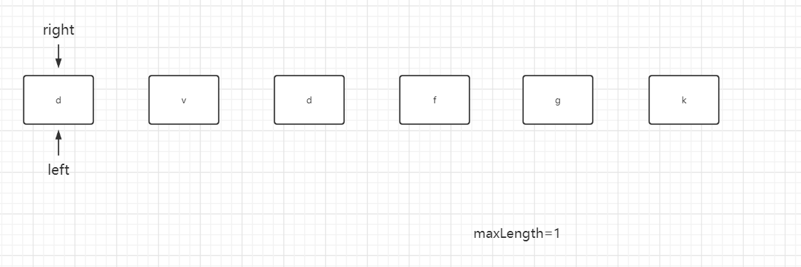
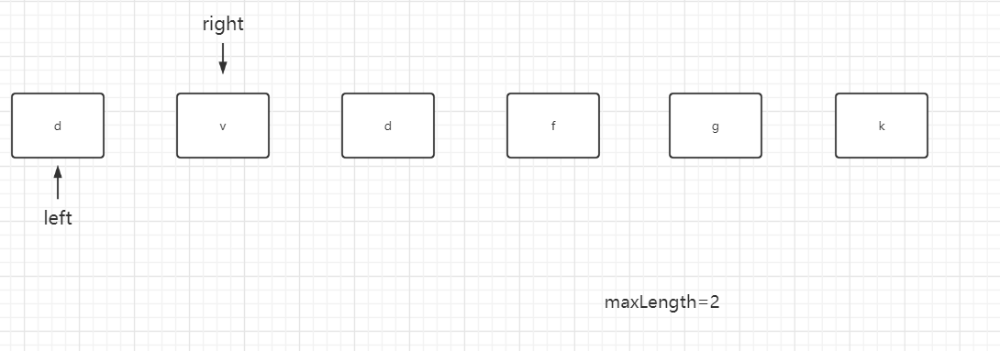
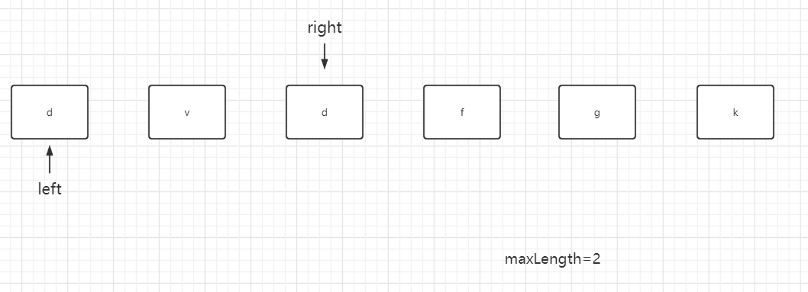
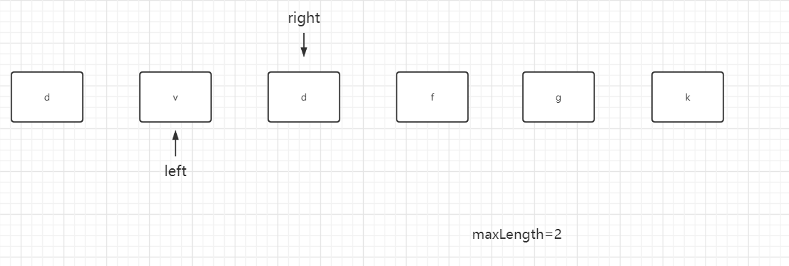
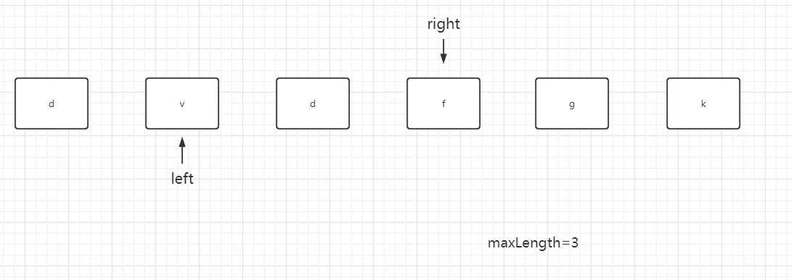
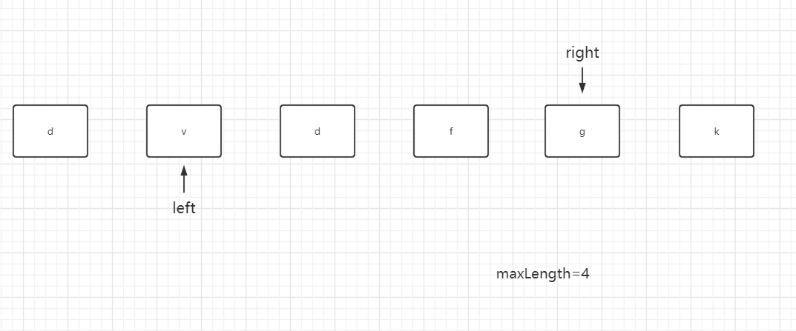
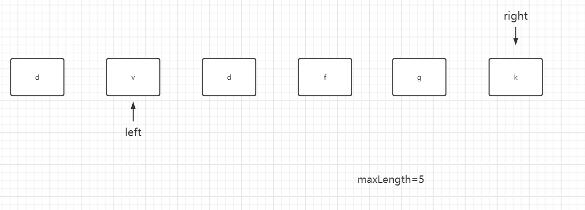
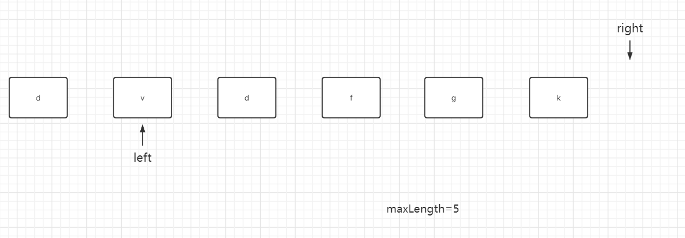
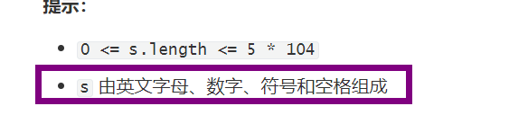

## 无重复字符的最长子串

给定一个字符串 `s` ，请你找出其中不含有重复字符的 **最长子串** 的长度。

**示例 1:**

```
输入: s = "abcabcbb"
输出: 3 
解释: 因为无重复字符的最长子串是 "abc"，所以其长度为 3。
```

**示例 2:**

```
输入: s = "bbbbb"
输出: 1
解释: 因为无重复字符的最长子串是 "b"，所以其长度为 1。
```

**示例 3:**

```
输入: s = "pwwkew"
输出: 3
解释: 因为无重复字符的最长子串是 "wke"，所以其长度为 3。
     请注意，你的答案必须是 子串 的长度，"pwke" 是一个子序列，不是子串。
```

**提示：**

- `0 <= s.length <= 5 * 104`
- `s` 由英文字母、数字、符号和空格组成

**Related Topics**

* 哈希表
* 字符串
* 滑动窗口

### 暴力解法

遍历数组的所有的区间，将满足题意区间长度的最大值返回

```java
class Solution {
    public int lengthOfLongestSubstring(String s) {
        int len = s.length();
        if (len <= 1) {
            return len;
        }
        int maxLength = 1;
        for (int i = 0; i < len; i++) {
            for (int j = i + 1; j < len; j++) {
                // 如果是无重复的子串才需要和 maxLength 作比较
                if (allUnique(s, i, j)) {
                    maxLength = Math.max(maxLength, j - i + 1);
                }
            }
        }
        return maxLength;
    }

    /**
     * 该函数的作用是返回该区间是否有重复的字符，有则返回false，没有则返回true
     *
     * @param s
     * @param i
     * @param j
     * @return
     */
    private boolean allUnique(String s, int i, int j) {
        // 这里使用ArrayList也是可以的
        Set<Character> set = new HashSet<>();
        // 看s的[i,j]区间内是否有重复的字符
        for (int x = i; x <= j; x++) {
            if (set.contains(s.charAt(x))) {
                return false;
            }
            set.add(s.charAt(x));
        }
        return true;
    }
}
```

中间会有重复的比较

导致效率十分低下

当string长度十分大的时候，一定会导致超时

### 滑动窗口法

思路如下组图所示

















> 示例代码 1

```java
class Solution {
    // 这是完完全全遵守滑动窗口的思路
    public int lengthOfLongestSubstring(String s) {
        int size = s.length();
        if(size <= 1){
            return s;
        }
        char[] sArray = s.toCharArray();
        Map<Character, Integer> window = new HashMap<>();
        int left = 0;
        int right = 0;
        int maxLength = 0;
        // [left,right)是没有重复元素的区间
        while (right < size) {
            // 如果窗口中没有此元素或者出现次数为0，扩大右边界
            while (right < size && window.getOrDefault(sArray[right], 0) == 0) {
                window.merge(sArray[right++], 1, Integer::sum);
            }
            maxLength = Math.max(right - left, maxLength);
            // 如果走到了尾部，不需要再缩小窗口了，直接返回最大值即可
            if (right == size) {
                return maxLength;
            }
            // 没有到尾部，right所在的位置就是[left,right)中重复的元素
            // 
            while (sArray[left] != sArray[right]) {
                window.merge(sArray[left++], -1, Integer::sum);
            }
            window.merge(sArray[left++], -1, Integer::sum);
        }
        return maxLength;
    }
}
```

在这道题目中用`set`来充当`window`也是可以的

> 示例代码 2

```java
class Solution {
    public int lengthOfLongestSubstring(String s) {
        int size = s.length();
        if(size <= 1){
            return s;
        }
        char[] sArray = s.toCharArray();
        Set<Character> window = new HashSet<>();
        int right = 0;
        int left = 0;
        int maxLength = 1;
        while (right < size) {
            // 只要窗口中没有sArray[right]，就一直扩大右边界
            while (right < size && !window.contains(sArray[right])) {
                window.add(sArray[right++]);
            }
            maxLength = Math.max(right - left, maxLength);
            // 说明到了尾部
            if (right == size) {
                return maxLength;
            }
            while (sArray[left] != sArray[right]) {
                window.remove(sArray[left++]);
            }
            window.remove(sArray[left++]);
        }
        return maxLength;
    }
}
```

但是这两种都不大好

这两种的window的定义都是s的`[legft,right)`区间是不重复的子串

下面看window的定义是s的`[left,right]`区间不是重复的子串的时候该如何写代码

> 示例代码 3

```java
class Solution {
    public int lengthOfLongestSubstring(String s) {
        int size = s.length();
        if(size <= 1){
            return s;
        }
        char[] sArray = s.toCharArray();
        Set<Character> window = new HashSet<>();
        int right = 0;
        int left = 0;
        int maxLength = 1;
        // [left,right]是不重复的子串
        while (right < size) {
            char rightChar = sArray[right];
            // 保持窗口中没有和即将加入的右边界一样的字符
            while (window.contains(rightChar)) {
                window.remove(sArray[left++]);
            }
            maxLength = Math.max(maxLength, right - left + 1);
            // 将右边界加入窗口
            window.add(sArray[right++]);
        }
        return maxLength;
    }
}
```

#### 使用队列优化

```java
class Solution {
    public int lengthOfLongestSubstring(String s) {
        int size = s.length();
        if(size <= 1){
            return s;
        }
        char[] sArray = s.toCharArray();
        int right = 0;
        int left = 0;
        int maxLength = 0;
        LinkedList<Character> window = new LinkedList<>();
        while (right < size) {
            while (window.contains(sArray[right])) {
                window.removeFirst();
                left++;
            }
            maxLength = Math.max(maxLength, right - left + 1);
            window.addLast(sArray[right++]);
        }
        return maxLength;
    }
}
```

#### 使用map优化

我们发现对于处理left，需要遍历left往后走

那我们就可以使用map存一下，从而可以快速拿到窗口中重复的字符的那一个索引

```java
class Solution {
    public int lengthOfLongestSubstring(String s) {
        int size = s.length();
        if(size <= 1){
            return s;
        }
        char[] sArray = s.toCharArray();
        int right = 0;
        int left = 0;
        int maxLength = 0;
        Map<Character, Integer> window = new HashMap<>();
        while (right < size) {
            // 如果右边界加入就会导致窗口有重复字符了
            if (window.containsKey(sArray[right])) {
                // 更新左边界
                left = Math.max(window.get(sArray[right]) + 1, left);
            }
            // 更新最大值
            maxLength = Math.max(maxLength, right - left + 1);
            // 覆盖或保存对应的关系
            window.put(sArray[right], right++);
        }
        return maxLength;
    }
}
```

#### 对map再次进行优化



因为字符是确定的所以，我们可以new一个128长度的数组来当hashmap，键是字符的ascll码值，值是索引，代码如下

```java
class Solution {
    public int lengthOfLongestSubstring(String s) {
        int len = s.length();
        if(len <= 1){
            return len;
        }
        int maxLength = 1;
        int left = 0;
        int right = 0;
        int[] window = new int[128];
        while(right < len){
            char now = s.charAt(right);
            // 如果window[now]没有值就是0和原本的left相比较即可
            left = Math.max(left, window[now] +1);
            // 更新最大值
            maxLength = Math.max(maxLength, right-left+1);
            // 覆盖或保存对应的关系
            window[now] = right++;
        }
        return maxLength;
    }
}
```

