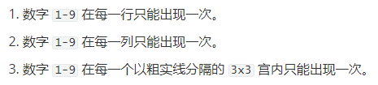
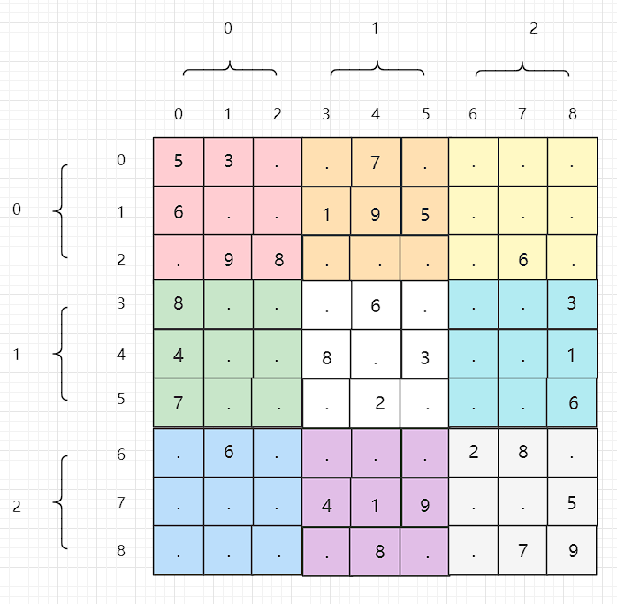

## 解数独

编写一个程序，通过填充空格来解决数独问题。

数独的解法需 **遵循如下规则**：

1. 数字 `1-9` 在每一行只能出现一次。
2. 数字 `1-9` 在每一列只能出现一次。
3. 数字 `1-9` 在每一个以粗实线分隔的 `3x3` 宫内只能出现一次。（请参考示例图）

数独部分空格内已填入了数字，空白格用 `'.'` 表示。


**示例 1：**


```
输入：board = [["5","3",".",".","7",".",".",".","."],["6",".",".","1","9","5",".",".","."],[".","9","8",".",".",".",".","6","."],["8",".",".",".","6",".",".",".","3"],["4",".",".","8",".","3",".",".","1"],["7",".",".",".","2",".",".",".","6"],[".","6",".",".",".",".","2","8","."],[".",".",".","4","1","9",".",".","5"],[".",".",".",".","8",".",".","7","9"]]
输出：[["5","3","4","6","7","8","9","1","2"],["6","7","2","1","9","5","3","4","8"],["1","9","8","3","4","2","5","6","7"],["8","5","9","7","6","1","4","2","3"],["4","2","6","8","5","3","7","9","1"],["7","1","3","9","2","4","8","5","6"],["9","6","1","5","3","7","2","8","4"],["2","8","7","4","1","9","6","3","5"],["3","4","5","2","8","6","1","7","9"]]
解释：输入的数独如上图所示，唯一有效的解决方案如下所示：
```


**提示：**

- `board.length == 9`
- `board[i].length == 9`
- `board[i][j]` 是一位数字或者 `'.'`
- 题目数据 **保证** 输入数独仅有一个解

Related Topics

* 数组
* 回溯
* 矩阵

### 回溯

这里需要关注一下题目给的提示，我们来一一分析

第一条和第二条告诉我们，传入的数组是一个固定`9 * 9`的矩阵

第三条告诉我们`'.'`指的是空位

第四条告诉我们题目传入的数独只有一个答案，这就代表着我最后穷举出来解满足条件的只有一个



---

回溯三要素

1、路径：填上的数字，就是棋盘上的数字

2、选择列表：`'1'-'9'`

3、结束条件：穷举到最后一个格子（由第四条提示可得）

下面直接上代码

```java
class Solution {
    public void solveSudoku(char[][] board) {
        // 辅助函数
        solveSudoku(board,0,0);
    }
    
    // 路径：已经被填上数字的棋盘，即row之前
	// 对每一个格子的选择列表: 1 - 9
	// 结束条件：穷举到最后一行
    private boolean solveSudoku(char[][] board, int row, int column) {
        // 返回true，结束递归
        // 到了最后一行
        if (row==board.length){
            return true;
        }
        // 到了这一行的结尾了，换行
        if (column==board[0].length){
            return solveSudoku(board,row+1,0);
        }
        // 如果已经有数字了，直接下一列
        // 因为给出的棋盘中有的格子中是有数字的
        if (board[row][column]!='.'){
            return solveSudoku(board,row,column+1);
        }
        // 穷举
        for (char ch = '1'; ch <= '9'; ch++) {
            // 如果要填写的数字不合法，直接跳过此次选择
            if (!valid(board,row,column,ch)){
                continue;
            }
            // 做出选择
            board[row][column] = ch;
            // 如果已经得到答案，直接结束穷举，返回true
            if(solveSudoku(board,row,column+1)){
                return true;
            }
            // 撤销选择
            board[row][column] = '.';
        }
        // [row][column]这个格子填1-9都不合法，回退上一个格子，撤销上一次的选择
        return false;
    }
    
    // 判断要填入[row,column]的这个key是否符合规则
    private boolean valid(char[][] board, int row, int column, char key) {
        for (int i = 0; i < board.length; i++) {
            // 这一列不能有重复数字
            if (board[i][column]==key){
                return false;
            }
            // 这一行不能用重复数字
            if (board[row][i]==key){
                return false;
            }
            // 九宫格不能有重复数字
            // 这里要斟酌一下的
            if (board[(row / 3) * 3 + i / 3][(column / 3) * 3 + i % 3]==key){
                return false;
            }
        }
        return true;
    }
}
```

我们来看下这个`valid`函数中判断九宫格内是否有重复数字的代码

```java
if (board[(row / 3) * 3 + i / 3][(column / 3) * 3 + i % 3]==key){
    return false;
}
```



```bash
row/3 可以将其映射到其对应的九宫格行
column/3 可以将其映射到其对应的九宫格列
i	->	[0,1,2,3,4,5,6,7,8]
i/3	->	[0,0,0,1,1,1,2,2,2]
i%3	->	[0,1,2,0,1,2,0,1,2]
```

### 进阶

如果我将提示的第四条，即只有一个正确答案这个条件删除，那这道题该怎么做？

其实也不难，只要改变结束条件即可，上述代码是直接将可以穷举到最后的答案返回

因为题目说了只有唯一解，所以我不需要再对其进行判断

既然删除了只有唯一解这个条件，那我就要对穷举到最后的答案进行验证

怎么验证呢，那就是验证每一行每一列对角线加起来都是一样的

```java
private boolean valid(int[][] board){
    int sum = Arrays.stream(board[0]).sum();
    int row = 0;
    int column = 0;
    int downCatercorner = 0;
    int upCatercorner = 0;
    // 计算行列和对角线的和
    for (int i = 0; i < board.length; i++) {
        row = 0;
        for (int j = 0; j < board[0].length; j++) {
            row += board[i][j];
            column += board[j][i];
            // 从左上角到右下角的对角线
            if (i==j){
                downCatercorner+=board[i][j];
            }
            // 从左下角到右上角的对角线
            if (i+j==board.length-1){
                upCatercorner += board[i][j];
            }
        }
        // 每一次循环中对比行和列的和
        if (row!=sum||column!=sum){
            return false;
        }
        row = 0;
        column=0;
    }
    // 最后对比对角线的和
    return downCatercorner == sum && upCatercorner == sum;
}
```
