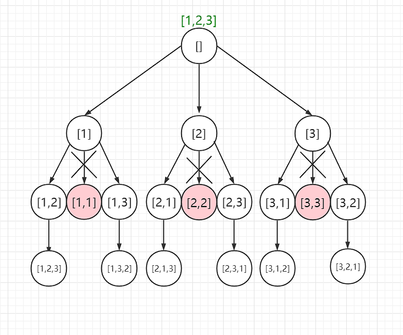

##  全排列

给定一个不含重复数字的数组 `nums` ，返回其 *所有可能的全排列* 。你可以 **按任意顺序** 返回答案。

**示例 1：**

```
输入：nums = [1,2,3]
输出：[[1,2,3],[1,3,2],[2,1,3],[2,3,1],[3,1,2],[3,2,1]]
```

**示例 2：**

```
输入：nums = [0,1]
输出：[[0,1],[1,0]]
```

**示例 3：**

```
输入：nums = [1]
输出：[[1]]
```


**提示：**

- `1 <= nums.length <= 6`
- `-10 <= nums[i] <= 10`
- `nums` 中的所有整数 **互不相同**

Related Topics

* 数组
* 回溯

### 回溯

全排列，这是很经典的一道回溯的问题

回溯三要素

1、路径：已经做出了哪些选择

2、选择列表：可以选择的元素集合

3、结束条件：到了决策树的叶子节点处了

> 图示：



#### 示例代码

```java
class Solution {
    public List<List<Integer>> permute(int[] nums) {
        // 这个是结果集用来保存结果的
        List<List<Integer>> res = new LinkedList<>();
        // 路径
        LinkedList<Integer> track = new LinkedList<>();
        // 辅助函数
        backtrack(nums,track,res);
        return res;
    }
    // 路径：track中的数字
    // 选择列表：通过track和nums推得
    // 结束条件：track的长度等于nums的长度
    private void backtrack(int[] nums, LinkedList<Integer> track, List<List<Integer>> res){
        // 到了叶子节点处
        if (track.size()== nums.length){
            // 将当前路径加入到结果集
            res.add(new LinkedList<>(track));
            return;
        }
        // 遍历选择列表
        for (int i = 0; i < nums.length; i++) {
            // 筛选掉不符合要求的选择列表
            if (track.contains(nums[i])){
                continue;
            }
            // 做出选择
            track.add(nums[i]);
            // 回溯	
            backtrack(nums,track,res);
            // 撤销选择
            track.removeLast();
        }
    }
}
```

所有的回溯问题，其实就是一棵决策树的遍历过程

在前序位置做出选择，在后序位置撤销选择
