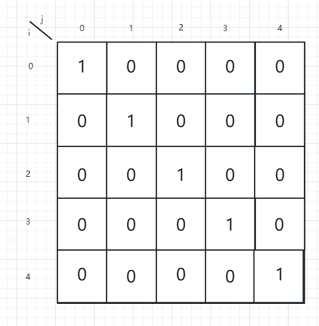
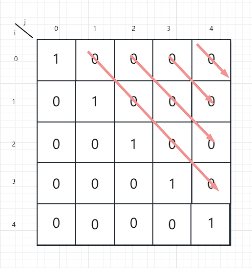

## 最长回文数

给你一个字符串 `s`，找到 `s` 中最长的回文子串。

**示例 1：**

```
输入：s = "babad"
输出："bab"
解释："aba" 同样是符合题意的答案。
```

**示例 2：**

```
输入：s = "cbbd"
输出："bb"
```

**提示：**

- `1 <= s.length <= 1000`
- `s` 仅由数字和英文字母组成

**Related Topics**

* 字符串
* 动态规划

### 暴力枚举

暴力枚举的思路很简单

> 示例代码

```java
class Solution {
    public String longestPalindrome(String s) {
        if (s.length() < 2) {
            return s;
        }
		// 得到字符数组
        char[] chars = s.toCharArray();
        // 记录开始位置
        int begin = 0;
        // 记录结束位置
        int end = 0;
        for (int i = 0; i < s.length() - 1; i++) {
            for (int j = i + 1; j < s.length(); j++) {
                if ((j - i + 1) > (end - begin + 1) && isValid(chars, i, j)) {
                    begin = i;
                    end = j;
                }
            }
        }
        return s.substring(begin, end + 1);
    }

    // 返回chars数组的[left,right]部分是否是回文的
    private boolean isValid(char[] chars, int left, int right) {
        while (left < right) {
            if (chars[left] != chars[right]) {
                return false;
            }
            left++;
            right--;
        }
        return true;
    }
}
```

### 中心扩散

将每"一位"作为中心向两边扩撒

每次扩散分两种情况

第一种情况是以当前那一位为中心向两边扩散

第二种情况是以当前那一位和下一位为中心向两边扩散

取这两种情况的最值max

如果max比maxLen大的话，更新begin

最后直接返回截取的字符串

> 示例代码

```java
class Solution {
    public String longestPalindrome(String s) {
        if (s.length() < 2) {
            return s;
        }
        int begin = 0;
        int maxLen = 1;
        for (int i = 0; i < s.length(); i++) {
            int max = Math.max(expand(s, i, i), expand(s, i, i + 1));
            if (max > maxLen) {
                maxLen = max;
                begin = i - (max - 1) / 2;
            }
        }
        return s.substring(begin, maxLen + begin);
    }

    // 返回以s[left,right]为中心得到的最大的回文子串的长度
    public int expand(String s, int left, int right) {
        while (left >= 0 && right < s.length() && s.charAt(left) == s.charAt(right)) {
            left--;
            right++;
        }
        // right - left + 1 - 2(头尾两个不相等)
        return right - left - 1;
    }
}
```

### 动态规划

对于一个子串而言，如果它是回文串，并且长度大于 2，那么将它首尾的两个字母去除之后，它仍然是个回文串。

例如对于字符串 "ababa'"，如果我们已经知道 "bab” 是回文串**这层关系**，那么 "ababa” 一定是回文串，这是因为它的首尾两个字母都是a

使用`dp[][]`二位数组来存储这层**关系**

`dp[i][j]`表示`s[i,j]`是否是回文数

如果当前要判断的范围是`dp[left][right]`，字符串长度为x

第一步先看首尾是否一致，

如果不一致，则`dp[left][right]`直接为false，

如果一致，则进入下一步判断

如果当前判断的字符串长度小于3

> 为什么是 3 ？
>
> 如果长度为1，则本身就是字符串，形成自回文
>
> 如果长度为2，则首尾一致的情况下，可以直接判断为回文
>
> 如果长度为3，则首尾一致的情况下，也可以直接判断回文
>

则直接将`dp[left][right]`赋值为true

反之将`dp[left+1][right-1]`（即去掉首尾的时候是否为回文数）的回文结构赋值给`dp[i][j]`

这些结束后，当`dp[left][right]`是true时，

则将当前循环长度和存储的maxLen进行比较，

如果当前循环长度较大，则将其赋值给maxLen，将left赋值给begin

> 示例代码

```java
public String longestPalindrome(String s) {
    int len = s.length();
    if(len < 2){
        return s;
    }
    int begin = 0;
    int maxLen = 1;
    char[] chars = s.toCharArray();
    boolean[][] dp = new boolean[len][len];
    // dp[i][j]即表示s[i..j]是否为回文数
    // 对角线即为每个字符本身那就可以直接初始化为true
    // 也可以不初始化这个，但是为了语义完整，最好还是加上
    for (int i = 0; i < len; i++) {
        dp[i][i] = true;
    }
    //x表示长度，从长度为2开始，因为长度为1的情况可以直接判断
    for (int x = 2 ; x <= len; x++) {
        //循环次数为总长度减当前循环的长度再加一
        for (int left = 0; left < len - x + 1; left++) {
            //x=right-left+1
            int right = x + left - 1;
            if(chars[left] != chars[right]){
                dp[left][right] = false;
            }else {
                if(x < 4){
                    dp[left][right] = true;
                }else {
                    dp[left][right] = dp[left+1][right-1];
                }
            }
            if(dp[left][right] && x > maxLen){
                begin = left;
                maxLen = x;
            }
        }
    }
    return s.substring(begin, maxLen+begin);
}
```

先来看 `dp` 数组，假设长度是5

> PS： 1 代表true，0 代表false



现在任务就是根据这一条主对角线然后推演出右上三角的数据，在推演过程中更新最大值

`dp[i][j]`的状态可能要通过`dp[i + 1][j - 1]`得知，所以需要按照此顺序斜着遍历



那就使用斜遍历即可，这里使用相对于对角线的偏移

```java
public String longestPalindrome1(String s) {
    int len = s.length();
    char[] sArray = s.toCharArray();
    int maxLen = 1;
    int begin = 0;
    boolean[][] dp = new boolean[len][len];
    // 对角线初始化位true
    for (int i = 0; i < len; i++) {
        dp[i][i] = true;
    }
    for (int offset = 1; offset < len; offset++) {
        for (int j = offset; j < len; j++) {
            int i = j - offset;
            System.out.println(i + " " + j);
            if (sArray[i] != sArray[j]) {
                dp[i][j] = false;
            } else {
                if (offset + 1 < 4) {
                    // 如果长度是2或者3，直接赋值true即可
                    dp[i][j] = true;
                } else {
                    dp[i][j] = dp[i + 1][j - 1];
                }
                if (dp[i][j] && j - i + 1 > maxLen) {
                    // 更新最大值
                    maxLen = j - i + 1;
                    // 更新开始位置
                    begin = i;
                }
            }
        }
    }
    return s.substring(begin, begin + maxLen);
}
```

