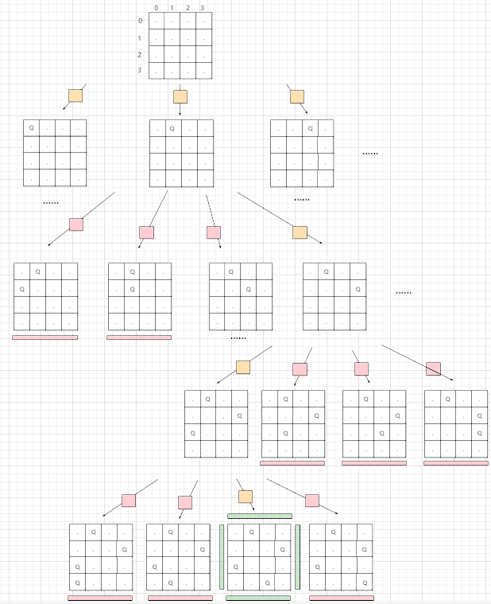

## N皇后

按照国际象棋的规则，皇后可以攻击与之处在同一行或同一列或同一斜线上的棋子。

**n 皇后问题** 研究的是如何将 `n` 个皇后放置在 `n×n` 的棋盘上，并且使皇后彼此之间不能相互攻击。

给你一个整数 `n` ，返回所有不同的 **n 皇后问题** 的解决方案。

每一种解法包含一个不同的 **n 皇后问题** 的棋子放置方案，该方案中 `'Q'` 和 `'.'` 分别代表了皇后和空位。

**示例 1：**


```
输入：n = 4
输出：[[".Q..","...Q","Q...","..Q."],["..Q.","Q...","...Q",".Q.."]]
解释：如上图所示，4 皇后问题存在两个不同的解法。
```

**示例 2：**

```
输入：n = 1
输出：[["Q"]]
```


**提示：**

- `1 <= n <= 9`

Related Topics

* 数组
* 回溯

### 回溯

**N皇后**问题和**全排列**问题被称为回溯问题的两大经典问题

今天我们就来盘一盘**N皇后**问题

回溯题目三大基本元素

路径、选择列表、结束条件

我们来一 一看看在这道题目中都和什么对应

>路径

路径就是已经选择将皇后放哪后的棋盘`board`

> 选择列表

选择列表就是每一行的每一列放`QUEUE`

> 结束条件

结束条件就是当选择到了最后一行，则将当前棋盘加入到结果集中去

下面上代码

```java
class Solution {
    // 空位
    private static final String EMPTY = ".";
    // 皇后
    private static final String QUEUE = "Q";
    public List<List<String>> solveNQueens(int n) {
        // 结果集，用来保存所有符合要求的结果
        List<List<String>> res = new ArrayList<>();
        // 用n初始化棋盘
        String[][] board = new String[n][n];
        // 用空位填充每一个位置
        fillEmpty(board);
        // 辅助函数
        solveNQueens(board,0,res);
        return res;
    }
    // 将棋盘置空
    private void fillEmpty(String[][] board) {
        for (int i = 0; i < board.length; i++) {
            for (int j = 0; j < board[0].length; j++) {
                board[i][j] = EMPTY;
            }
        }
    }
    // 装配结果集到符合题目要求的格式
    private List<String> assemble(String[][] board){
        List<String> res = new ArrayList<>();
        StringBuffer temp = new StringBuffer();
        for (String[] row : board) {
            for (String c : row) {
                temp.append(c);
            }
            res.add(temp.toString());
            temp = new StringBuffer();
        }
        return res;
    }
    // 回溯函数
    private void solveNQueens(String[][] board, int row, List<List<String>> res) {
        // 符合退出条件
        if (row==board.length){
            res.add(assemble(board));
            return;
        }
        // 对每一列进行选择
        for (int column = 0; column < board[0].length; column++) {
            // 如果选择不符合要求，直接跳过此次选择
            if (!valid(board,row,column)){
                continue;
            }
            board[row][column] = QUEUE;
            solveNQueens(board,row+1,res);
            board[row][column] = EMPTY;
        }
    }

    // 判断此次选择是否合法
    // 注意：这里还没做出选择，只是预判此次选择是否合法
    private boolean valid(String[][] board, int row, int column) {
        // 上方
        for (int r = 0; r < row; r++) {
            if (board[r][column].equals(QUEUE)){
                return false;
            }
        }
        // 左边不需要，因为我是对每一行的每一列进行选择，并且选择之后会撤销，所以不需要进行行上的判断
		/*for (int c = 0; c < column; c++) {
            if (board[row][c].equals(QUEUE)){
                return false;
            }
        }*/
        // 左上方
        for (int r = row - 1, c = column - 1; r >= 0 && c >= 0; r-- , c--) {
            if (board[r][c].equals(QUEUE)){
                return false;
            }
        }
        // 右上方
        for (int r = row - 1, c = column + 1; r >= 0 && c <board[0].length; r-- , c++) {
            if (board[r][c].equals(QUEUE)){
                return false;
            }
        }
        return true;
    }
}
```

以下是 `n=4` 的递归树

黄色的小方块表示此次选择是合法的

红色的小方块表示此次选择是不合法的，直接跳过此次选择

绿色的屏障表示的此次选择到了结束条件，直接将其放入结果集中



回溯问题无非就是遍历一颗递归树，然后在前序位置判断这次选择是否合法，如果合法就进入子树，然后在后序位置将此次选择撤销

