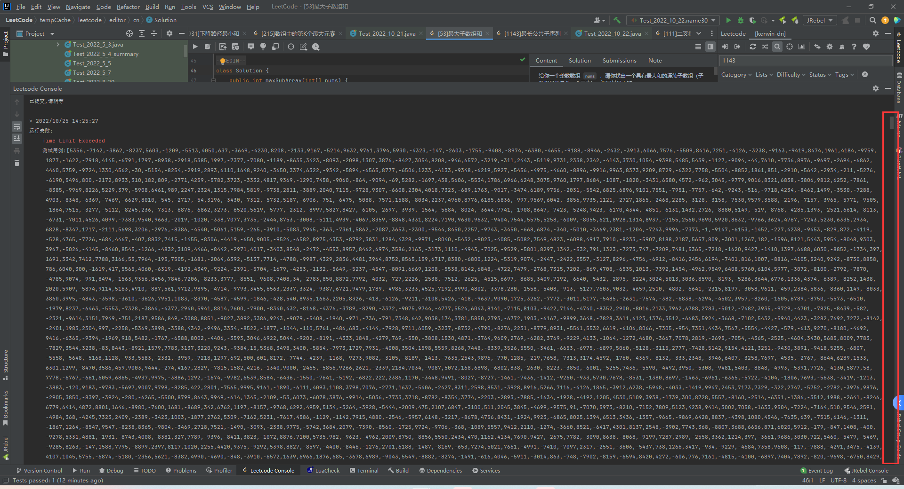

## 最大子数组和

给你一个整数数组 `nums` ，请你找出一个具有最大和的连续子数组（子数组最少包含一个元素），返回其最大和。

**子数组** 是数组中的一个连续部分。


**示例 1：**

```
输入：nums = [-2,1,-3,4,-1,2,1,-5,4]
输出：6
解释：连续子数组 [4,-1,2,1] 的和最大，为 6 。
```

**示例 2：**

```
输入：nums = [1]
输出：1
```

**示例 3：**

```
输入：nums = [5,4,-1,7,8]
输出：23
```


**提示：**

- `1 <= nums.length <= 105`
- `-104 <= nums[i] <= 104`


**进阶：**如果你已经实现复杂度为 `O(n)` 的解法，尝试使用更为精妙的 **分治法** 求解。

Related Topics

* 数组
* 分治
* 动态规划

### 暴力递归

```java
class Solution {
    public int maxSubArray(int[] nums) {
        int res = Integer.MIN_VALUE;
        for (int i = 0; i < nums.length; i++) {
            res = Math.max(maxSubArray(nums, i), res);
        }
        return res;
    }

    // 函数i当以：返回以nums[index]结尾的连续子数组的最大和
    private int maxSubArray(int[] nums, int index) {
        if (index == 0) {
            return nums[0];
        }
        int max = nums[index];
        max = Math.max(maxSubArray(nums, index - 1) + nums[index], max);
        return max;
    }
}
```



### 带备忘录的递归

```java
class Solution {
    public int maxSubArray(int[] nums) {
        int[] meno = new int[nums.length];
        System.arraycopy(nums, 0, meno, 0, nums.length);
        maxSubArray(nums, nums.length - 1, meno);
        int res = Integer.MIN_VALUE;
        for (int t : meno) {
            res = Math.max(res, t);
        }
        return res;
    }

    // 函数定义：返回以nums[index]结尾的连续子数组的最大和
    private int maxSubArray(int[] nums, int index, int[] meno) {
        if (index == 0) {
            return nums[0];
        }
        if (meno[index] != nums[index]) {
            return meno[index];
        }
        int max = nums[index];
        max = Math.max(maxSubArray(nums, index - 1, meno) + nums[index], max);
        meno[index] = max;
        return max;
    }
}
```

### 动态规划

```java
class Solution {
    public int maxSubArray(int[] nums) {
        // dp[i]是nums的[0,i]形成的最大子数组的和
        int[] dp = new int[nums.length];
        dp[0] = nums[0];
        for (int i = 1; i < nums.length; i++) {
            dp[i] = Math.max(
                    // i不加入nums的[0,i-1]形成的子数组
                    nums[i],
                    // i加入nums的[0,i-1]形成的子数组
                    dp[i - 1] + nums[i]
            );
        }
        // 取最大值
        int res = Integer.MIN_VALUE;
        for (int t : dp) {
            res = Math.max(res, t);
        }
        return res;
    }
}
```


