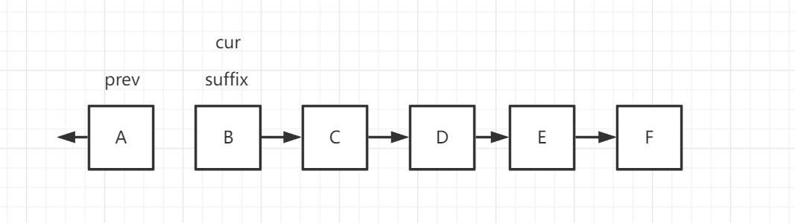

## 逆转单链表

逆转单链表，这是一个经典的单链表问题

本节不仅讲如何迭代去逆转单链表

还讲如何使用递归去逆转一部分单链表或者整个单链表

```java
public class ListNode {
    int val;
    ListNode next;
    ListNode() {}
    ListNode(int val) { this.val = val; }
    ListNode(int val, ListNode next) { this.val = val; this.next = next; }
}
```

### 反转链表

[力扣206：反转链表](https://leetcode-cn.com/problems/reverse-linked-list/)

**迭代实现**

1、初始化三个节点`prev = null`（作为前置节点）、`cur = head`（作为当前节点）、`suffix`（作为后置节点）

2、开始循环条件为`cur!=null`的循环，cur将一直走到最后一个节点的下一个节点为null的地方

3、先将`suffix`指向cur的next，然后将`cur`的next指向前一个指针`prev`，然后`prev`变为`cur`，`cur`变为`suffix`

4、返回`prev`节点

初始化


开始循环




```java
class Solution {
    public ListNode reverseList(ListNode head) {
        if (head == null) {
            return null;
        }
        ListNode prev = null;
        ListNode curr = head;
        ListNode suffix;
        while (curr != null) {
            suffix = curr.next;
            curr.next = prev;
            prev = curr;
            curr = suffix;
        }
        return prev;
    }
}
```

**递归实现**

我们的 `reverseList` 函数定义是这样的：

**输入一个节点 `head`，将「以 `head` 为起点」的链表反转，并返回反转之后的头结点**。

先递归到源链表的最后一个节点

然后当前的`head`节点就是需要加入到反转好的链表中，

`head`的`next`指针是逆转后的链表的最后一个节点

```java
class Solution {
    public ListNode reverseList1(ListNode head) {
        if (head == null || head.next == null) {
            return head;
        }
        ListNode newHead = reverseList(head.next);
        head.next.next = head;
        head.next = null;
        return newHead;
    }
}
```

### 反转前n个节点

n<=链表长度

```java
class Solution {
    ListNode end = null;
    public ListNode reverseList(ListNode head,int n) {
        if(n == 1){
            end = head.next;
            return head;
        }
        ListNode node = reverseList(head.next,n-1);
        head.next.next = head;
        head.next = end;
        return node;
    }
}
```

### 反转指定索引范围的链表

[力扣92：反转链表 II](https://leetcode-cn.com/problems/reverse-linked-list-ii/)

反转`left`到`right`部分的链表

注意：这里的 `left` 是从 1 开始的

如果当`left`为1，那就回到上面的那个问题了

所以只需要在`reverseBetween`中不断递归直到`left`为 1 的时候，`right`也就变成了区间长度

```java
class Solution {
    ListNode end = null;

    public ListNode reverseBetween(ListNode head, int left, int right) {
        if (left == 1) {
            return reverseList(head, right);
        }
        head.next = reverseBetween(head.next, left - 1, right - 1);
        return head;
    }

    public ListNode reverseList(ListNode head, int n) {
        if (n == 1) {
            end = head.next;
            return head;
        }
        ListNode node = reverseList(head.next, n - 1);
        head.next.next = head;
        head.next = end;
        return node;
    }
}
```

