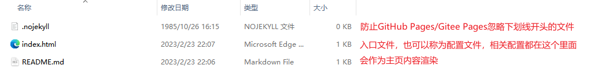

## 如何使用docsify搭建一个个人博客

### 下载docsify命令行工具

```bash
# 设置镜像源
npm config set registry https://registry.npmmirror.com/
# 全局下载
npm i docsify -g
```

### 初始化目录

```bash
docsify init .
```

目录格式如下



### 查看效果

```bash
docsify serve
```


当然，你现在应该没有这个中间的图片和文字

### 设置封面

在工作目录下创建文件`_coverpage.md`

这个文件里面的内容就是封面的内容了

> 参考内容

```markdown
<p align="center">

</p>
<h1 align="center" style="color:#b6a014">芝麻芝麻</h1>

[GitHub](https://github.com/li-zhi1802)
[我的hexo博客](https://www.li-zhi.net.cn)
```

在`index.html`中增加以下配置

```html
<script>
    window.$docsify = {
        ......
        coverpage: true,
        ......
    };
</script>
```

### 设置侧边栏

在工作目录下创建文件`_sidebar.md`

这个文件里面就是侧边栏的内容了

> 参考内容如下

```markdown
* [如何使用docsify搭建一个博客](/docs/Guide)

* 数组问题
  * [双指针](/docs/array/双指针问题)
  * [前缀和](/docs/array/前缀和)
* 小题一刷
  * [【1-Easy】两数之和](/docs/leetcode/【1-Easy】两数之和)
```

在`index.html`中增加以下配置

```html
<script>
    window.$docsify = {
        ......
        loadSidebar: true,
        ......
    };
</script>
```

### 实用的插件

#### 全文搜索

```html
<!--全文搜索,直接用官方提供的无法生效-->
<script src="https://cdn.bootcss.com/docsify/4.5.9/plugins/search.min.js"></script>
<script>
    window.$docsify = {
        ......
        search: {
            maxAge: 24 * 60 * 60,
            paths: 'auto',
            placeholder: '搜索关键词',
            noData: '找不到结果',
            // 搜索标题的最大程级, 1 - 6
            depth: 3,
        },
        ......
    };
</script>
```

#### 复制代码到剪切版

```html
<!-- 复制代码到剪贴板 -->
<script src="//unpkg.com/docsify-copy-code"></script>
```

#### 图片缩放

```html
<!-- 图片缩放 -->
<script src="//unpkg.com/docsify/lib/plugins/zoom-image.js"></script>
```

#### 字数统计

```html
<!-- 字数统计 -->
<script src="//unpkg.com/docsify-count/dist/countable.js"></script>
```

#### 跳转GitHub编辑页面

```html
<!-- docsify-edit-on-github -->
<script src="//unpkg.com/docsify-edit-on-github/index.js"></script>
<script>
    window.$docsify = {
        ......
        plugins: [
            EditOnGithubPlugin.create(
                "https://github.com/li-zhi1802/zhima-docsify/blob/master/"
            ),
        ],
        ......
    };
</script>
```

> Tips：这里的脚本必须在上面引入，不然会报错 `Uncaught ReferenceError: EditOnGithubPlugin is not defined`

