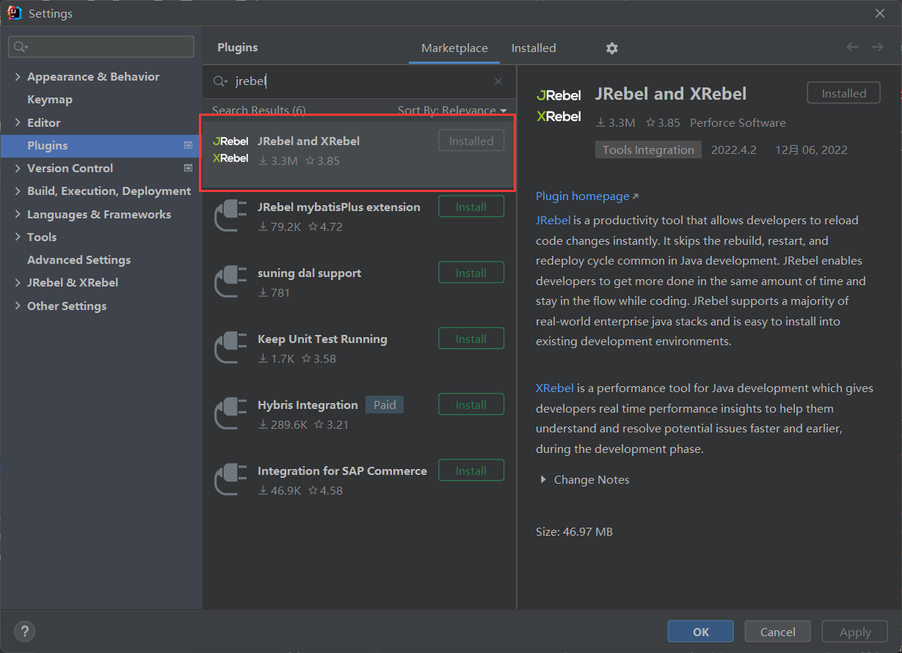
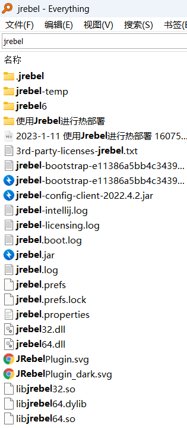
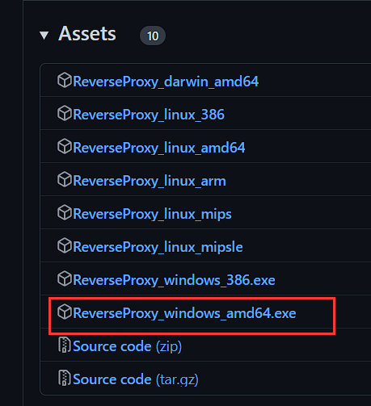
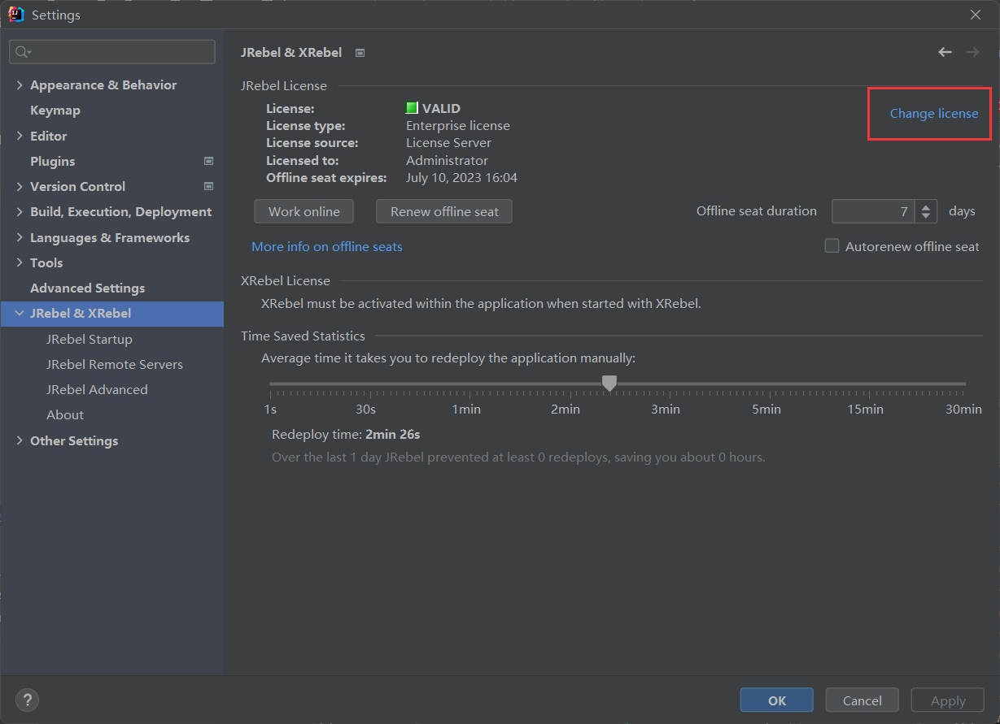
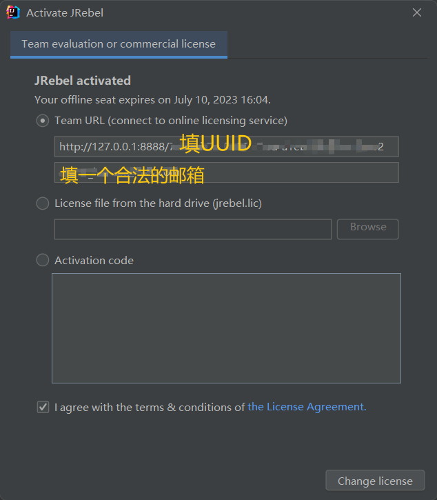
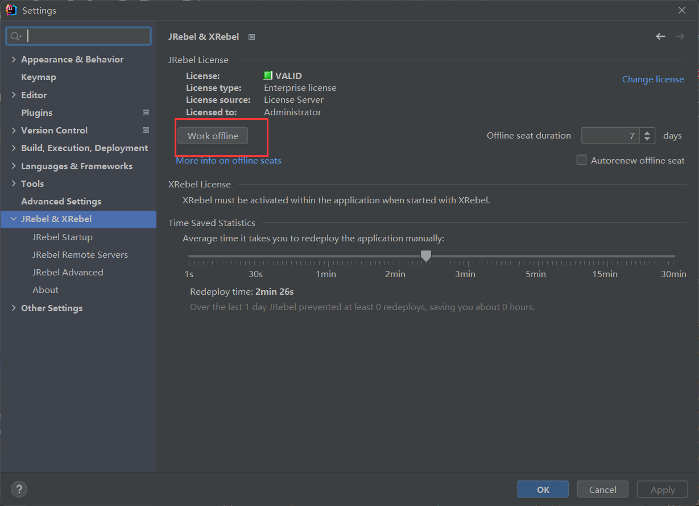
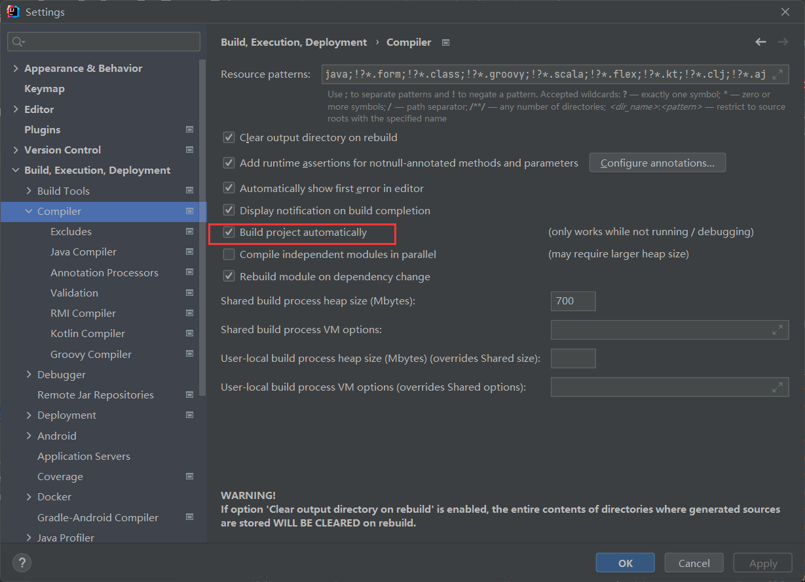

## 使用JRebel进行热部署

在我们使用Java开发后端的时候，修改了代码之后

需要重新启动服务器，然后才可以看到修改代码后的效果

这服务器的一关一启至少需要浪费30s，下面介绍一款IDEA的插件`JRebel&XRebel`

下面一步步教大家如何使用

### 在IDEA的插件市场下载此插件

下载时间会根据你的网络状况而定

### 破解

#### 提示

如果是之前就下载这个插件，然后破解失效了

最好使用`EveryThing`查找磁盘中所有文件名中包含`JRebel`和`XRebel`的文件夹和文件并删除

#### 下载反向代理的软件

下载地址如下：https://github.com/ilanyu/ReverseProxy/releases/tag/v1.4

下载后双击打开即可

#### 生成UUID

在线网站如下：https://www.uuidgenerator.net/version1

> Tips：使用java程序直接生成也是可以的

#### 激活JRebel

下面填写信息

然后点击`change license`

#### 开启离线模式

#### 开启IDEA部分设置

开启自动构建项目

